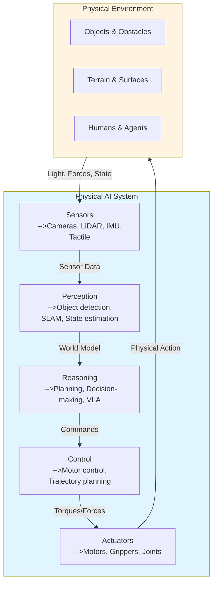

# Chapter 1: Introduction to Physical AI

## Learning Objectives

By the end of this chapter, you will:
1. Define Physical AI and distinguish it from traditional AI
2. Understand the historical evolution from industrial robots to humanoids
3. Identify key players, current capabilities, and limitations

## 1.1 What is Physical AI?

**Physical AI** = AI systems with physical bodies that interact with the real world through sensors and actuators.

**Figure 1.1**: Physical AI system architecture showing the perception-reasoning-action loop embedded in a physical environment.

**Figure 1.1**: Physical AI system architecture showing the perception-reasoning-action loop embedded in a physical environment.

### Core Characteristics

Physical AI systems must:
- **Perceive**: Process sensor data in real-time (cameras, LiDAR, IMUs, tactile)
- **Reason**: Make decisions under uncertainty and partial observability
- **Act**: Control physical actuators (motors, hydraulics, pneumatics)
- **Learn**: Adapt through physical interaction (sim, demonstrations, RL)

### Physical AI vs Traditional AI

| Aspect | Traditional AI | Physical AI |
|--------|---------------|-------------|
| Environment | Digital | Physical world |
| Time | Flexible | Real-time (ms) |
| Safety | Low stakes | High stakes |
| Embodiment | None | Critical |

**Example**: ChatGPT processes text with no physical consequences. A humanoid must balance at 100Hz while avoiding obstacles—errors cause falls.

## 1.2 Historical Context

### 1960s: Programmable Automation
- **Unimate** (1961): First industrial robot at GM
- Fixed, pre-programmed, no sensors

### 1970s-80s: Sensing and Planning  
- **Shakey** (1966-72): First mobile robot with vision
- **Stanford Cart** (1979): Vision-guided navigation
- Too slow for dynamic environments

### 1986: Subsumption Revolution
- **Rodney Brooks**: Reactive behaviors > planning
- No world model—direct sensor-to-actuator
- *"The world is its own best model"*

### 1990s-2000s: Probabilistic Robotics
- SLAM, Kalman filters, particle filters
- DARPA Grand Challenge (2005)

### 2010s: Deep Learning
- CNNs for vision (ImageNet 2012)
- End-to-end learning, sim-to-real
- Boston Dynamics Atlas (2013)

### 2020s: VLA Models
- RT-2, OpenVLA, SmolVLA
- Web-scale + robot data
- Humanoid renaissance (Figure, Tesla, 1X)

## 1.3 Current State

### Capabilities (2024)

**Locomotion**:
- ✓ Flat terrain, stairs
- ⚠ Rough terrain
- ✗ Running with obstacles

**Manipulation**:
- ✓ Pick-and-place rigid objects
- ⚠ Deformable objects
- ✗ High-precision assembly

**Autonomy**:
- ✓ Scripted sequences
- ⚠ Natural language tasks
- ✗ Open-ended problems

### Major Limitations

1. **Energy**: 1 hour battery vs human all-day
2. **Sim-to-Real**: Policies fail on real robots
3. **Generalization**: Out-of-distribution failures
4. **Safety**: Cannot verify learned policies
5. **Cost**: `$100k-$500k+` (target `<$50k`)

## Summary

Physical AI = embodied intelligence confronting real-time, uncertainty, and physical constraints.

Evolution: Industrial robots → planners → reactive → probabilistic → deep learning → VLAs

**Next**: Chapter 2 explores why embodiment matters.

## Exercises

**Exercise 1.1**: Compare and contrast a web-based chatbot with a humanoid robot. List three capabilities that are unique to physical AI systems and explain why embodiment is necessary for each.

**Exercise 1.2**: Research one of the historical systems mentioned (Shakey, Stanford Cart, or Atlas). Write a brief report on its technical specifications, key innovations, and limitations at the time.

**Exercise 1.3**: Identify a current limitation of Physical AI (from Section 1.3) and propose one research direction or engineering approach that could address it. Justify your proposal with technical reasoning.

## Exercises

**Exercise 1.1**: Compare and contrast a web-based chatbot with a humanoid robot. List three capabilities that are unique to physical AI systems and explain why embodiment is necessary for each.

**Exercise 1.2**: Research one of the historical systems mentioned (Shakey, Stanford Cart, or Atlas). Write a brief report on its technical specifications, key innovations, and limitations at the time.

**Exercise 1.3**: Identify a current limitation of Physical AI (from Section 1.3) and propose one research direction or engineering approach that could address it. Justify your proposal with technical reasoning.

---
