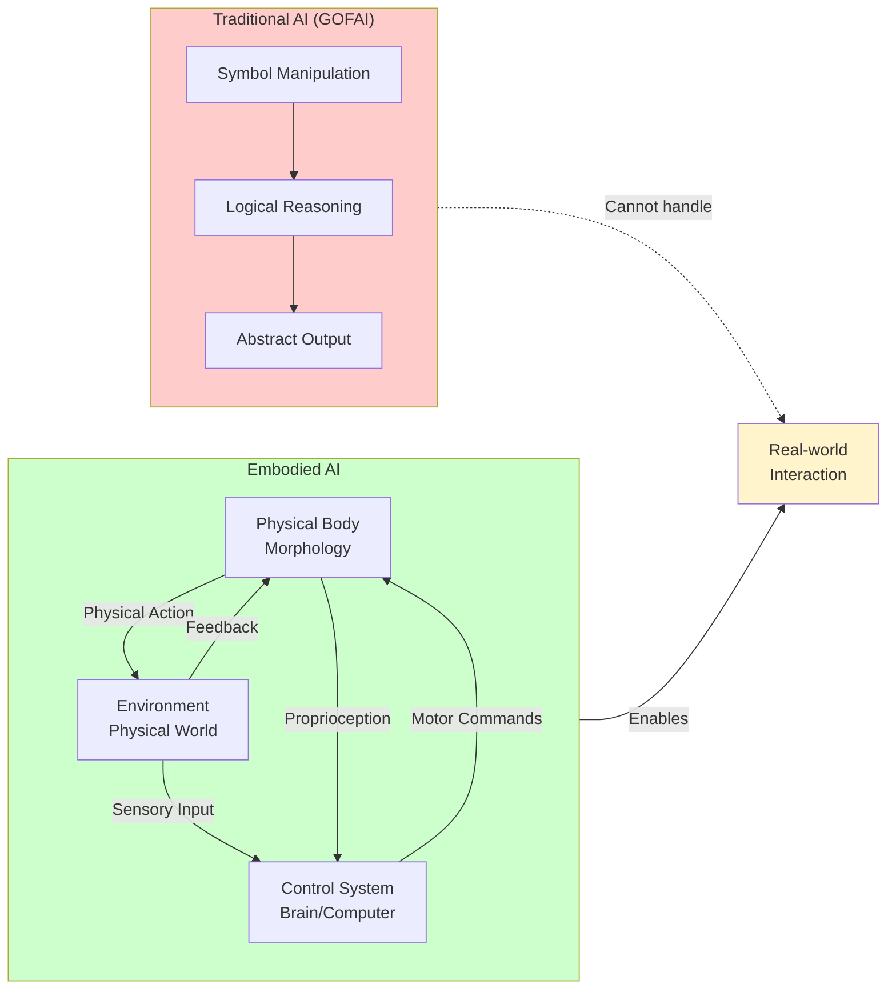

# Chapter 2: Embodied Intelligence

## Learning Objectives

1. Explain the embodiment hypothesis and its implications
2. Understand morphological computation with robotics examples
3. Describe how developmental robotics mirrors infant learning

## 2.1 The Embodiment Hypothesis

**Core Idea**: Intelligence emerges from body-brain-environment interactions, not abstract reasoning alone.

### Theoretical Foundation

Traditional AI (GOFAI - "Good Old-Fashioned AI"):
- Intelligence = symbol manipulation + logic
- Body is just I/O device for the brain
- **Problem**: Fails at "simple" tasks (walking, grasping)

**Figure 2.1**: Traditional AI vs Embodied AI. Embodied systems form a closed loop with the environment through sensing and acting, while traditional symbolic AI operates in isolation from the physical world.

**Embodied Cognition** (Brooks, Pfeifer, Varela):
- Intelligence grounded in sensorimotor experience
- Body shapes what can be perceived and learned
- Environment is part of the cognitive system

### Evidence from Neuroscience

**Mirror Neurons** (Rizzolatti, 1990s):
- Fire both when acting AND observing actions
- Understanding comes from motor simulation
- "I understand grasping because I can grasp"

**Sensorimotor Contingencies**:
- Vision is active exploration (saccades, head movements)
- Not passive image processing
- Robots with active cameras outperform fixed ones

### Robotics Implications

1. **Cheap design**: Offload computation to body morphology
2. **Faster learning**: Exploit physical dynamics
3. **Robustness**: Body provides implicit feedback

## 2.2 Morphological Computation

**Definition**: Using body structure to simplify or eliminate control complexity.

### Example 1: Passive Dynamic Walkers

**McGeer's Walker** (1990):
- Bipedal robot with NO motors, NO sensors, NO computer
- Walks down shallow slopes purely from leg geometry
- Demonstrates: Control can emerge from mechanics

**Key Insight**: The "right" body does computation for free.

### Example 2: Compliant Grippers

**Soft Robotics**:
- Rigid gripper: Must plan finger trajectories, force control
- Soft gripper: Material compliance adapts to object shape
- **Result**: 10x fewer control parameters

**Boston Dynamics**: Uses leg compliance to absorb landing impacts without complex control.

### Example 3: Whiskers

**Rat Whiskers**:
- Passive sensors, no actuation needed
- Material properties encode distance and texture
- Computational cost: near-zero

**Robotic Implementation**:
- Artificial whiskers for navigation in dark/dusty environments
- Body (whisker stiffness) does feature extraction

## 2.3 Developmental Robotics

**Inspiration**: Human infants learn through sensorimotor exploration.

### Developmental Stages

**1. Random Motor Babbling** (0-3 months):
- Infant: Flail arms randomly, discover hand-eye coordination
- Robot: Random joint commands → learn forward kinematics

**2. Object Permanence** (4-8 months):
- Infant: Realize objects exist when occluded
- Robot: Track objects behind obstacles (predictive models)

**3. Tool Use** (12-18 months):
- Infant: Use spoon, extend reach with stick
- Robot: Learn body schema includes grasped tools

### Curiosity-Driven Learning

**Intrinsic Motivation**:
- Not task-specific rewards
- Explore novel states, maximize information gain
- Example: Robot arm explores workspace, discovers objects

**Benefits**:
- No manual reward engineering
- Discovers affordances (what actions are possible)
- Robust to changing environments

## Summary

Embodiment is not optional—bodies shape intelligence.

**Key Concepts**:
- Embodiment hypothesis: Intelligence from interaction
- Morphological computation: Bodies do computation
- Developmental robotics: Learn like infants

**Next**: Chapter 3 on sensing and perception.

## Exercises

**Exercise 2.1**: Explain the concept of "morphological computation" using a specific example not covered in this chapter. How does the physical structure reduce computational requirements?

**Exercise 2.2**: Design a simple robot appendage (e.g., gripper, leg, whisker) that uses passive compliance to simplify a control task. Sketch the design and explain how material properties contribute to its function.

**Exercise 2.3**: Compare motor babbling in infants with random exploration in reinforcement learning agents. What are the similarities and differences in terms of learning objectives and outcomes?

