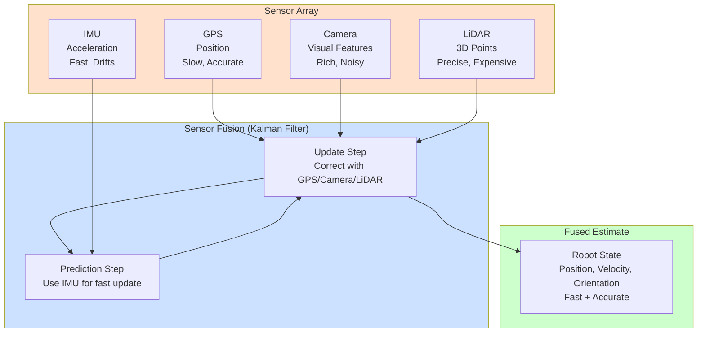
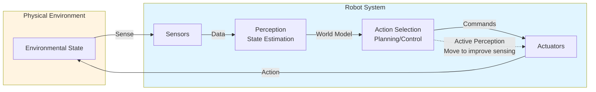

nimport { ChatbotWidget } from '@site/src/components/ChatbotWidget';

# Chapter 3: Sensing and Perception

## Learning Objectives

1. Identify key sensor modalities and their trade-offs
2. Explain sensor fusion architectures
3. Understand the perception-action loop

## 3.1 Sensor Modalities

### Vision: Cameras

**RGB Cameras**:
- Rich semantic information (colors, textures, text)
- Cheap ($10-$100)
- **Limitations**: No direct depth, lighting-dependent

**Depth Cameras** (RealSense, Kinect):
- Stereo or structured light for 3D
- **Trade-off**: Indoor only, limited range (0.5-5m)

**Event Cameras**:
- Asynchronous pixels (fire on brightness change)
- High temporal resolution (microseconds)
- Low latency for fast motion

### Ranging: LiDAR

**Principle**: Time-of-flight laser measurement

**Advantages**:
- Accurate 3D (mm precision)
- Works in dark, immune to lighting

**Disadvantages**:
- Expensive ($1k-$10k)
- Reflective/transparent surfaces fail
- Moving parts (mechanical LiDAR)

### Inertial: IMU

**Components**:
- Accelerometer: Linear acceleration (m/s²)
- Gyroscope: Angular velocity (rad/s)
- Magnetometer: Orientation (compass)

**Use Cases**:
- Balance control (detect tipping)
- Dead reckoning (integrate acceleration → velocity → position)
- **Drift Problem**: Integration error accumulates

### Proprioception

**Joint Encoders**: Measure joint angles (0.01° resolution)
**Force/Torque Sensors**: Detect contact, measure grip strength

**Importance**: Know body state independent of vision.

### Tactile

**Types**:
- Resistive (pressure changes resistance)
- Capacitive (proximity/contact)
- Optical (camera inside soft skin)

**Applications**: Grasp stability, texture recognition, safe human contact.

## 3.2 Sensor Fusion Architectures

**Problem**: Each sensor has errors, blind spots, delays.

**Solution**: Combine redundant sensors for robustness.




**Figure 3.1**: Sensor fusion pipeline combining complementary sensors (GPS, IMU, camera, LiDAR) using a Kalman filter to produce a fast and accurate state estimate.


### Kalman Filter

**Use Case**: Fusing GPS + IMU for position

**Idea**:
- Prediction: Use IMU to predict position (fast, drifts)
- Update: Correct with GPS (slow, accurate)
- **Result**: Fast + accurate estimate

**Formula** (simplified):
```
x̂ = Prediction + K × (Measurement - Prediction)
```
K = Kalman Gain (how much to trust measurement vs prediction)

**Pseudocode Example: Kalman Filter for GPS + IMU Fusion**

```python
# State: [position_x, position_y, velocity_x, velocity_y]
# Measurements: GPS (position), IMU (acceleration)

def kalman_filter(state, covariance, measurement, dt):
    # Prediction step (use IMU)
    F = [[1, 0, dt, 0],   # State transition matrix
         [0, 1, 0, dt],
         [0, 0, 1, 0],
         [0, 0, 0, 1]]
    
    predicted_state = F @ state + B @ imu_acceleration
    predicted_cov = F @ covariance @ F.T + process_noise
    
    # Update step (use GPS)
    H = [[1, 0, 0, 0],    # Measurement matrix (GPS measures position only)
         [0, 1, 0, 0]]
    
    innovation = gps_measurement - H @ predicted_state
    kalman_gain = predicted_cov @ H.T @ inv(H @ predicted_cov @ H.T + measurement_noise)
    
    updated_state = predicted_state + kalman_gain @ innovation
    updated_cov = (I - kalman_gain @ H) @ predicted_cov
    
    return updated_state, updated_cov
```

This combines fast IMU predictions with slower but accurate GPS corrections.


### Particle Filter

**Use Case**: Robot localization with unknown position

**Idea**:
- Represent belief as particles (samples)
- Each particle = possible robot pose
- Resample based on sensor likelihood
- **Handles**: Multi-modal distributions (multiple hypotheses)

### Modern Approach: Learned Fusion

**Neural Networks**:
- Input: Multi-modal data (image + LiDAR + IMU)
- Output: Fused representation (e.g., occupancy grid)
- **Advantage**: Learns sensor correlations from data

## 3.3 Perception-Action Loop



**Figure 3.2**: The perception-action loop showing how action affects perception (active perception) and how sensory feedback continuously guides action. This is a continuous cycle, not a sequential pipeline.


**Classical View**: Sense → Perceive → Plan → Act (sequential)

**Embodied View**: Continuous loop, action affects perception

### Active Perception

**Concept**: Move to improve sensing

**Examples**:
- Turn head to see occluded object
- Poke object to infer mass/compliance
- Shake box to hear contents

### Sensorimotor Contingencies

**Definition**: Learned relationships between actions and sensory changes

**Robot Example**:
- Move forward → objects grow in image
- Turn left → visual flow rightward
- **Learning**: Build model of these contingencies

### Real-Time Constraints

**Humanoid Walking**:
- Sense: IMU at 1kHz, cameras at 30Hz
- Control: Joint commands at 100Hz
- **Challenge**: Fuse asynchronous sensors for real-time control

## Summary

**Sensors**: Vision, LiDAR, IMU, proprioception, tactile
**Fusion**: Kalman, particle filters, learned fusion
**Loop**: Perception and action are coupled, not sequential

**Next**: Chapter 4 on locomotion and motor control.

## Exercises

**Exercise 3.1**: Choose two sensor modalities from Section 3.1 and design a sensor fusion approach for a specific task (e.g., autonomous navigation, grasping). Justify why combining these sensors improves performance over using either alone.

**Exercise 3.2**: Implement the Kalman filter pseudocode in Python or your preferred language. Test it with simulated GPS and IMU data where the IMU has high-frequency noise and the GPS has low-frequency drift.

**Exercise 3.3**: Give three examples of "active perception" in everyday human activities (beyond the examples in this chapter). For each, explain how action improves sensing and what would be lost if the system were purely passive.


---

## Ask Questions About This Chapter

Have questions about the content? Use our AI-powered chatbot to get instant answers based on the book material:

<ChatbotWidget 
  bookId="physical-ai-robotics" 
  chapterNumber={0} 
/>

:::tip
The chatbot provides answers grounded in the book content with source references. Try asking questions about the concepts covered in this chapter.
:::
