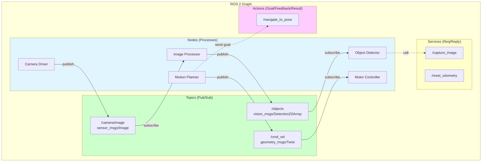
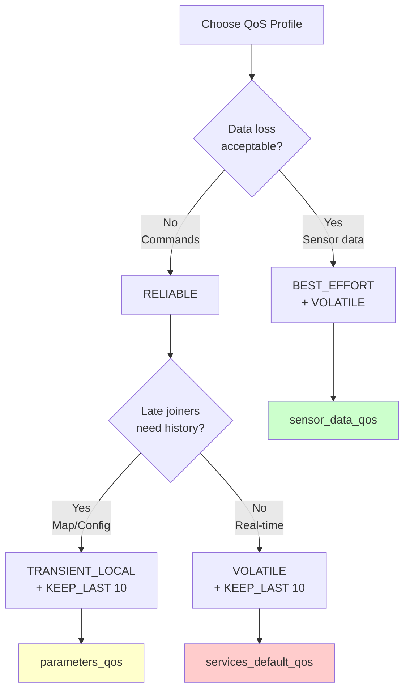

# Chapter 1: ROS 2 Core Concepts

## Learning Objectives

1. Compare ROS 2 with ROS 1 and understand the motivations for redesign
2. Understand the graph architecture of ROS 2 systems
3. Configure Quality of Service (QoS) policies for reliable communication

## 1.1 ROS 2 vs ROS 1

### Why ROS 2?

**ROS 1 Limitations**:
- Single point of failure (ROS Master)
- No real-time support (Python/TCP-based)
- Poor multi-robot support (namespace conflicts)
- No built-in security
- Linux-only production use

**ROS 2 Improvements**:
- **DDS (Data Distribution Service)**: Industry-standard middleware
- **No master**: Peer-to-peer discovery
- **Real-time**: Deterministic communication paths
- **Multi-robot**: Isolated DDS domains
- **Security**: DDS-Security (authentication, encryption)
- **Cross-platform**: Windows, macOS, RTOS support

### DDS Middleware

**What is DDS?**
- OMG (Object Management Group) standard for data-centric pub/sub
- Used in military, aerospace, medical devices
- Multiple vendors: Fast-DDS, Cyclone DDS, RTI Connext

**Key Features**:
- Discovery: Automatic participant detection
- QoS: Fine-grained reliability/latency control
- Data types: IDL (Interface Definition Language) for serialization

### Migration Considerations

**When to use ROS 2**:
- New projects (default choice)
- Multi-robot systems
- Real-time control loops
- Production deployments

**When ROS 1 is acceptable**:
- Legacy codebases (ros1_bridge exists)
- Prototyping with mature ROS 1 packages
- Research with limited time (some packages not yet ported)

## 1.2 Graph Architecture



**Figure 1.1**: ROS 2 graph architecture showing nodes communicating via topics (asynchronous), services (synchronous), and actions (goal-based). Topics use publish-subscribe, while services and actions use request-reply patterns.


**ROS 2 Graph** = Nodes connected by topics, services, actions, and parameters

### Nodes

**Definition**: Independent processes that perform computation

**Characteristics**:
- Single responsibility (e.g., camera driver, motion planner)
- Language-agnostic (C++, Python, Rust via rclcpp/rclpy/rclrust)
- Composable: Multiple nodes in one process for efficiency

**Example**:
```bash
ros2 run demo_nodes_cpp talker  # Start publisher node
ros2 run demo_nodes_cpp listener # Start subscriber node
ros2 node list                   # See active nodes
```

### Topics

**Pattern**: Publish-Subscribe (asynchronous, many-to-many)

**Use Case**: Streaming data (sensor readings, odometry, images)

**Message Types**:
- Standard: `sensor_msgs/Image`, `geometry_msgs/Twist`
- Custom: Define in `.msg` files

**Example**:
```bash
ros2 topic list
ros2 topic echo /chatter
ros2 topic hz /camera/image_raw  # Check publish frequency
```

### Services

**Pattern**: Request-Reply (synchronous, one-to-one)

**Use Case**: Discrete operations (reset odometry, capture image, load map)

**Example**:
```bash
ros2 service list
ros2 service call /add_two_ints example_interfaces/srv/AddTwoInts "{a: 2, b: 3}"
```

### Actions

**Pattern**: Goal-Feedback-Result (asynchronous, preemptable)

**Use Case**: Long-running tasks (navigate to waypoint, grasp object)

**Components**:
- Goal: Target state
- Feedback: Progress updates
- Result: Final outcome + success/failure

**Example**:
```bash
ros2 action list
ros2 action send_goal /fibonacci example_interfaces/action/Fibonacci "{order: 5}"
```

### Parameters

**Definition**: Node configuration values (read at runtime)

**Use Case**: Tuning without recompiling (PID gains, sensor IDs, file paths)

**Example**:
```bash
ros2 param list
ros2 param get /camera frame_rate
ros2 param set /camera frame_rate 60
```

## 1.3 Quality of Service (QoS) Policies

**Problem**: One size does not fit all communication patterns

### Key QoS Policies

**Reliability**:
- `RELIABLE`: Guaranteed delivery (TCP-like) - Use for commands
- `BEST_EFFORT`: No retransmission (UDP-like) - Use for sensors (lossy OK)

**Durability**:
- `TRANSIENT_LOCAL`: Late-joiners get last N messages - Use for maps, static data
- `VOLATILE`: Only current messages - Use for real-time sensor streams

**History**:
- `KEEP_LAST(N)`: Store last N messages (default N=10)
- `KEEP_ALL`: Store all (unbounded, risky)

**Deadline**:
- Max time between messages
- Triggers callback if violated
- Use for safety-critical loops

**Lifespan**:
- Max age of message before discarded
- Prevents stale data (e.g., old odometry)

### QoS Profiles (Presets)

```python
from rclpy.qos import QoSProfile, ReliabilityPolicy, HistoryPolicy

# Sensor data (lossy, real-time)
sensor_qos = QoSProfile(
    reliability=ReliabilityPolicy.BEST_EFFORT,
    history=HistoryPolicy.KEEP_LAST,
    depth=5
)

# Commands (reliable, no loss)
command_qos = QoSProfile(
    reliability=ReliabilityPolicy.RELIABLE,
    history=HistoryPolicy.KEEP_LAST,
    depth=10
)
```

### QoS Compatibility

**Publisher-Subscriber Matching**:
- Reliability: RELIABLE publisher can match BEST_EFFORT subscriber (downgrade)
- Durability: TRANSIENT_LOCAL publisher can match VOLATILE subscriber
- Mismatch causes silent failure (check with `ros2 doctor`)

**Best Practice**: Use standard profiles (`sensor_data`, `services_default`, `parameters`)




**Figure 1.2**: QoS policy decision tree. Choose BEST_EFFORT for high-frequency sensor data where occasional loss is acceptable. Use RELIABLE + TRANSIENT_LOCAL for configuration data that late-joining nodes need. Use RELIABLE + VOLATILE for commands that must arrive but don't need history.


## Summary

**ROS 2**: Modern redesign with DDS, real-time, multi-robot, security
**Graph**: Nodes connected via topics (pub/sub), services (req/reply), actions (goals)
**QoS**: Fine-grained control over reliability, latency, and durability


## Exercises

**Exercise 1.1**: Compare DDS-based ROS 2 with ROS 1 (with ROS Master). List three failure scenarios where ROS 1 would fail but ROS 2 would continue operating.

**Exercise 1.2**: Design QoS policies for the following use cases. Justify your choices:
1. Robot odometry (50 Hz)
2. Emergency stop command
3. Static map loaded at startup
4. Camera feed for object detection (30 Hz)

**Exercise 1.3**: Create a simple ROS 2 package with a publisher and subscriber. The publisher should send a custom message containing robot battery status (voltage, current, percentage). The subscriber should log warnings when battery is below 20%.

**Exercise 1.4**: Debug a QoS mismatch scenario: A camera publishes with `sensor_data_qos` (BEST_EFFORT), but a logger subscribes with `services_default_qos` (RELIABLE). Why does the subscriber not receive messages? How would you fix it?


**Next**: Chapter 2 dives deeper into implementing nodes, topics, services, and actions.
