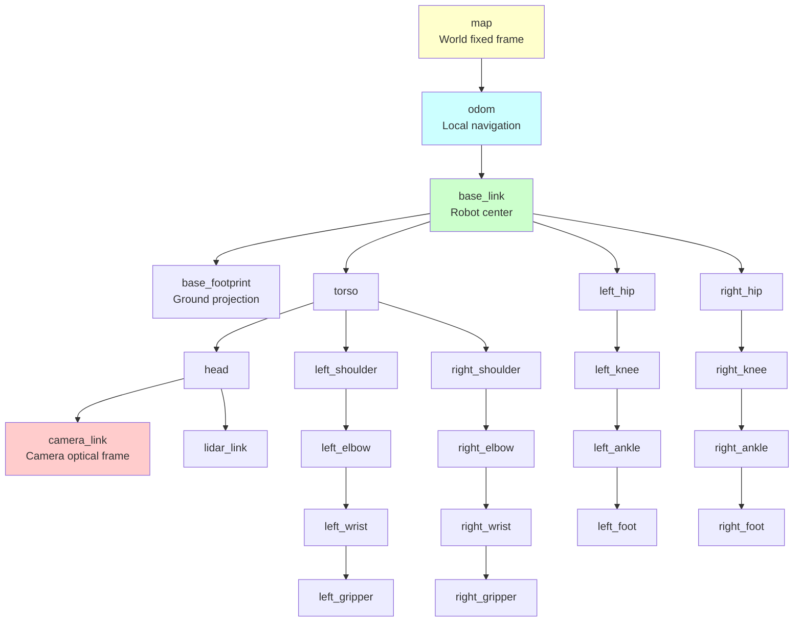

# Chapter 3: TF and URDF

## Learning Objectives

1. Use TF2 to manage coordinate transforms in robot systems
2. Design robot descriptions using URDF and Xacro
3. Apply best practices for modular robot descriptions

## 3.1 Transform Trees (TF2)

### Why TF2?

**Problem**: Robots have many coordinate frames (world, base, sensors, end-effector)

**Example**: To grasp an object detected by a camera:
1. Camera sees object at (x, y, z) in `camera_frame`
2. Need position in `base_link` for arm planning
3. TF2 automatically transforms: `camera_frame` → `base_link`




**Figure 3.1**: TF tree for a humanoid robot. The tree has a single root (`map`), with `odom` for local odometry and `base_link` as the robot's reference frame. Sensors (camera, lidar) and body parts (arms, legs) are child frames. TF2 automatically computes transforms between any two frames (e.g., `camera_link` to `left_gripper` for visual servoing).


### TF2 Concepts

**Frame**: Coordinate system (origin + orientation)

**Transform**: Translation + rotation between two frames

**Tree Structure**: Frames form a tree (one parent, multiple children)
- Root: `world` or `map`
- Mobile base: `odom` → `base_link`
- Sensors: `base_link` → `camera_link`, `lidar_link`
- Manipulator: `base_link` → `shoulder` → `elbow` → `wrist` → `end_effector`

### TF2 API

**Broadcasting Transforms** (Python):
```python
from tf2_ros import TransformBroadcaster
from geometry_msgs.msg import TransformStamped

class OdometryPublisher(Node):
    def __init__(self):
        super().__init__('odometry_publisher')
        self.tf_broadcaster = TransformBroadcaster(self)

    def publish_odometry(self, x, y, theta):
        t = TransformStamped()
        t.header.stamp = self.get_clock().now().to_msg()
        t.header.frame_id = 'odom'
        t.child_frame_id = 'base_link'
        t.transform.translation.x = x
        t.transform.translation.y = y
        t.transform.translation.z = 0.0

        # Convert yaw to quaternion
        q = quaternion_from_euler(0, 0, theta)
        t.transform.rotation.x = q[0]
        t.transform.rotation.y = q[1]
        t.transform.rotation.z = q[2]
        t.transform.rotation.w = q[3]

        self.tf_broadcaster.sendTransform(t)
```

**Looking Up Transforms** (C++):
```cpp
#include <tf2_ros/transform_listener.h>
#include <tf2_ros/buffer.h>

std::shared_ptr<tf2_ros::Buffer> tf_buffer;
std::shared_ptr<tf2_ros::TransformListener> tf_listener;

tf_buffer = std::make_shared<tf2_ros::Buffer>(node->get_clock());
tf_listener = std::make_shared<tf2_ros::TransformListener>(*tf_buffer);

try {
    auto transform = tf_buffer->lookupTransform(
        "base_link", "camera_link",
        tf2::TimePointZero);  // Latest available
    // Use transform...
} catch (tf2::TransformException &ex) {
    RCLCPP_WARN(node->get_logger(), "TF lookup failed: %s", ex.what());
}
```

### Time Travel

**Problem**: Transforms change over time (robot moves)

**Solution**: TF2 stores history (default: 10 seconds)

```python
# Get transform at specific time
past_time = rclpy.time.Time(seconds=5.0)
transform = tf_buffer.lookup_transform(
    'map', 'base_link',
    past_time,
    timeout=rclpy.duration.Duration(seconds=1.0))
```

**Use Case**: Localization - where was the robot when it saw this landmark?

### Static vs Dynamic Transforms

**Static**: Fixed (sensor mounted on robot)
```bash
ros2 run tf2_ros static_transform_publisher 0 0 0.5 0 0 0 base_link camera_link
```

**Dynamic**: Changes (odometry, joint states)
- Broadcast at sensor rate (IMU: 100Hz, odometry: 50Hz)

### Debugging TF

```bash
# Visualize tree
ros2 run tf2_tools view_frames

# Check specific transform
ros2 run tf2_ros tf2_echo base_link end_effector

# View in RViz
rviz2
# Add TF display, set fixed frame to 'world'
```

## 3.2 Robot Description (URDF/Xacro, SDF)

### URDF (Unified Robot Description Format)

**XML format** defining robot structure:
- Links: Rigid bodies (visual, collision, inertial)
- Joints: Connections (revolute, prismatic, fixed, continuous)

**Simple Example**:
```xml
<?xml version="1.0"?>
<robot name="simple_robot">
  <link name="base_link">
    <visual>
      <geometry>
        <box size="0.6 0.4 0.2"/>
      </geometry>
      <material name="blue">
        <color rgba="0 0 0.8 1"/>
      </material>
    </visual>
    <collision>
      <geometry>
        <box size="0.6 0.4 0.2"/>
      </geometry>
    </collision>
    <inertial>
      <mass value="10.0"/>
      <inertia ixx="0.1" ixy="0" ixz="0" iyy="0.1" iyz="0" izz="0.1"/>
    </inertial>
  </link>

  <link name="wheel_left">
    <visual>
      <geometry>
        <cylinder radius="0.1" length="0.05"/>
      </geometry>
    </visual>
    <inertial>
      <mass value="0.5"/>
      <inertia ixx="0.01" ixy="0" ixz="0" iyy="0.01" iyz="0" izz="0.01"/>
    </inertial>
  </link>

  <joint name="base_to_wheel_left" type="continuous">
    <parent link="base_link"/>
    <child link="wheel_left"/>
    <origin xyz="0 0.25 -0.1" rpy="0 0 0"/>
    <axis xyz="0 1 0"/>
  </joint>
</robot>
```

**Joint Types**:
- `fixed`: Welded (sensor mounts)
- `revolute`: Hinge with limits (elbow: -90° to +90°)
- `continuous`: Unlimited rotation (wheels)
- `prismatic`: Linear slide (elevator, gripper)
- `floating`: 6-DOF (rarely used, for simulating free-flying objects)

### Xacro (XML Macros)

**Problem**: URDF is verbose and repetitive

**Solution**: Xacro adds variables, math, macros

**Example**:
```xml
<?xml version="1.0"?>
<robot name="modular_robot" xmlns:xacro="http://www.ros.org/wiki/xacro">
  <!-- Parameters -->
  <xacro:property name="wheel_radius" value="0.1"/>
  <xacro:property name="wheel_width" value="0.05"/>
  <xacro:property name="base_width" value="0.4"/>

  <!-- Macro for wheels (reusable) -->
  <xacro:macro name="wheel" params="prefix x_pos y_pos">
    <link name="${prefix}_wheel">
      <visual>
        <geometry>
          <cylinder radius="${wheel_radius}" length="${wheel_width}"/>
        </geometry>
      </visual>
      <inertial>
        <mass value="0.5"/>
        <inertia ixx="0.01" ixy="0" ixz="0" iyy="0.01" iyz="0" izz="0.01"/>
      </inertial>
    </link>

    <joint name="base_to_${prefix}_wheel" type="continuous">
      <parent link="base_link"/>
      <child link="${prefix}_wheel"/>
      <origin xyz="${x_pos} ${y_pos} ${-wheel_radius}" rpy="0 0 0"/>
      <axis xyz="0 1 0"/>
    </joint>
  </xacro:macro>

  <!-- Use macro -->
  <xacro:wheel prefix="left" x_pos="0" y_pos="${base_width/2}"/>
  <xacro:wheel prefix="right" x_pos="0" y_pos="${-base_width/2}"/>
</robot>
```

**Convert to URDF**:
```bash
xacro robot.urdf.xacro > robot.urdf
```

### SDF (Simulation Description Format)

**Gazebo-native format** (more expressive than URDF):
- Supports closed kinematic chains
- Plugin system
- Nested models (multi-robot scenarios)

**ROS 2 Integration**: `urdf_to_sdf` converter, or use URDF directly in Gazebo

## 3.3 URDF Best Practices

### Modularity

**Principle**: Separate robot into composable modules

**Structure**:
```
robot_description/
├── urdf/
│   ├── robot.urdf.xacro           # Top-level assembly
│   ├── base/
│   │   └── base.urdf.xacro        # Mobile base
│   ├── sensors/
│   │   ├── lidar.urdf.xacro
│   │   └── camera.urdf.xacro
│   └── manipulator/
│       └── arm.urdf.xacro
└── meshes/
    ├── base_link.stl
    └── gripper.stl
```

**Top-level File**:
```xml
<robot name="mobile_manipulator" xmlns:xacro="http://www.ros.org/wiki/xacro">
  <xacro:include filename="base/base.urdf.xacro"/>
  <xacro:include filename="sensors/lidar.urdf.xacro"/>
  <xacro:include filename="manipulator/arm.urdf.xacro"/>

  <!-- Assemble -->
  <xacro:mobile_base prefix=""/>
  <xacro:lidar parent="base_link" xyz="0.2 0 0.3"/>
  <xacro:robot_arm parent="base_link" xyz="0 0 0.2"/>
</robot>
```

### Parameterization

**Use properties for tunable values**:
```xml
<xacro:arg name="robot_mass" default="50.0"/>
<xacro:arg name="wheel_diameter" default="0.2"/>
<xacro:arg name="use_gpu_lidar" default="false"/>

<mass value="$(arg robot_mass)"/>
```

**Load with arguments**:
```bash
ros2 launch robot_bringup robot.launch.py robot_mass:=60.0 use_gpu_lidar:=true
```

### Coordinate Frame Conventions

**REP 103** (ROS coordinate frames):
- X: Forward
- Y: Left
- Z: Up

**REP 105** (frame names):
- `map`: World frame (static, localization reference)
- `odom`: Local odometry frame (continuous, drifts over time)
- `base_link`: Robot center (origin for planning)
- `base_footprint`: Projection of `base_link` on ground (Z=0)

### Validation

```bash
# Check URDF for errors
check_urdf robot.urdf

# Visualize in RViz
ros2 launch urdf_tutorial display.launch.py model:=robot.urdf

# Test joint limits
ros2 run joint_state_publisher_gui joint_state_publisher_gui
```

## Summary

**TF2**: Manages coordinate transforms, time-aware, tree structure
**URDF**: Robot description (links, joints, visual, collision, inertial)
**Xacro**: Modular, parameterized URDF with macros
**Best Practices**: Modularity, parameterization, REP compliance


## Exercises

**Exercise 3.1**: Write a TF broadcaster that publishes the transform from `map` to `odom` based on a simulated robot position (x, y, theta). Update the transform at 50 Hz. Verify with `ros2 run tf2_ros tf2_echo map odom`.

**Exercise 3.2**: Create a URDF for a simple 2-DOF robot arm with:
- Base link (fixed to ground)
- Shoulder joint (revolute, ±90°)
- Elbow joint (revolute, ±120°)
- End effector link

Use Xacro to parameterize link lengths. Visualize in RViz with `joint_state_publisher_gui`.

**Exercise 3.3**: Use TF2 to transform a point detected by a camera (in `camera_link` frame) to the robot's `base_link` frame. Given a point at (0.5, 0, 1.0) in camera coordinates, compute its position relative to the base. Account for the camera being mounted 0.3m above and 0.2m forward of the base.

**Exercise 3.4**: Refactor a monolithic URDF into modular Xacro files. Separate the mobile base, sensors (camera, LiDAR), and manipulator into individual files. Create a top-level assembly file that includes all modules.


**Next**: Chapter 4 integrates ROS 2 with simulation (Gazebo, launch files, development workflow).
