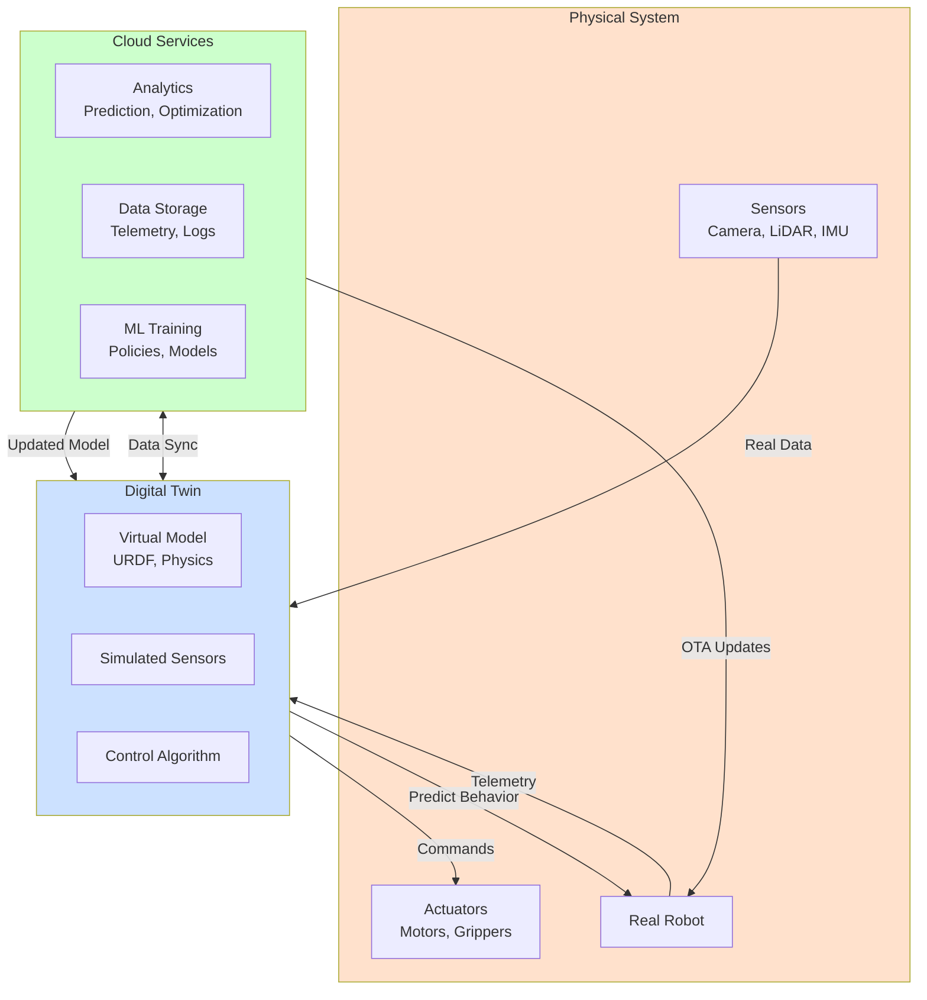

# Chapter 1: Digital Twin Basics

## Learning Objectives

1. Understand the digital twin concept and its applications in robotics
2. Analyze tradeoffs between simulation speed and physical accuracy
3. Apply strategies to bridge the sim-to-real gap

## 1.1 Digital Twin Concept

### Definition

**Digital Twin**: A virtual replica of a physical system that mirrors its behavior, appearance, and dynamics in real-time or near-real-time.

**In Robotics**:
- Virtual robot model (URDF/SDF) matches physical robot
- Simulated sensors produce data similar to real sensors
- Control algorithms tested in simulation transfer to hardware
- Environment models (warehouse, terrain) reflect real deployment sites

### Historical Context

**Origins**: NASA Apollo program (1960s) - physical duplicates for testing
**Modern**: Software-based virtual replicas with continuous data synchronization

**Evolution in Robotics**:
- 2000s: Basic kinematic simulators (V-REP, Webots)
- 2010s: Physics-based simulators (Gazebo, MuJoCo)
- 2020s: GPU-accelerated, photorealistic (Isaac Sim, Unity Simulation)

### Use Cases in Robotics

**1. Development and Testing**:
- Test algorithms before hardware exists
- Validate safety-critical behaviors (emergency stops, collision avoidance)
- Iterate rapidly (1000s of trials per day in simulation)

**2. Training AI Models**:
- Reinforcement learning (train policies in parallel simulations)
- Synthetic data generation (object detection, segmentation)
- Domain randomization (vary lighting, textures, physics for robustness)

**3. Deployment Planning**:
- Simulate warehouse layouts before construction
- Test multi-robot coordination
- Predict performance metrics (throughput, energy consumption)

**4. Operator Training**:
- Teleop practice without risking real robot
- Emergency scenario training (fire, equipment failure)
- VR-based interfaces for remote operation

**5. Continuous Validation**:
- Monitor real robot, replay scenarios in simulation
- Detect anomalies (real vs simulated behavior divergence)
- Predict failures before they occur




**Figure 1.1**: Digital twin architecture showing bidirectional data flow between physical robot, virtual model, and cloud services. The digital twin continuously mirrors the physical system, enabling prediction, optimization, and OTA updates.


### Digital Twin vs Simulation

**Traditional Simulation**:
- One-way: Design in simulation → deploy to hardware
- Offline: No connection to real system

**Digital Twin**:
- Two-way: Real-time data from hardware → update simulation
- Bidirectional sync: Simulation informs hardware decisions
- Continuous: Mirrors physical system throughout lifecycle

**Example**: Autonomous vehicle fleet
- Traditional: Test in simulator, deploy car
- Digital twin: Each car streams telemetry to its twin, simulation predicts maintenance needs, tests OTA updates

## 1.2 Simulation Fidelity Tradeoffs

**Fidelity**: How accurately the simulation represents reality

### Dimensions of Fidelity

**1. Kinematic Fidelity**:
- Low: Simplified geometry (boxes, cylinders)
- High: CAD meshes with sub-mm accuracy

**2. Dynamic Fidelity**:
- Low: Kinematic-only (no forces, instantaneous motion)
- Medium: Rigid body dynamics (mass, inertia, collisions)
- High: Deformable objects (cloth, fluids, soft robotics)

**3. Sensor Fidelity**:
- Low: Ray-casting for LiDAR, pin-hole camera
- High: Ray-tracing with noise models, lens distortion, motion blur

**4. Visual Fidelity**:
- Low: Flat colors, no lighting
- High: Physically-based rendering (PBR), global illumination, shadows

**5. Computational Fidelity**:
- Low: Simplified control loops
- High: Hardware-in-the-loop (real embedded code)

### Speed vs Accuracy

**Fast Simulation** (low fidelity):
- **Use case**: Reinforcement learning (need 1M+ episodes)
- **Example**: Isaac Gym - 10,000 parallel robots at 100x real-time
- **Tradeoff**: Simplified physics, less realistic sensor noise

**Accurate Simulation** (high fidelity):
- **Use case**: Hardware validation, safety testing
- **Example**: Gazebo with DART physics - realistic contact dynamics
- **Tradeoff**: Slower than real-time (0.1x-0.5x)

**Real-Time Requirement**:
- Human-in-loop: Must run ≥1x real-time (operator sees immediate feedback)
- Batch training: Can run slower (overnight training runs)

### Fidelity Selection Strategy

```
┌─────────────────────────────────────────────────┐
│ High Fidelity (Slow)                           │
│ - Safety validation                            │
│ - Hardware-specific tuning (PID gains)         │
│ - Operator training                            │
└─────────────────────────────────────────────────┘
                      ↕
┌─────────────────────────────────────────────────┐
│ Medium Fidelity (Real-time)                    │
│ - Algorithm development                        │
│ - Multi-robot coordination                     │
│ - ROS 2 integration testing                    │
└─────────────────────────────────────────────────┘
                      ↕
┌─────────────────────────────────────────────────┐
│ Low Fidelity (Fast)                            │
│ - Reinforcement learning                       │
│ - Path planning in large spaces                │
│ - Monte Carlo analysis (1000s of trials)       │
└─────────────────────────────────────────────────┘
```

**Adaptive Fidelity**: Start low (explore design space), increase for final validation

## 1.3 Sim-to-Real Gap

**Problem**: Policies trained in simulation fail on real robots

**Causes**:
1. **Physics inaccuracies**: Contact dynamics, friction, deformation
2. **Unmodeled effects**: Cable drag, actuator backlash, sensor drift
3. **Simplified perception**: Perfect object poses in sim, noisy estimates in reality
4. **Deterministic sim**: Real world has stochastic disturbances (wind, uneven floors)

### Quantifying the Gap

**Metrics**:
- Task success rate: 95% in sim, 60% on hardware → 35% gap
- Trajectory error: Mean deviation between sim and real execution
- Perception accuracy: Object detection mAP difference

**Example (Grasping)**:
- Sim: 100% success (known object pose, perfect gripper control)
- Real: 70% success (pose estimation errors, contact uncertainties)

### Bridging Strategies

**1. Domain Randomization**

**Idea**: Vary simulation parameters so policy learns robust features

**Randomize**:
- **Physics**: Friction (0.3-0.9), object mass (±20%), joint damping
- **Visual**: Lighting intensity, object textures, camera exposure
- **Geometry**: Object sizes, positions, robot link lengths (within tolerances)
- **Dynamics**: Action delays, sensor noise levels

**Example (Cube stacking)**:
```python
# Randomize cube properties
cube_mass = np.random.uniform(0.05, 0.15)  # kg
friction = np.random.uniform(0.4, 1.0)
texture = random.choice(textures)  # Different colors/patterns
```

**Result**: Policy sees diverse scenarios, generalizes to real world variability

**2. System Identification**

**Idea**: Measure real robot parameters, update simulation to match

**Process**:
1. Run calibration experiments on hardware (measure friction, inertia)
2. Fit simulation parameters to match observed behavior
3. Iteratively refine (residual minimization)

**Tools**:
- Motor torque calibration (apply known torque, measure angle)
- Contact friction tests (sliding blocks on surfaces)
- Sensor noise characterization (static environment, measure variance)

**Limitation**: Time-consuming, requires hardware access

**3. Sim-to-Real Transfer Learning**

**Fine-tuning**:
- Train policy in simulation (millions of samples)
- Collect small real-world dataset (1000s of samples)
- Fine-tune policy on real data (update last layers)

**Advantage**: Leverages sim for exploration, real data for final polish

**4. Reality Gap-Aware Training**

**Adversarial Training**:
- Train discriminator to detect sim vs real data
- Policy learns features that work in both domains

**Invariant Representations**:
- Learn state representations invariant to sim/real differences
- Example: Depth images (less affected by lighting than RGB)

**5. Hybrid Approaches**

**Hardware-in-the-Loop (HIL)**:
- Real robot actuators + simulated environment
- Or: Real sensors + simulated robot

**Digital Twin Feedback**:
- Run policy on real robot, stream data to sim
- If real diverges from sim prediction → trigger safety stop, investigate

### Best Practices

1. **Start simple**: Test sim-to-real on simple tasks (move to point) before complex (manipulation)
2. **Measure gap**: Log sim and real metrics, track convergence over development
3. **Incremental reality**: Sim → sim with randomization → simplified hardware setup → full deployment
4. **Safety margins**: If sim predicts 70% success, expect 50-60% on hardware
5. **Iterative**: Sim → real → analyze failures → improve sim → repeat

## Summary

**Digital Twin**: Virtual replica for development, training, deployment planning, continuous validation
**Fidelity Tradeoffs**: Fast (RL, Monte Carlo) ↔ Accurate (safety, tuning)
**Sim-to-Real Gap**: Bridged via domain randomization, system ID, transfer learning, hybrid approaches


## Exercises

**Exercise 1.1**: Design a digital twin system for a warehouse robot fleet. Specify:
1. What data flows from physical robots to digital twins
2. What predictions the twin makes (maintenance, performance)
3. How the twin influences robot behavior (OTA updates, routing optimization)

**Exercise 1.2**: For a pick-and-place robot, determine appropriate simulation fidelity levels for:
1. Initial algorithm development (RL policy training)
2. PID gain tuning for gripper force control
3. Safety validation before hardware deployment
Justify each choice with speed/accuracy tradeoffs.

**Exercise 1.3**: Implement domain randomization for a cube stacking task. Randomize:
- Cube mass (±20%)
- Surface friction (0.4-1.0)
- Lighting direction and intensity
Measure sim-to-real transfer by comparing success rates in simulation vs on real robot.

**Exercise 1.4**: Conduct system identification for a mobile robot. Measure wheel friction by applying known torques and recording velocities. Update simulation parameters to match. Compare trajectories before and after calibration.


**Next**: Chapter 2 covers Gazebo physics engines, contact modeling, and sensor simulation.
