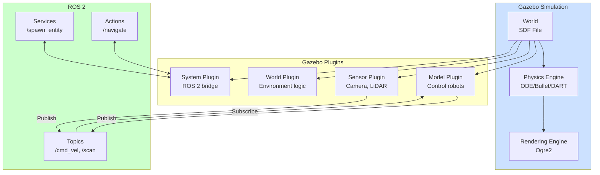

# Chapter 2: Gazebo Physics

## Learning Objectives

1. Compare physics engines (ODE, Bullet, DART) and select appropriate engine
2. Configure contact parameters (friction, compliance) for realistic simulation
3. Implement sensor plugins (camera, LiDAR, IMU) in Gazebo

## 2.1 Physics Engines

### Overview

**Physics Engine**: Computes forces, collisions, and motion of rigid/soft bodies

**Gazebo** supports multiple engines via plugin architecture:
- **ODE** (Open Dynamics Engine): Default, stable, mature
- **Bullet**: Fast, used in games and VR
- **DART** (Dynamic Animation and Robotics Toolkit): Accurate contact, best for manipulation
- **Simbody**: Biomechanics-focused (rarely used in robotics)

### ODE (Open Dynamics Engine)

**Strengths**:
- Mature (20+ years of development)
- Stable for wheeled robots and simple manipulation
- Good documentation

**Weaknesses**:
- Less accurate contact resolution
- Struggles with stacked objects (instability)
- Slower convergence for complex contacts

**Use Cases**:
- Mobile robots (differential drive, Ackermann steering)
- Prototyping (quick setup)
- Educational simulations

**Configuration**:
```xml
<physics type="ode">
  <max_step_size>0.001</max_step_size>
  <real_time_factor>1.0</real_time_factor>
  <real_time_update_rate>1000</real_time_update_rate>
  <ode>
    <solver>
      <type>quick</type>
      <iters>50</iters>
      <sor>1.3</sor>
    </solver>
    <constraints>
      <cfm>0.0</cfm>
      <erp>0.2</erp>
      <contact_max_correcting_vel>100.0</contact_max_correcting_vel>
      <contact_surface_layer>0.001</contact_surface_layer>
    </constraints>
  </ode>
</physics>
```

### Bullet

**Strengths**:
- Fast (optimized for real-time games)
- Good for soft body dynamics (deformable objects)
- Multi-threaded (can utilize multiple CPU cores)

**Weaknesses**:
- Less deterministic (minor numerical differences across runs)
- Contact constraints less precise than DART

**Use Cases**:
- Fast simulation for reinforcement learning
- Soft robotics (pneumatic actuators, flexible grippers)
- Large-scale environments (100+ objects)

**Configuration**:
```xml
<physics type="bullet">
  <max_step_size>0.001</max_step_size>
  <bullet>
    <solver>
      <type>sequential_impulse</type>
      <iters>50</iters>
      <sor>1.3</sor>
    </solver>
    <constraints>
      <cfm>0.0</cfm>
      <erp>0.2</erp>
      <split_impulse>true</split_impulse>
    </constraints>
  </bullet>
</physics>
```

### DART

**Strengths**:
- Most accurate contact resolution (LCP solver)
- Best for manipulation (grasping, assembly, contact-rich)
- Deterministic (exact same results on repeated runs)

**Weaknesses**:
- Slower (prioritizes accuracy over speed)
- More complex configuration

**Use Cases**:
- Manipulation tasks (pick-and-place, in-hand manipulation)
- Legged locomotion (foot contacts critical)
- Sim-to-real transfer (minimizes reality gap)

**Configuration**:
```xml
<physics type="dart">
  <max_step_size>0.001</max_step_size>
  <dart>
    <solver>
      <solver_type>dantzig</solver_type>
    </solver>
    <collision_detector>bullet</collision_detector>
  </dart>
</physics>
```

### Comparison Table

| Feature | ODE | Bullet | DART |
|---------|-----|--------|------|
| **Speed** | Medium | Fast | Slow |
| **Contact Accuracy** | Low | Medium | High |
| **Stacking Stability** | Poor | Medium | Excellent |
| **Soft Bodies** | No | Yes | Limited |
| **Determinism** | Medium | Low | High |
| **Best For** | Mobile robots | Fast RL | Manipulation |

### Selection Guidelines

**Choose ODE** if:
- Mobile robot (no complex contacts)
- Need quick setup with defaults
- Educational use

**Choose Bullet** if:
- Need `>1x` real-time speed
- Soft body simulation
- Determinism not critical

**Choose DART** if:
- Manipulation or legged robots
- Accuracy more important than speed
- Sim-to-real transfer planned

## 2.2 Contact Modeling

### Contact Parameters

**Contact** occurs when two collision geometries overlap

**Key Parameters**:
1. **Friction** (μ): Resistance to sliding
2. **Restitution** (e): Bounciness (0 = inelastic, 1 = perfectly elastic)
3. **Contact stiffness** (k): How "hard" the surface feels
4. **Contact damping** (c): Energy dissipation during contact

### Friction Models

**Coulomb Friction**:
- `F_friction ≤ μ * F_normal`
- Static friction (μ_s) > dynamic friction (μ_d)

**In Gazebo**:
```xml
<surface>
  <friction>
    <ode>
      <mu>0.8</mu>    <!-- Coefficient of friction -->
      <mu2>0.8</mu2>  <!-- Secondary direction (anisotropic) -->
      <fdir1>1 0 0</fdir1>  <!-- Primary friction direction -->
      <slip1>0.0</slip1>
      <slip2>0.0</slip2>
    </ode>
  </friction>
</surface>
```

**Material-Specific Values**:
- Rubber on concrete: μ = 0.9-1.0
- Metal on metal: μ = 0.15-0.3
- Ice on ice: μ = 0.02-0.05
- Gripper pad on plastic: μ = 0.6-0.8

**Anisotropic Friction** (direction-dependent):
- Example: Tank tracks (high lateral friction, low longitudinal)

### Restitution (Bounciness)

**Coefficient of Restitution** (e):
- 0: Perfectly inelastic (object sticks)
- 0.5: Loses half its velocity
- 1: Perfectly elastic (bounces back to same height)

**In Gazebo**:
```xml
<surface>
  <bounce>
    <restitution_coefficient>0.2</restitution_coefficient>
    <threshold>0.01</threshold>  <!-- Min velocity for bounce -->
  </bounce>
</surface>
```

**Use Cases**:
- Ball: e = 0.7-0.9
- Cube on table: e = 0.1-0.3
- Soft gripper: e = 0.0-0.1

### Contact Compliance

**Hard Contact** (default):
- Instantaneous collision resolution
- No penetration allowed
- Can cause instability (jitter, explosions)

**Soft Contact** (compliant):
- Allow small penetration (spring-damper model)
- More stable, especially for stacking
- Adds compliance (objects "squish")

**Configuration**:
```xml
<surface>
  <contact>
    <ode>
      <kp>1e6</kp>     <!-- Contact stiffness (N/m) -->
      <kd>100.0</kd>   <!-- Contact damping (N·s/m) -->
      <max_vel>0.01</max_vel>  <!-- Max penetration velocity -->
      <min_depth>0.001</min_depth>  <!-- Allowed penetration -->
    </ode>
  </contact>
</surface>
```

**Tuning**:
- High `kp` (stiff): Realistic but can jitter
- Low `kp` (soft): Stable but objects sink
- Rule of thumb: `kp = object_mass / desired_penetration`

### Contact Instabilities

**Problem**: Stacked objects vibrate or explode

**Causes**:
- Timestep too large (`max_step_size > 0.001`)
- Insufficient solver iterations (`iters < 50`)
- Conflicting contacts (box corners on uneven ground)

**Solutions**:
1. Reduce timestep: `max_step_size = 0.0005` (slower)
2. Increase iterations: `iters = 100` (more accurate)
3. Increase damping: `kd = 200` (more energy loss)
4. Use DART engine (better contact solver)
5. Simplify geometry (rounded corners instead of sharp edges)

## 2.3 Sensor Simulation

### Camera

**Types**:
- **Monocular**: Single RGB camera
- **Stereo**: Two cameras for depth
- **Depth**: RGB-D (Kinect-style)

**Plugin**:
```xml
<sensor name="camera" type="camera">
  <update_rate>30</update_rate>
  <camera>
    <horizontal_fov>1.047</horizontal_fov>  <!-- 60 degrees -->
    <image>
      <width>640</width>
      <height>480</height>
      <format>R8G8B8</format>
    </image>
    <clip>
      <near>0.1</near>
      <far>100</far>
    </clip>
    <noise>
      <type>gaussian</type>
      <mean>0.0</mean>
      <stddev>0.007</stddev>  <!-- Per-channel noise -->
    </noise>
  </camera>
  <plugin name="camera_controller" filename="libgazebo_ros_camera.so">
    <ros>
      <remapping>image_raw:=camera/image</remapping>
    </ros>
  </plugin>
</sensor>
```

**Realism Enhancements**:
- Lens distortion: Radial/tangential coefficients
- Motion blur: Simulate fast camera motion
- Rolling shutter: Row-by-row exposure (CMOS sensors)
- Auto-exposure: Dynamic brightness adjustment

### LiDAR (2D/3D)

**2D LiDAR** (e.g., SICK, Hokuyo):
```xml
<sensor name="lidar" type="gpu_ray">
  <update_rate>10</update_rate>
  <ray>
    <scan>
      <horizontal>
        <samples>720</samples>
        <resolution>1</resolution>
        <min_angle>-3.14159</min_angle>
        <max_angle>3.14159</max_angle>
      </horizontal>
    </scan>
    <range>
      <min>0.1</min>
      <max>30.0</max>
      <resolution>0.01</resolution>
    </range>
    <noise>
      <type>gaussian</type>
      <mean>0.0</mean>
      <stddev>0.01</stddev>
    </noise>
  </ray>
  <plugin name="lidar_controller" filename="libgazebo_ros_ray_sensor.so">
    <ros>
      <remapping>~/out:=scan</remapping>
    </ros>
  </plugin>
</sensor>
```

**3D LiDAR** (Velodyne, Ouster):
- Add `<vertical>` scan parameters
- Higher computational cost (100k+ points/sec)

**GPU Acceleration**:
- `type="gpu_ray"` uses GPU ray-tracing
- 10-100x faster than CPU version

### IMU (Inertial Measurement Unit)

**Measures**:
- Linear acceleration (m/s²)
- Angular velocity (rad/s)
- (Optional) Orientation (from magnetometer)

**Plugin**:
```xml
<sensor name="imu" type="imu">
  <update_rate>100</update_rate>
  <imu>
    <angular_velocity>
      <x>
        <noise type="gaussian">
          <mean>0</mean>
          <stddev>0.009</stddev>  <!-- Gyro noise (rad/s) -->
          <bias_mean>0.00075</bias_mean>
          <bias_stddev>0.0000008</bias_stddev>
        </noise>
      </x>
      <!-- Repeat for y, z -->
    </angular_velocity>
    <linear_acceleration>
      <x>
        <noise type="gaussian">
          <mean>0</mean>
          <stddev>0.017</stddev>  <!-- Accel noise (m/s²) -->
          <bias_mean>0.1</bias_mean>
          <bias_stddev>0.001</bias_stddev>
        </noise>
      </x>
      <!-- Repeat for y, z -->
    </linear_acceleration>
  </imu>
  <plugin name="imu_plugin" filename="libgazebo_ros_imu_sensor.so">
    <ros>
      <remapping>~/out:=imu/data</remapping>
    </ros>
  </plugin>
</sensor>
```

**Noise Modeling**:
- **White noise**: Random fluctuations
- **Bias**: Constant offset (drifts over time)
- **Bias instability**: Slow bias changes

**Calibration**: Measure real IMU noise, configure sim to match

### Joint Encoders

**Measures**: Joint positions and velocities

**Plugin** (via `libgazebo_ros2_control`):
- Automatically publishes `sensor_msgs/JointState`
- No explicit sensor tag needed (part of robot URDF)

**Noise**:
```xml
<joint name="elbow_joint">
  <dynamics damping="0.1"/>
  <sensor_noise>0.001</sensor_noise>  <!-- Position noise (rad) -->
</joint>
```

### Force/Torque Sensors

**Measures**: Forces and torques at joints (e.g., wrist force sensor)

**Plugin**:
```xml
<sensor name="force_torque" type="force_torque">
  <update_rate>100</update_rate>
  <force_torque>
    <frame>child</frame>  <!-- Measure in child link frame -->
    <measure_direction>child_to_parent</measure_direction>
  </force_torque>
  <plugin name="ft_plugin" filename="libgazebo_ros_ft_sensor.so"/>
</sensor>
```

**Use Cases**: Compliant control, grasp force regulation




**Figure 2.1**: Gazebo plugin architecture. Plugins attach to world, models, or sensors and interface with ROS 2 for bidirectional communication. The physics engine computes dynamics, while plugins handle I/O and control logic.


## Summary

**Physics Engines**: ODE (stable), Bullet (fast), DART (accurate manipulation)
**Contact**: Friction (μ), restitution (e), compliance (kp, kd) for realistic interactions
**Sensors**: Camera, LiDAR, IMU, joint encoders with noise models for sim-to-real


## Exercises

**Exercise 2.1**: Compare ODE, Bullet, and DART for a robot arm picking a fragile object. Run the same scenario in all three engines and measure:
- Task success rate
- Contact forces (should be gentle)
- Simulation speed (real-time factor)
Which engine is best? Why?

**Exercise 2.2**: Tune contact parameters for realistic box stacking. Start with default Gazebo settings (often unstable). Adjust kp (stiffness), kd (damping), friction (μ), and solver iterations until a 5-box stack is stable for 10 seconds. Document your final parameters.

**Exercise 2.3**: Add sensor noise to a camera plugin to match real sensor specifications. If your camera has 0.007 stddev per-channel noise (from datasheet), configure Gazebo to match. Capture images, measure noise, and verify it matches.

**Exercise 2.4**: Create a custom Gazebo plugin that publishes joint torques to ROS 2. The plugin should:
- Read torques from ArticulationBody or physics engine
- Publish to `/joint_torques` topic
- Update at 100 Hz
Test by commanding the robot and observing torque changes.


**Next**: Chapter 3 covers Unity for high-fidelity rendering and animation.
