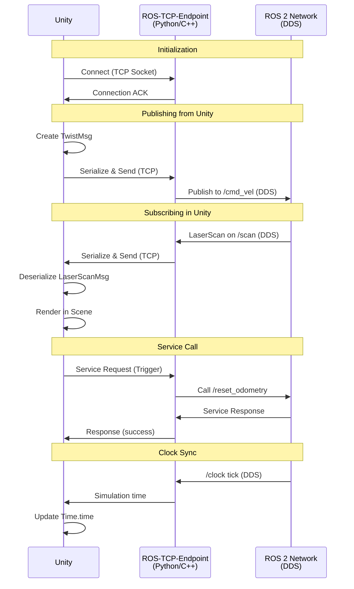

# Chapter 4: ROS 2 Integration

## Learning Objectives

1. Configure Gazebo-ROS 2 bridge for seamless message passing
2. Integrate Unity with ROS 2 using ROS-TCP-Connector
3. Design multi-simulator workflows combining Gazebo and Unity

## 4.1 Gazebo-ROS 2 Bridge

### Architecture

**ros_gz** (formerly ros_ign): Bridge between Gazebo and ROS 2

**Components**:
1. **ros_gz_bridge**: Message translator (Gazebo ↔ ROS 2)
2. **ros_gz_sim**: Launch Gazebo from ROS 2
3. **ros_gz_image**: Image transport optimization

### Message Translation

**Gazebo Topics** use Protobuf messages (e.g., `gz.msgs.Twist`)
**ROS 2 Topics** use ROS messages (e.g., `geometry_msgs/Twist`)

**Bridge**: Converts between formats automatically

**Example Bridge Configuration**:
```yaml
# bridge_config.yaml
- ros_topic_name: "/cmd_vel"
  gz_topic_name: "/model/robot/cmd_vel"
  ros_type_name: "geometry_msgs/msg/Twist"
  gz_type_name: "gz.msgs.Twist"
  direction: ROS_TO_GZ

- ros_topic_name: "/scan"
  gz_topic_name: "/world/warehouse/model/robot/link/lidar_link/sensor/lidar/scan"
  ros_type_name: "sensor_msgs/msg/LaserScan"
  gz_type_name: "gz.msgs.LaserScan"
  direction: GZ_TO_ROS

- ros_topic_name: "/camera/image"
  gz_topic_name: "/camera"
  ros_type_name: "sensor_msgs/msg/Image"
  gz_type_name: "gz.msgs.Image"
  direction: GZ_TO_ROS
```

**Launch Bridge**:
```bash
ros2 run ros_gz_bridge parameter_bridge --ros-args -p config_file:=bridge_config.yaml
```

**Bidirectional** (ROS ↔ Gazebo):
```yaml
direction: BIDIRECTIONAL
```

### Clock Synchronization

**Problem**: Simulation time ≠ wall-clock time (pause, slow-motion, fast-forward)

**Solution**: `/clock` topic with `use_sim_time:=true`

**Gazebo publishes clock**:
```xml
<!-- In world SDF -->
<plugin filename="libgz_ros2_control-system.so" name="gz_ros2_control">
  <ros>
    <namespace>/robot</namespace>
    <argument>--ros-args</argument>
    <argument>-p use_sim_time:=true</argument>
  </ros>
</plugin>
```

**ROS 2 nodes use sim time**:
```bash
ros2 run my_package my_node --ros-args -p use_sim_time:=true
```

**Bridge automatically forwards /clock**:
```bash
ros2 run ros_gz_bridge parameter_bridge /clock@rosgraph_msgs/msg/Clock[gz.msgs.Clock
```

### Plugin-Based Integration

**Alternative**: Gazebo ROS 2 plugins (no bridge needed)

**Camera Plugin**:
```xml
<sensor name="camera" type="camera">
  <plugin filename="libgazebo_ros_camera.so" name="camera_driver">
    <ros>
      <namespace>/robot</namespace>
      <remapping>image_raw:=camera/image</remapping>
      <remapping>camera_info:=camera/info</remapping>
    </ros>
    <update_rate>30</update_rate>
  </plugin>
</sensor>
```

**Advantages**:
- No separate bridge process
- Lower latency (direct ROS 2 publishing)
- Simpler launch files

**Disadvantages**:
- Plugin must exist for each sensor type
- Less flexible than bridge (bridge can map any topic)

### Debugging Bridge

```bash
# List Gazebo topics
gz topic -l

# Echo Gazebo topic
gz topic -e -t /model/robot/cmd_vel

# Check ROS 2 topics
ros2 topic list

# Monitor data flow
ros2 topic echo /cmd_vel
gz topic -e -t /model/robot/cmd_vel
```

**Common Issues**:
- **Type mismatch**: ROS and Gazebo message types don't align
- **Topic name errors**: Check exact topic names (case-sensitive)
- **Clock not synced**: Nodes not using `use_sim_time:=true`

## 4.2 Unity-ROS 2 Integration

### ROS-TCP-Connector Architecture

**Components**:
1. **Unity Package**: `com.unity.robotics.ros-tcp-connector`
2. **ROS 2 Package**: `ros_tcp_endpoint`

**Communication**:
```
Unity (C#) ←→ TCP Socket ←→ ROS 2 (Python/C++)
```

**Advantages**:
- No native ROS 2 dependency (Unity runs standalone)
- Cross-platform (Windows, macOS, Linux, mobile)
- Firewall-friendly (single TCP port)

**Disadvantages**:
- Extra latency (TCP serialization)
- Not real-time (best-effort delivery)

### Setup

**Unity Side**:
1. Install package: Window → Package Manager → Add by Git URL: `https://github.com/Unity-Technologies/ROS-TCP-Connector.git?path=/com.unity.robotics.ros-tcp-connector`
2. Configure: Robotics → ROS Settings
   - ROS IP Address: `127.0.0.1` (localhost) or remote IP
   - ROS Port: `10000` (default)
   - Protocol: ROS 2

**ROS 2 Side**:
```bash
sudo apt install ros-humble-ros-tcp-endpoint
source /opt/ros/humble/setup.bash
ros2 run ros_tcp_endpoint default_server_endpoint --ros-args -p ROS_IP:=0.0.0.0
```

### Message Generation

**Auto-generate C# classes from ROS .msg files**:

```bash
# In ROS 2 package
cd ~/ros2_ws/src/my_msgs
ros2 run ros_tcp_endpoint msg_srv_gen.py --package my_msgs --output-dir ~/unity_project/Assets/RosMessages

# Generates: Assets/RosMessages/my_msgs/msg/MyCustomMsg.cs
```

**Import in Unity**: Assets auto-refresh, C# classes ready to use

### Publishing from Unity

```csharp
using Unity.Robotics.ROSTCPConnector;
using RosMessageTypes.Geometry;

public class VelocityPublisher : MonoBehaviour
{
    ROSConnection ros;
    public float publishRate = 10f;  // Hz
    float timer = 0f;

    void Start()
    {
        ros = ROSConnection.GetOrCreateInstance();
        ros.RegisterPublisher<TwistMsg>("cmd_vel");
    }

    void Update()
    {
        timer += Time.deltaTime;
        if (timer > 1f / publishRate)
        {
            var msg = new TwistMsg
            {
                linear = new Vector3Msg { x = 1.0, y = 0.0, z = 0.0 },
                angular = new Vector3Msg { x = 0.0, y = 0.0, z = 0.5 }
            };
            ros.Publish("cmd_vel", msg);
            timer = 0f;
        }
    }
}
```

### Subscribing in Unity

```csharp
using Unity.Robotics.ROSTCPConnector;
using RosMessageTypes.Sensor;

public class LaserScanSubscriber : MonoBehaviour
{
    void Start()
    {
        ROSConnection.GetOrCreateInstance().Subscribe<LaserScanMsg>("scan", OnScanReceived);
    }

    void OnScanReceived(LaserScanMsg msg)
    {
        Debug.Log($"Received {msg.ranges.Length} laser points");

        // Visualize in Unity (draw lines)
        for (int i = 0; i < msg.ranges.Length; i++)
        {
            float angle = msg.angle_min + i * msg.angle_increment;
            float range = msg.ranges[i];
            Vector3 point = new Vector3(
                range * Mathf.Cos(angle),
                0,
                range * Mathf.Sin(angle)
            );
            Debug.DrawRay(transform.position, point, Color.red, 0.1f);
        }
    }
}
```

### Service Calls

**Unity Client**:
```csharp
using RosMessageTypes.Std;

public void CallService()
{
    var request = new TriggerRequest();
    ROSConnection.GetOrCreateInstance().SendServiceMessage<TriggerResponse>(
        "reset_odometry",
        request,
        OnServiceResponse
    );
}

void OnServiceResponse(TriggerResponse response)
{
    if (response.success)
        Debug.Log("Odometry reset successful");
}
```

**ROS 2 Server**:
```python
from std_srvs.srv import Trigger

def reset_callback(request, response):
    # Reset odometry
    response.success = True
    response.message = "Reset complete"
    return response

node.create_service(Trigger, 'reset_odometry', reset_callback)
```

## 4.3 Multi-Simulator Workflows

### Hybrid Simulation

**Concept**: Use multiple simulators for different aspects

**Example 1: Vision + Manipulation**
- **Unity**: Generate synthetic RGB-D images (domain randomization)
- **Gazebo**: Simulate grasping with DART physics
- **Bridge**: Share object poses via ROS 2

**Workflow**:
1. Unity publishes camera images (`/camera/image`)
2. Vision pipeline (ROS 2 node) detects objects
3. Gazebo receives object poses, simulates grasp
4. Grasp result sent back to Unity for visualization

**Architecture**:
```
┌───────────┐         ┌──────────────┐         ┌───────────┐
│  Unity    │ /camera │ ROS 2 Vision │ /object │  Gazebo   │
│ (Visuals) ├────────>│   Pipeline   ├────────>│ (Physics) │
└───────────┘         └──────────────┘         └───────────┘
```

### Parallel Simulations

**Use Case**: Distributed training (RL with 1000s of agents)

**Setup**:
- Launch N Unity instances on different machines
- Each publishes to unique namespace: `/robot_001/cmd_vel`, `/robot_002/cmd_vel`
- Central ROS 2 trainer subscribes to all

**Example**:
```bash
# Machine 1: Launch 10 Unity instances
for i in {1..10}; do
    unity-server --namespace /robot_00$i &
done

# Machine 2: Python trainer
ros2 run my_trainer ppo_trainer --num-robots 10
```

### Sequential Workflow

**Use Case**: Asset pipeline (model → test → deploy)

**Stages**:
1. **CAD → URDF**: Design in SolidWorks, export URDF
2. **Unity**: Visual validation (check mesh quality, textures)
3. **Gazebo**: Physics validation (dynamics, collisions)
4. **Real Hardware**: Deploy with ros2_control

**Automation** (CI/CD):
```yaml
# GitHub Actions
- name: Import URDF to Unity
  run: unity-headless --import urdf/robot.urdf
- name: Validate in Gazebo
  run: ros2 launch gazebo validate_robot.launch.py
- name: Build Docker image
  run: docker build -t robot:latest .
```

### Cross-Simulator Verification

**Scenario**: Ensure sim-to-real consistency

**Method**:
1. Run same controller in Unity, Gazebo, and hardware
2. Record trajectories (joint angles, velocities)
3. Compare:
   - Unity vs Gazebo (physics consistency)
   - Gazebo vs Hardware (sim-to-real gap)

**Metrics**:
- Mean trajectory error
- Success rate (task completion)
- Stability (oscillations, failures)

**Example**:
```python
# Log data from all sources
unity_traj = load_csv('unity_trajectory.csv')
gazebo_traj = load_csv('gazebo_trajectory.csv')
hardware_traj = load_csv('hardware_trajectory.csv')

# Compare
unity_gazebo_rmse = np.sqrt(np.mean((unity_traj - gazebo_traj)**2))
gazebo_hardware_rmse = np.sqrt(np.mean((gazebo_traj - hardware_traj)**2))

print(f"Unity-Gazebo error: {unity_gazebo_rmse}")
print(f"Gazebo-Hardware error: {gazebo_hardware_rmse}")
```

### Best Practices

1. **Namespace isolation**: Use unique namespaces per simulator (`/unity/`, `/gazebo/`)
2. **Clock sync**: All sims should publish `/clock`, nodes use `use_sim_time`
3. **Message versioning**: Pin ROS message package versions (avoid drift)
4. **Graceful fallback**: If Unity fails, Gazebo continues (don't tightly couple)
5. **Logging**: Record all data (rosbag2) for offline analysis




**Figure 4.1**: Unity-ROS 2 message flow via ROS-TCP-Connector. Unity communicates over TCP with the endpoint, which translates to/from ROS 2 DDS messages. Clock synchronization ensures Unity and ROS 2 nodes use the same simulation time.


## Summary

**Gazebo-ROS 2**: `ros_gz_bridge` for message translation, plugins for direct integration
**Unity-ROS 2**: ROS-TCP-Connector over TCP, message generation from .msg files
**Multi-Simulator**: Hybrid (Unity visuals + Gazebo physics), parallel (distributed RL), sequential (asset pipeline)


## Exercises

**Exercise 4.1**: Configure the Gazebo-ROS 2 bridge for a robot with camera, LiDAR, and IMU. Create a bridge config YAML that:
- Publishes camera images at 30 Hz
- Publishes LiDAR scans at 10 Hz
- Publishes IMU data at 100 Hz
- Subscribes to /cmd_vel for control
Verify all topics with `ros2 topic hz`.

**Exercise 4.2**: Synchronize Gazebo and ROS 2 clocks. Launch Gazebo in slow-motion (0.5x real-time) and verify a ROS 2 node receives `/clock` updates. Log timestamps and confirm they match simulation time, not wall-clock time.

**Exercise 4.3**: Implement Unity-ROS 2 communication for a camera feed. Create a Unity script that:
- Captures RGB images at 10 Hz
- Publishes to `/unity/camera/image` as `sensor_msgs/Image`
- Includes correct timestamp in header
Subscribe in ROS 2 and visualize with `rqt_image_view`.

**Exercise 4.4**: Design a hybrid simulation workflow. Use Unity for vision (object detection training with synthetic data) and Gazebo for manipulation (DART physics for grasping). The workflow should:
1. Unity detects objects → publishes poses
2. ROS 2 node plans grasp based on poses
3. Gazebo executes grasp and reports success/failure
4. Unity updates visualization
Measure end-to-end latency from detection to grasp completion.


**Module 2 Complete!** Next modules cover NVIDIA Isaac (Module 3), VLA models (Module 4), and capstone project (Module 5).
