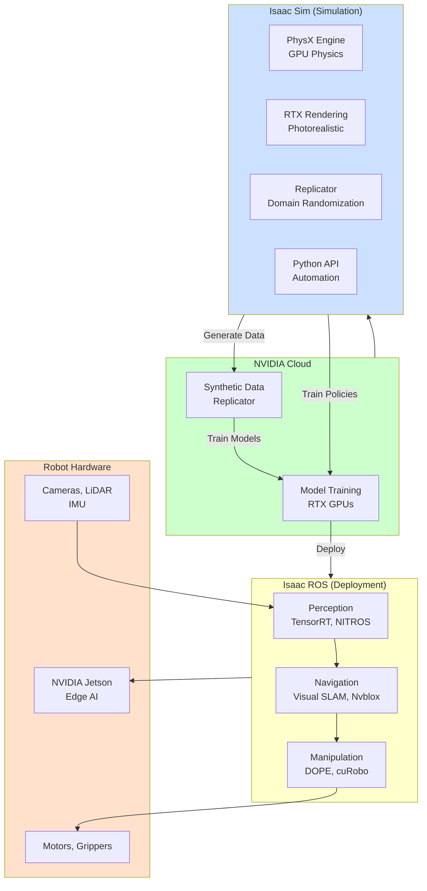

# Chapter 1: NVIDIA Isaac Overview

## Learning Objectives

1. Understand the NVIDIA Isaac ecosystem and its components
2. Leverage GPU-accelerated PhysX for scalable physics simulation
3. Use Replicator for synthetic data generation

## 1.1 Isaac Ecosystem



**Figure 1.1**: NVIDIA Isaac ecosystem showing the complete workflow from simulation (Isaac Sim) to deployment (Isaac ROS on Jetson hardware). Synthetic data and trained models flow from cloud/sim to edge devices.


### Overview

**NVIDIA Isaac**: End-to-end platform for AI-powered robotics, from simulation to deployment.

**Core Components**:
1. **Isaac Sim**: GPU-accelerated robot simulation (Omniverse-based)
2. **Isaac ROS**: ROS 2 packages for perception, navigation, manipulation (hardware-accelerated)
3. **Isaac Manipulator**: Pre-trained models and workflows for robotic arms
4. **Isaac AMR**: Autonomous mobile robot stack (SLAM, navigation, fleet management)

### Isaac Sim

**Built on NVIDIA Omniverse**: Collaborative 3D design platform using USD (Universal Scene Description)

**Key Features**:
- **PhysX 5**: GPU physics (1000s of parallel robots)
- **RTX Ray Tracing**: Photorealistic rendering for vision training
- **Replicator**: Synthetic data generation with domain randomization
- **ROS/ROS 2 Bridge**: Seamless integration
- **Python API**: Scripting for automation

**Use Cases**:
- Train RL policies (Isaac Gym style, but with full rendering)
- Generate synthetic datasets (object detection, segmentation)
- Test navigation algorithms in virtual warehouses
- Validate manipulation before hardware deployment

**System Requirements**:
- GPU: NVIDIA RTX (2000 series or newer)
- VRAM: 8GB minimum, 16GB+ recommended
- OS: Ubuntu 20.04/22.04, Windows 10/11

### Isaac ROS

**Hardware-Accelerated ROS 2 Packages** (run on Jetson or x86+GPU)

**Key Packages**:
- **isaac_ros_dnn_inference**: GPU-accelerated deep learning (TensorRT)
- **isaac_ros_image_proc**: Image processing (debayering, rectification) on GPU
- **isaac_ros_visual_slam**: Real-time visual SLAM (GPU-optimized)
- **isaac_ros_object_detection**: Object detection (DOPE, CenterPose)
- **isaac_ros_nvblox**: 3D reconstruction and mapping (GPU voxel hashing)

**Advantages**:
- **Performance**: 10-100x faster than CPU (e.g., SegFormer: 5 FPS CPU → 50 FPS GPU)
- **NITROS**: Zero-copy message passing (no serialization overhead)
- **Jetson Optimized**: Runs on Jetson Orin (edge deployment)

**Example**: Visual SLAM at 30 Hz with 1MP camera (vs 5 Hz CPU)

### Isaac Manipulator

**Pre-trained Models** for pick-and-place:
- Grasp detection (6-DOF grasps)
- Object pose estimation (DOPE for known objects)
- Motion planning (cuRobo - GPU-accelerated trajectory optimization)

**Workflows**:
1. Train object detector in Isaac Sim (synthetic data)
2. Deploy on Jetson with Isaac ROS
3. Plan grasps with cuRobo (collision-free, optimized)

### Isaac AMR

**Autonomous Mobile Robot Stack**:
- **Visual SLAM**: isaac_ros_visual_slam (GPU-accelerated ORB-SLAM3)
- **LiDAR SLAM**: Gmapping, Cartographer integration
- **Path Planning**: Nav2 integration (GPU-accelerated costmaps)
- **Fleet Management**: Multi-robot coordination

**Deployment**: Warehouse robots, delivery bots, inspection drones

## 1.2 PhysX Engine

### GPU-Accelerated Physics

**PhysX 5**: NVIDIA's physics engine (used in games, robotics, VFX)

**Key Features**:
- **GPU Acceleration**: Simulate 1000s of robots in parallel
- **Rigid Body Dynamics**: Articulations, contacts, collisions
- **Soft Bodies**: Deformable objects (limited in Isaac Sim)
- **Determinism**: Reproducible results (critical for RL)

**Scalability**:
- Single robot: 1000 FPS (faster than real-time)
- 1000 robots: 10-100 FPS (parallel RL training)
- Trade-off: Accuracy vs throughput

### Comparison with Other Engines

| Feature | PhysX (Isaac) | DART (Gazebo) | MuJoCo |
|---------|---------------|---------------|--------|
| **GPU Acceleration** | Yes | No | No |
| **Parallel Robots** | 1000s | 1 | 1 |
| **Contact Accuracy** | High | Very High | Very High |
| **Speed (single robot)** | Very Fast | Medium | Fast |
| **Best For** | RL, synthetic data | Manipulation | Control research |

**When to use PhysX/Isaac Sim**:
- Reinforcement learning (need >1M samples)
- Synthetic data at scale (100k images)
- Multi-robot scenarios (fleet simulation)

**When to use DART/Gazebo**:
- High-precision manipulation (assembly, surgery)
- Hardware validation (closest to real physics)

### PhysX Configuration

**In Isaac Sim**:
```python
from omni.isaac.core import World

# Create world with PhysX
world = World(physics_dt=1/60, rendering_dt=1/60)

# Get PhysX scene
physx_scene = world.get_physics_context().get_physics_scene()

# Configure solver
physx_scene.set_solver_type("TGS")  # Temporal Gauss-Seidel (accurate)
physx_scene.set_solver_position_iteration_count(4)
physx_scene.set_solver_velocity_iteration_count(1)

# Enable GPU dynamics
physx_scene.enable_gpu_dynamics(flag=True)
```

**Parameters**:
- `physics_dt`: Simulation timestep (1/60 = 16.7ms)
- `solver_type`: TGS (accurate) vs PGS (fast)
- `position_iterations`: Higher = more accurate contacts (slower)

## 1.3 Replicator

### Synthetic Data Generation

**Replicator**: Procedural data generation framework in Isaac Sim

**Problem**: Real-world data is expensive (labeling, collection, diversity)

**Solution**: Generate 100k+ labeled images in simulation
- Randomize: Object poses, lighting, backgrounds, camera angles
- Auto-label: Bounding boxes, segmentation masks, depth

### Domain Randomization

**Randomize Visual Appearance**:
```python
import omni.replicator.core as rep

# Randomize object textures
with rep.trigger.on_frame():
    rep.randomizer.texture(
        objects=rep.get.prims(path_pattern="/World/Objects/*"),
        textures=rep.utils.get_textures("textures/"),
        project_uvw=True
    )
```

**Randomize Lighting**:
```python
with rep.trigger.on_frame():
    rep.randomizer.light(
        lights=rep.get.prims(semantics=[("class", "light")]),
        intensity=(500, 3000),
        temperature=(3000, 6500),  # Color temperature (K)
        angle=(0, 180)
    )
```

**Randomize Camera**:
```python
with rep.trigger.on_frame():
    rep.randomizer.camera_position(
        cameras=rep.get.prims(semantics=[("class", "camera")]),
        position_range=((-5, 5), (1, 3), (-5, 5))
    )
```

### Data Collection Workflow

**1. Setup Scene**:
```python
import omni.isaac.core.utils.stage as stage_utils
from omni.isaac.core.objects import DynamicCuboid

# Load environment (warehouse, kitchen)
stage_utils.add_reference_to_stage(usd_path="warehouse.usd", prim_path="/World/Warehouse")

# Add objects to detect
for i in range(10):
    DynamicCuboid(
        prim_path=f"/World/Objects/cube_{i}",
        size=0.1,
        position=(i * 0.2, 0, 0.5)
    )
```

**2. Configure Replicator**:
```python
# Camera setup
camera = rep.create.camera(position=(0, 2, 5), look_at=(0, 0, 0))

# Annotators (what data to capture)
rp = rep.create.render_product(camera, resolution=(640, 480))
writer = rep.WriterRegistry.get("BasicWriter")

writer.initialize(
    output_dir="output/synthetic_data",
    rgb=True,
    bounding_box_2d_tight=True,  # Tight bounding boxes
    semantic_segmentation=True,
    distance_to_camera=True  # Depth
)
writer.attach([rp])
```

**3. Run Data Generation**:
```python
rep.orchestrator.run(num_frames=10000)
# Generates 10k images with labels
```

**Output**: `output/synthetic_data/`
- `rgb_*.png`: RGB images
- `bounding_box_2d_tight_*.json`: Bounding boxes (COCO format)
- `semantic_segmentation_*.png`: Segmentation masks
- `distance_to_camera_*.npy`: Depth maps

### Use Cases

**Object Detection**:
- Train YOLOv8 on 50k synthetic images
- Fine-tune on 1k real images
- Deploy with Isaac ROS

**Grasp Planning**:
- Generate depth images of objects
- Train grasp pose estimator (6-DOF)
- Deploy on robot arm

**Navigation**:
- Randomize warehouse layouts
- Train semantic segmentation (floor, obstacles, shelves)
- Deploy visual navigation policy

### Best Practices

1. **Start with real data**: Collect 1k real images, measure baseline
2. **Match distributions**: Ensure synthetic data resembles real (lighting, backgrounds)
3. **Incremental randomization**: Start simple, add complexity
4. **Validate**: Test on real robot frequently (avoid overfitting to sim)
5. **Mix real + synthetic**: Best results with 80% synthetic + 20% real

## Exercises

**Exercise 1.1**: Isaac Sim Installation and Setup
- Install Isaac Sim via NVIDIA Omniverse Launcher
- Verify GPU support with `nvidia-smi`
- Run the Jetbot sample scene and measure FPS
- Document system specs and performance

**Exercise 1.2**: PhysX Configuration Experiment
- Create a scene with 10 identical robots
- Measure simulation FPS with different solver settings (TGS vs PGS, different iteration counts)
- Compare GPU vs CPU physics performance
- Plot results and analyze tradeoffs

**Exercise 1.3**: Synthetic Data Generation with Replicator
- Set up a scene with 5 different objects on a table
- Implement visual randomization (textures, lighting, camera poses)
- Generate 1000 labeled images (bounding boxes + segmentation)
- Verify output format (COCO JSON) and visualize samples

**Exercise 1.4**: Isaac ROS Deployment
- Install Isaac ROS packages on Jetson Orin or x86+GPU
- Convert a YOLOv8 model to TensorRT engine
- Run inference on camera feed and measure FPS
- Compare with CPU-only ROS 2 implementation

## Summary

**Isaac Ecosystem**: Sim (physics, rendering), ROS (perception, navigation), Manipulator/AMR (pre-trained models)
**PhysX**: GPU-accelerated, 1000s of parallel robots, RL-ready
**Replicator**: Synthetic data generation with domain randomization for vision ML

**Next**: Chapter 2 covers Isaac ROS perception and planning packages.
