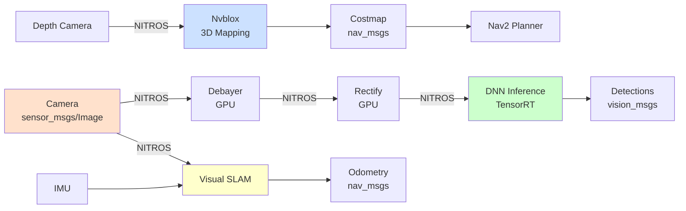

# Chapter 2: Isaac ROS Perception and Planning

## Learning Objectives

1. Implement GPU-accelerated perception with Isaac ROS
2. Deploy visual SLAM for autonomous navigation
3. Integrate motion planning for manipulation tasks




**Figure 2.1**: Isaac ROS perception pipeline showing zero-copy NITROS communication between GPU-accelerated nodes. All image processing stays on GPU for minimal latency.


## 2.1 Isaac ROS Perception

### DNN Inference (TensorRT)

**isaac_ros_dnn_inference**: GPU-accelerated deep learning

**Workflow**:
1. Train model (PyTorch, TensorFlow)
2. Convert to ONNX
3. Optimize with TensorRT (FP16/INT8 quantization)
4. Deploy with Isaac ROS

**Example** (Object Detection):
```python
# Convert PyTorch to ONNX
import torch
model = torch.load('yolov8.pth')
torch.onnx.export(model, dummy_input, 'yolov8.onnx')

# Optimize with TensorRT (command line)
trtexec --onnx=yolov8.onnx --saveEngine=yolov8.engine --fp16
```

**ROS 2 Node**:
```python
from isaac_ros_tensor_rt import TensorRTNode

tensorrt_node = TensorRTNode(
    model_file_path='yolov8.engine',
    engine_file_path='yolov8.engine',
    input_tensor_names=['images'],
    input_binding_names=['images'],
    output_tensor_names=['output0'],
    output_binding_names=['output0']
)
```

**Performance**:
- YOLOv8: 5 FPS (CPU) → 60 FPS (GPU/TensorRT)
- SegFormer: 2 FPS (CPU) → 30 FPS (GPU)

### NITROS (Zero-Copy Messaging)

**Problem**: ROS 2 message serialization overhead (10-50ms latency)

**NITROS**: GPU-to-GPU message passing (no CPU copy)

**Benefits**:
- Lower latency (1-5ms)
- Higher throughput (100+ FPS pipelines)
- Reduced CPU load

**Example**: Camera → Debayer → Rectify → DNN
- Standard ROS 2: 50ms latency
- NITROS: 10ms latency

## 2.2 Isaac ROS Navigation

### Visual SLAM

**isaac_ros_visual_slam**: GPU-accelerated ORB-SLAM3

**Features**:
- Real-time: 30 Hz with 1MP camera
- Stereo or monocular
- Loop closure detection
- Map persistence (save/load)

**Setup**:
```bash
ros2 launch isaac_ros_visual_slam isaac_ros_visual_slam.launch.py
```

**Subscribed Topics**:
- `/camera/image_raw` (sensor_msgs/Image)
- `/camera/camera_info` (sensor_msgs/CameraInfo)
- `/imu` (sensor_msgs/Imu) - optional

**Published Topics**:
- `/visual_slam/tracking/odometry` (nav_msgs/Odometry)
- `/visual_slam/tracking/vo_pose` (geometry_msgs/PoseStamped)
- `/visual_slam/vis/observations_cloud` (sensor_msgs/PointCloud2)

**Use Cases**:
- Indoor navigation without LiDAR
- Drone SLAM (lightweight, visual-only)
- AR/VR tracking

### Nvblox (3D Mapping)

**isaac_ros_nvblox**: GPU voxel hashing for 3D reconstruction

**Features**:
- Real-time mapping (30 Hz with depth camera)
- ESDF (Euclidean Signed Distance Field) for path planning
- Mesh output for visualization

**Pipeline**:
1. Depth camera → Point cloud
2. Nvblox integrates into voxel map
3. ESDF computed on GPU
4. Planner queries ESDF for collision-free paths

**Example**:
```bash
ros2 launch isaac_ros_nvblox isaac_ros_nvblox.launch.py
```

**Integration with Nav2**:
- Nvblox publishes costmap
- Nav2 uses for obstacle avoidance

## 2.3 Isaac ROS Manipulation

### Object Pose Estimation (DOPE)

**DOPE** (Deep Object Pose Estimation): 6-DOF pose from RGB

**Workflow**:
1. Train DOPE on synthetic data (Isaac Sim)
2. Deploy with Isaac ROS on Jetson
3. Get object pose → plan grasp

**Training in Isaac Sim**:
```python
# Generate synthetic data with Replicator
import omni.replicator.core as rep

# Randomize object pose
with rep.trigger.on_frame():
    rep.randomizer.scatter_3d(
        objects=rep.get.prims(path_pattern="/World/Objects/*"),
        surface_prims="/World/Ground",
        check_for_collisions=True
    )
```

**Inference**:
```bash
ros2 launch isaac_ros_dope isaac_ros_dope.launch.py
```

**Output**: `geometry_msgs/PoseStamped` for each detected object

### Motion Planning (cuRobo)

**cuRobo**: GPU-accelerated motion planning

**Features**:
- Trajectory optimization (100-1000x faster than MoveIt)
- Collision checking on GPU
- Multi-arm support

**Example**:
```python
from curobo.wrap.reacher import MotionGenConfig, MotionGen

# Load robot
config = MotionGenConfig.from_urdf("robot.urdf")
motion_gen = MotionGen(config)

# Plan to goal pose
result = motion_gen.plan_single(
    goal_pose=target_pose,
    start_state=current_joint_state
)

# Execute trajectory
for waypoint in result.trajectory:
    robot.set_joint_positions(waypoint)
```

**Performance**: 10ms planning time (vs 100ms+ for OMPL/MoveIt)

## Exercises

**Exercise 2.1**: TensorRT Model Conversion Pipeline
- Train a simple object detection model (YOLOv8 or MobileNet-SSD) on COCO dataset
- Convert model from PyTorch → ONNX → TensorRT engine
- Benchmark inference speed (FP32, FP16, INT8) on target hardware
- Document accuracy vs speed tradeoffs

**Exercise 2.2**: NITROS Performance Analysis
- Set up a perception pipeline: Camera → Debayer → Rectify → DNN Inference
- Measure latency with standard ROS 2 messages vs NITROS
- Profile CPU/GPU usage with both approaches
- Create performance comparison chart

**Exercise 2.3**: Visual SLAM Deployment
- Deploy Isaac ROS Visual SLAM on a mobile robot or test rig
- Collect odometry data while navigating a structured environment
- Evaluate drift over time and loop closure performance
- Compare with wheel odometry and sensor fusion results

**Exercise 2.4**: cuRobo Motion Planning
- Set up cuRobo for a robotic arm (e.g., UR5, Franka Emika)
- Define collision geometry for workspace obstacles
- Plan trajectories to 10 random goal poses
- Measure planning time and compare with OMPL/MoveIt

## Summary

**Perception**: TensorRT for DNN inference, NITROS for zero-copy, 10-100x speedup
**Navigation**: Visual SLAM (30 Hz), Nvblox (real-time 3D mapping), Nav2 integration
**Manipulation**: DOPE (6-DOF pose), cuRobo (GPU motion planning)

**Next**: Chapter 3 covers sim-to-real transfer strategies with Isaac Sim.
