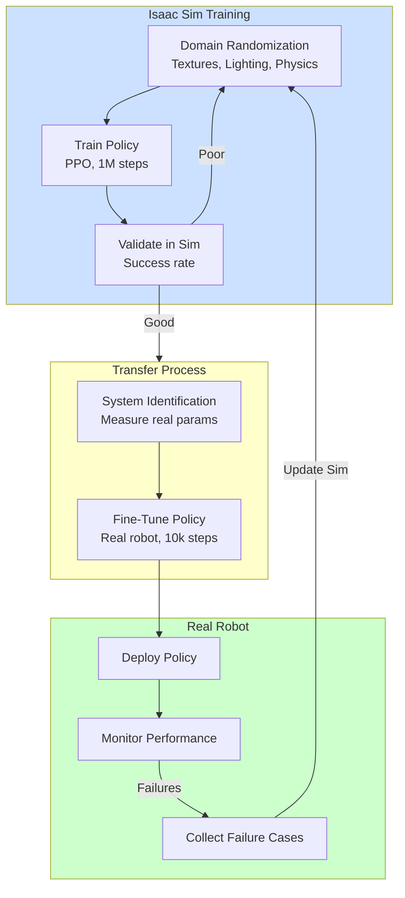

# Chapter 3: Sim-to-Real Transfer

## Learning Objectives

1. Apply domain randomization techniques in Isaac Sim
2. Conduct system identification workflows
3. Implement transfer learning strategies for robot policies




**Figure 3.1**: Sim-to-real workflow showing iterative process: train in simulation with domain randomization, transfer to real robot with system ID and fine-tuning, monitor performance and update simulation based on failures.


## 3.1 Domain Randomization in Isaac Sim

### Visual Randomization

**Randomize Textures**:
```python
import omni.replicator.core as rep

# Randomize object materials
with rep.trigger.on_frame():
    rep.randomizer.materials(
        objects=rep.get.prims(path_pattern="/World/Objects/*"),
        materials=rep.utils.get_materials("materials/"),
        project_uvw=True
    )
```

**Randomize Lighting**:
```python
# Random light positions and intensities
with rep.trigger.on_frame():
    rep.randomizer.light(
        lights=rep.get.prims(semantics=[("class", "light")]),
        intensity=(500, 3000),
        temperature=(2500, 7500),
        position=((-10, 10), (2, 5), (-10, 10))
    )
```

**Camera Randomization**:
```python
# Random camera pose, FOV, exposure
with rep.trigger.on_frame():
    rep.randomizer.camera(
        cameras=rep.get.prims(semantics=[("class", "camera")]),
        focal_length=(18, 85),  # mm
        f_stop=(1.4, 16),
        focus_distance=(0.5, 10)
    )
```

### Physics Randomization

**Object Properties**:
```python
from omni.isaac.core.utils.prims import get_prim_at_path
from pxr import UsdPhysics

cube_prim = get_prim_at_path("/World/Cube")
physics_api = UsdPhysics.RigidBodyAPI.Apply(cube_prim)

# Randomize mass
import random
mass = random.uniform(0.05, 0.15)  # kg
physics_api.CreateMassAttr(mass)
```

**Friction**:
```python
physics_material = UsdPhysics.MaterialAPI.Apply(cube_prim)
physics_material.CreateStaticFrictionAttr(random.uniform(0.3, 0.9))
physics_material.CreateDynamicFrictionAttr(random.uniform(0.2, 0.8))
```

**Joint Dynamics**:
```python
# Randomize joint damping/stiffness
joint = robot.get_articulation().get_joints_by_name("elbow_joint")[0]
joint.set_joint_damping(random.uniform(0.1, 1.0))
joint.set_joint_stiffness(random.uniform(50, 200))
```

### Structured Randomization

**Curriculum Learning**: Progressively harder randomization

```python
class DomainRandomizer:
    def __init__(self, difficulty=0.0):
        self.difficulty = difficulty  # 0.0 (easy) to 1.0 (hard)

    def randomize_mass(self, nominal_mass):
        variation = 0.05 + 0.45 * self.difficulty  # 5% to 50% variation
        return nominal_mass * random.uniform(1 - variation, 1 + variation)

    def randomize_friction(self):
        if self.difficulty < 0.5:
            return random.uniform(0.6, 0.9)  # Easy: high friction
        else:
            return random.uniform(0.1, 0.9)  # Hard: full range

# Increase difficulty during training
randomizer = DomainRandomizer(difficulty=0.0)
for epoch in range(100):
    randomizer.difficulty = min(1.0, epoch / 100.0)
    # Train policy with current difficulty
```

## 3.2 System Identification Workflows

### Parameter Estimation

**Workflow**:
1. Run experiments on real robot (collect data)
2. Fit simulation parameters to match observations
3. Validate: Run same experiment in sim, compare

**Example** (Friction Identification):

**Step 1**: Real robot data collection
```python
# Apply known torques, measure joint velocities
torques = [0.1, 0.2, 0.3, 0.5, 1.0]  # N·m
measured_velocities = []  # rad/s

for torque in torques:
    robot.apply_joint_torque("elbow", torque)
    time.sleep(1.0)  # Let reach steady state
    vel = robot.get_joint_velocity("elbow")
    measured_velocities.append(vel)
```

**Step 2**: Simulation parameter fitting
```python
import numpy as np
from scipy.optimize import minimize

def simulate_joint(friction_coeff, torque):
    # Simple friction model: torque = friction * velocity
    # At steady state: applied_torque = friction * velocity
    return torque / friction_coeff

def error_function(friction_coeff):
    errors = []
    for i, torque in enumerate(torques):
        sim_vel = simulate_joint(friction_coeff, torque)
        real_vel = measured_velocities[i]
        errors.append((sim_vel - real_vel) ** 2)
    return np.mean(errors)

# Optimize
result = minimize(error_function, x0=0.1, bounds=[(0.01, 1.0)])
optimal_friction = result.x[0]
```

**Step 3**: Update Isaac Sim
```python
joint.set_joint_damping(optimal_friction)
```

### Automated Calibration

**Loop**: Real robot → Sim → Compare → Adjust

```python
class SystemIDWorkflow:
    def __init__(self, real_robot, sim_robot):
        self.real = real_robot
        self.sim = sim_robot

    def run_experiment(self, commands):
        # Run on real robot
        real_data = self.real.execute(commands)
        # Run in sim
        sim_data = self.sim.execute(commands)
        return real_data, sim_data

    def calibrate(self, param_ranges, n_iterations=10):
        best_params = None
        best_error = float('inf')

        for i in range(n_iterations):
            # Sample parameters
            params = {k: random.uniform(*v) for k, v in param_ranges.items()}
            self.sim.set_parameters(params)

            # Run experiments
            real_data, sim_data = self.run_experiment(test_commands)

            # Compute error
            error = np.linalg.norm(real_data - sim_data)

            if error < best_error:
                best_error = error
                best_params = params

        return best_params
```

## 3.3 Transfer Learning Strategies

### Pre-training in Simulation

**Workflow**:
1. Train policy in Isaac Sim (millions of samples)
2. Fine-tune on real robot (1000s of samples)
3. Deploy

**Example** (Grasping):
```python
# 1. Train in simulation
policy = PPO("MlpPolicy", env=isaac_sim_env)
policy.learn(total_timesteps=1_000_000)
policy.save("policy_sim.zip")

# 2. Fine-tune on real robot
policy = PPO.load("policy_sim.zip")
policy.set_env(real_robot_env)
policy.learn(total_timesteps=10_000)  # Fine-tune
policy.save("policy_real.zip")
```

**Advantages**:
- Leverage sim for exploration
- Real robot data only for final polish
- Faster convergence (warm start from sim)

### Sim-to-Real Adaptation

**Progressive Networks**: Separate columns for sim and real
```python
class ProgressivePolicy(nn.Module):
    def __init__(self):
        self.sim_column = nn.Sequential(...)  # Frozen after sim training
        self.real_column = nn.Sequential(...)  # Trainable

    def forward(self, state):
        sim_features = self.sim_column(state)
        real_features = self.real_column(state)
        combined = torch.cat([sim_features, real_features], dim=-1)
        return self.policy_head(combined)
```

**Domain Adversarial Training**: Learn domain-invariant features
```python
# Discriminator predicts sim vs real
discriminator = DomainClassifier(input_dim=128)

# Policy learns to fool discriminator
policy_loss = task_loss - 0.1 * discriminator_loss
```

### Residual Learning

**Idea**: Policy = Sim policy + Residual (learned on real robot)

```python
class ResidualPolicy:
    def __init__(self, sim_policy_path):
        self.sim_policy = load_policy(sim_policy_path)
        self.sim_policy.freeze()  # Don't update

        self.residual = nn.Sequential(
            nn.Linear(obs_dim, 128),
            nn.ReLU(),
            nn.Linear(128, action_dim)
        )

    def get_action(self, obs):
        sim_action = self.sim_policy(obs)
        residual = self.residual(obs)
        return sim_action + 0.1 * residual  # Small correction
```

**Train**: Only `residual` on real robot, keep `sim_policy` frozen

**Advantages**:
- Sim policy handles coarse behavior
- Residual corrects for sim-to-real gap
- Safer (residual bounded)

## Exercises

**Exercise 3.1**: Visual Domain Randomization for Object Detection
- Create an Isaac Sim scene with 10 household objects
- Implement texture, lighting, and camera randomization with Replicator
- Generate 5000 synthetic images with bounding box annotations
- Train YOLOv8 on synthetic data and test on real images

**Exercise 3.2**: Physics Parameter Identification
- Set up a simple pendulum in both Isaac Sim and real hardware
- Apply known torques and measure joint velocities on real system
- Use optimization to fit simulation parameters (damping, friction)
- Validate by comparing real and sim trajectories

**Exercise 3.3**: Curriculum-Based Domain Randomization
- Implement a curriculum randomizer for a robot grasping task
- Start with minimal randomization (5% mass variation, high friction)
- Progressively increase difficulty over training epochs
- Plot success rate vs difficulty level

**Exercise 3.4**: Residual Policy Learning
- Train a base policy for robot navigation in Isaac Sim (1M steps)
- Fine-tune with residual learning on real robot (10k steps)
- Compare performance with: (a) sim-only, (b) real-only, (c) residual approach
- Analyze which behaviors come from sim vs residual

## Summary

**Domain Randomization**: Visual (textures, lighting), physics (mass, friction), curriculum learning
**System ID**: Parameter estimation from real data, automated calibration loops
**Transfer Learning**: Pre-training in sim, progressive networks, residual policies

**Next**: Chapter 4 covers control loops with RL and imitation learning in Isaac.
