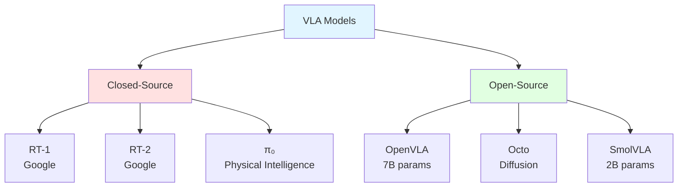

# Chapter 1: VLA Fundamentals

## Learning Objectives

1. Understand Vision-Language-Action (VLA) models and their role in robotics
2. Grasp transformer architectures adapted for multimodal robot learning
3. Compare training paradigms: imitation learning, RL, and hybrid approaches

## 1.1 Vision-Language-Action Models

### What are VLA Models?

**Vision-Language-Action (VLA)** models are foundation models that map visual observations and natural language instructions to robot actions.

**Core Capability**: "Pick up the red mug" + camera image → gripper motion

**Key Innovation**: Generalization across tasks, objects, and environments without task-specific retraining.

### Historical Context

**2017-2020**: Task-specific policies
- Separate models for grasping, navigation, manipulation
- Trained from scratch per task (100k+ demonstrations)

**2021-2022**: Language-conditioned policies
- CLIPort (2021): Language + vision for pick-and-place
- BC-Z (2022): Multi-task behavior cloning with language goals

**2023-Present**: Foundation models for robotics
- RT-1 (2023): 130k demonstrations, 700 tasks
- RT-2 (2023): Vision-language model → robot actions
- OpenVLA (2024): Open-source 7B parameter VLA
- π₀ (Pi-Zero, 2024): Generalist robot policy

### Key Research Papers

1. **RT-1** (Brohan et al., 2023): "RT-1: Robotics Transformer for Real-World Control at Scale"
   - Transformer for robot control (not just vision/language)
   - 130k robot trajectories across 700 tasks
   - 97% success on seen tasks, 62% on novel tasks

2. **RT-2** (Brohan et al., 2023): "RT-2: Vision-Language-Action Models Transfer Web Knowledge to Robotic Control"
   - Pretrained vision-language model (PaLI-X) → robot actions
   - Leverages internet-scale vision-language data
   - Emergent capabilities: reasoning about object properties, physics

3. **OpenVLA** (Kim et al., 2024): "OpenVLA: An Open-Source Vision-Language-Action Model"
   - 7B parameter model trained on Open X-Embodiment dataset
   - 970k robot trajectories, 22 robot platforms
   - Apache 2.0 license (commercial-friendly)

4. **Octo** (Ghosh et al., 2024): "Octo: An Open-Source Generalist Robot Policy"
   - Diffusion-based action prediction
   - 800k trajectories from 9 robot types
   - Fine-tunes with `<1000` demonstrations

### VLA Model Taxonomy



**Figure 1.1**: VLA model landscape showing closed-source (industry) and open-source (academic/community) approaches.

## 1.2 Transformer Architectures for Robotics

### From Language to Actions

**Standard Transformer** (BERT, GPT):
- Input: Text tokens
- Output: Text tokens (next word prediction)

**VLA Transformer**:
- Input: Image tokens + language tokens + proprioception (joint angles, gripper state)
- Output: Action tokens (joint velocities, gripper commands)

### Architecture Components

**1. Vision Encoder**:
```python
from transformers import AutoImageProcessor, AutoModel

# Vision Transformer (ViT) for image encoding
processor = AutoImageProcessor.from_pretrained("google/vit-base-patch16-224")
vision_encoder = AutoModel.from_pretrained("google/vit-base-patch16-224")

# Process camera image
image_tokens = vision_encoder(pixel_values=processor(images, return_tensors="pt").pixel_values)
# Output: (batch, 196, 768) - 196 patches, 768-dim embeddings
```

**2. Language Encoder**:
```python
from transformers import AutoTokenizer, AutoModel

# T5 for language encoding
tokenizer = AutoTokenizer.from_pretrained("google/t5-v1_1-base")
language_encoder = AutoModel.from_pretrained("google/t5-v1_1-base")

# Encode instruction
instruction = "Pick up the red cup"
language_tokens = language_encoder(**tokenizer(instruction, return_tensors="pt"))
# Output: (batch, seq_len, 768)
```

**3. Multimodal Fusion**:
```python
import torch
import torch.nn as nn

class MultimodalFusion(nn.Module):
    def __init__(self, dim=768):
        super().__init__()
        self.cross_attention = nn.MultiheadAttention(dim, num_heads=12)
        self.norm = nn.LayerNorm(dim)

    def forward(self, image_tokens, language_tokens):
        # Cross-attention: language queries, image keys/values
        fused, _ = self.cross_attention(
            query=language_tokens,
            key=image_tokens,
            value=image_tokens
        )
        return self.norm(fused + language_tokens)  # Residual connection
```

**4. Action Head**:
```python
class ActionHead(nn.Module):
    def __init__(self, input_dim=768, action_dim=7):
        super().__init__()
        self.head = nn.Sequential(
            nn.Linear(input_dim, 256),
            nn.ReLU(),
            nn.Linear(256, action_dim)
        )

    def forward(self, fused_tokens):
        # Pool tokens (mean or CLS token)
        pooled = fused_tokens.mean(dim=1)  # (batch, 768)
        actions = self.head(pooled)  # (batch, 7) - e.g., 6-DOF arm + gripper
        return actions
```

### Full VLA Forward Pass

```python
class SimpleVLA(nn.Module):
    def __init__(self):
        super().__init__()
        self.vision_encoder = AutoModel.from_pretrained("google/vit-base-patch16-224")
        self.language_encoder = AutoModel.from_pretrained("google/t5-v1_1-base")
        self.fusion = MultimodalFusion(dim=768)
        self.action_head = ActionHead(input_dim=768, action_dim=7)

    def forward(self, images, instructions, proprioception=None):
        # Encode vision
        image_tokens = self.vision_encoder(pixel_values=images).last_hidden_state

        # Encode language
        language_tokens = self.language_encoder(**instructions).last_hidden_state

        # Fuse modalities
        fused = self.fusion(image_tokens, language_tokens)

        # Predict actions
        actions = self.action_head(fused)

        return actions  # (batch, action_dim)
```

### Attention Mechanisms

**Self-Attention** (within modality):
- Vision: Spatial relationships between image patches
- Language: Dependencies between words

**Cross-Attention** (across modalities):
- Language queries image: "Where is the red cup?"
- Image queries language: "What object am I looking at?"

**Causal Attention** (for autoregressive action prediction):
- Action at time `t` depends only on past actions (t-1, t-2, ...)
- Prevents "looking into the future" during training

## 1.3 Training Paradigms

### Imitation Learning (Behavior Cloning)

**Objective**: Learn policy π(a|s, g) from expert demonstrations

**Data**: (observation, language goal, action) tuples
- Example: (image of table, "pick up cup", gripper_close)

**Loss Function** (supervised learning):
```python
import torch.nn.functional as F

def imitation_loss(predicted_actions, expert_actions):
    # Mean squared error for continuous actions
    return F.mse_loss(predicted_actions, expert_actions)
```

**Advantages**:
- Simple to implement
- Stable training (no exploration needed)
- Leverages human expertise

**Disadvantages**:
- Requires large demonstration datasets (10k-1M)
- Distributional shift: Policy sees states expert never visited
- No error correction (drift accumulates)

### Reinforcement Learning

**Objective**: Maximize cumulative reward ∑ γᵗ r(sₜ, aₜ)

**Environment**: Robot simulator or real hardware
**Reward**: Task success (1.0) or failure (0.0), shaped rewards

**Example** (PPO training loop):
```python
from stable_baselines3 import PPO

# VLA policy wrapped for RL
policy = VLAPolicyWrapper(vla_model)

# PPO trainer
agent = PPO("MultiInputPolicy", env, policy=policy, verbose=1)

# Train
agent.learn(total_timesteps=1_000_000)
```

**Advantages**:
- Learns from trial and error (no demonstrations needed)
- Optimizes directly for task success
- Handles novel states via exploration

**Disadvantages**:
- Sample inefficient (millions of steps)
- Sim-to-real gap (simulator ≠ reality)
- Reward engineering challenging

### Hybrid: Pretrain + Fine-tune

**Best of both worlds**:
1. **Pretrain** with imitation learning on large dataset (100k-1M demos)
2. **Fine-tune** with RL on specific task (1k-10k steps)

**Workflow**:
```python
# Step 1: Pretrain on demonstrations
vla_model.train_behavior_cloning(demo_dataset, epochs=100)

# Step 2: Fine-tune with RL
vla_policy = VLAPolicyWrapper(vla_model)
ppo = PPO("MultiInputPolicy", env, policy=vla_policy)
ppo.learn(total_timesteps=10_000)  # Much faster than RL from scratch
```

**Example**: RT-2 pretrained on web data (vision-language), fine-tuned on robot tasks

### Training Data Sources

**Open X-Embodiment Dataset** (2023):
- 1M+ robot trajectories
- 22 robot types (arms, mobile manipulators, quadrupeds)
- 527 skills across diverse tasks
- CC BY 4.0 license

**Key Datasets**:
- **Bridge V2**: 60k trajectories, kitchen tasks
- **FrankaPlay**: 50k trajectories, Franka Emika arm
- **DROID**: 76k trajectories, 564 skills
- **Language-Table**: Simulated tabletop manipulation

## Exercises

**Exercise 1.1**: VLA Model Paper Review
- Read RT-2 paper (Brohan et al., 2023)
- Summarize: (a) Architecture, (b) Training data, (c) Emergent capabilities
- Compare with RT-1: What changed? Why does it generalize better?

**Exercise 1.2**: Transformer Forward Pass
- Implement a minimal VLA model using the code above
- Input: 224x224 image + "pick up cup" instruction
- Output: 7-dim action (6-DOF pose + gripper)
- Count total parameters and estimate FLOPs

**Exercise 1.3**: Imitation Learning Baseline
- Load the Bridge V2 dataset (or subset)
- Train behavior cloning model (ViT + T5 + action head)
- Evaluate on held-out tasks
- Plot training loss and validation success rate

**Exercise 1.4**: Hybrid Training Experiment
- Train baseline: (a) BC only, (b) RL only, (c) BC → RL fine-tuning
- Compare sample efficiency (timesteps to 80% success)
- Analyze which approach works best for your task

## Summary

**VLA Models**: Foundation models mapping vision + language → actions, enabling generalization across tasks
**Transformers for Robotics**: ViT (vision) + T5 (language) + cross-attention (fusion) + action head
**Training Paradigms**: Imitation learning (simple, stable), RL (optimal, sample-intensive), hybrid (best results)

**Next**: Chapter 2 covers RT-2, OpenVLA, and SmolVLA architectures and deployment.
