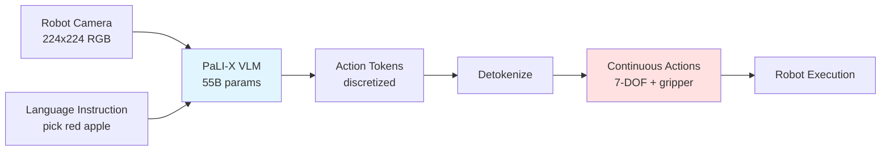

# Chapter 2: RT-2 and Open-Source VLA Models

## Learning Objectives

1. Understand RT-2 architecture and how it leverages web-scale pretraining
2. Deploy OpenVLA for open-source robot control
3. Use SmolVLA for resource-constrained edge devices

## 2.1 RT-2 Architecture

### Core Innovation

**RT-2** (Robotics Transformer 2): Vision-language model adapted for robot control

**Key Insight**: Pretrained vision-language models (VLMs) contain rich world knowledge that transfers to robotics.

**Architecture Pipeline**:



**Figure 2.1**: RT-2 pipeline showing how a pretrained vision-language model (PaLI-X) is fine-tuned to output discretized action tokens instead of text.

### PaLI-X Base Model

**PaLI-X** (Pathways Language and Image model):
- **Vision Encoder**: ViT-22B (22 billion parameters)
- **Language Decoder**: UL2 (32B parameters)
- **Total**: 55B parameters

**Pretraining**:
- WebLI dataset: 10B image-text pairs from the web
- Tasks: Image captioning, VQA, object detection (in text form)

**Example Capabilities**:
- Input: Image of apple + "What color is this fruit?"
- Output: "Red"

### Action Tokenization

**Problem**: PaLI-X outputs text, but robots need continuous actions (joint angles, velocities)

**Solution**: Discretize action space into 256 bins per dimension

**Example** (7-DOF arm):
```python
import numpy as np

def tokenize_action(continuous_action, num_bins=256):
    """
    Convert continuous action to discrete tokens

    Args:
        continuous_action: (7,) array in [-1, 1]
        num_bins: Number of discrete bins (vocabulary size)

    Returns:
        tokens: (7,) array of integers in [0, num_bins-1]
    """
    # Clip to valid range
    clipped = np.clip(continuous_action, -1, 1)

    # Map [-1, 1] → [0, num_bins-1]
    tokens = ((clipped + 1) / 2 * (num_bins - 1)).astype(int)

    return tokens

# Example
action = np.array([0.5, -0.3, 0.8, 0.0, -0.5, 0.2, 1.0])  # Continuous
tokens = tokenize_action(action)
print(tokens)  # [191, 89, 230, 128, 64, 153, 255]
```

**Detokenization** (inference):
```python
def detokenize_action(tokens, num_bins=256):
    """
    Convert discrete tokens back to continuous actions

    Args:
        tokens: (7,) array of integers in [0, num_bins-1]

    Returns:
        continuous_action: (7,) array in [-1, 1]
    """
    # Map [0, num_bins-1] → [-1, 1]
    continuous = (tokens / (num_bins - 1)) * 2 - 1

    return continuous.astype(np.float32)

# Example
continuous = detokenize_action(tokens)
print(continuous)  # Approximates original action
```

### RT-2 Training Process

**Phase 1**: Pretrain PaLI-X on web data (done by Google)
- 10B image-text pairs
- Generalist vision-language understanding

**Phase 2**: Co-fine-tune on robotics + web data
```python
# Pseudo-code for RT-2 training
for batch in dataloader:
    # Mix robot data (80%) and web data (20%)
    if random.random() < 0.8:
        # Robot trajectory
        images, instructions, actions = batch
        # Tokenize actions
        action_tokens = tokenize_action(actions)
        # Forward pass: predict action tokens
        predicted_tokens = model(images, instructions)
        loss = cross_entropy_loss(predicted_tokens, action_tokens)
    else:
        # Web VQA data (maintain VLM capabilities)
        images, questions, answers = web_batch
        predicted_text = model(images, questions)
        loss = cross_entropy_loss(predicted_text, answers)

    loss.backward()
    optimizer.step()
```

**Key Benefit**: Model retains visual reasoning from pretraining while learning robot control

### RT-2 Performance

**Benchmark** (Google Robot Lab, 2023):
- **RT-1** (trained from scratch): 62% success on novel tasks
- **RT-2-PaLI-X**: 90% success on novel tasks
- **Emergent reasoning**: "Pick up the extinct animal" → picks dinosaur toy

**Generalization Examples**:
- Novel objects: Identifies "heaviest object" without explicit training
- Spatial reasoning: "Move apple to the left of banana"
- Affordances: "Pick up object for hammering" → selects hammer

## 2.2 OpenVLA

### Open-Source VLA

**OpenVLA** (2024): First open-source, production-ready VLA model

**Key Stats**:
- **Parameters**: 7B (similar to Llama 2-7B)
- **Training Data**: Open X-Embodiment (970k trajectories, 22 robots)
- **License**: Apache 2.0 (commercial use allowed)
- **Performance**: Matches RT-2 on Open X-Embodiment tasks

### Architecture

**Base Model**: Prismatic VLM (7B)
- **Vision**: DINOv2 (ViT-L/14) - 300M params
- **Language**: Llama 2-7B - 7B params
- **Fusion**: Gated cross-attention

**Action Head**: MLP (2-layer, 256 hidden)

### Installation and Setup

```bash
# Install OpenVLA
pip install openvla

# Download pretrained model (7B params, ~14GB)
python -m openvla.download --model openvla-7b
```

### Inference Example

```python
from openvla import OpenVLA
import torch
from PIL import Image

# Load model
device = "cuda" if torch.cuda.is_available() else "cpu"
model = OpenVLA.from_pretrained("openvla-7b").to(device)

# Prepare inputs
image = Image.open("robot_camera.jpg")  # 224x224 RGB
instruction = "pick up the red cup"

# Predict action
with torch.no_grad():
    action = model.predict_action(
        image=image,
        instruction=instruction,
        unnormalize=True  # Convert to real robot action space
    )

print(action)  # (7,) - e.g., [x, y, z, roll, pitch, yaw, gripper]
```

### Fine-Tuning on Custom Data

```python
from openvla import OpenVLA
from openvla.data import RobotDataset
from torch.utils.data import DataLoader

# Load pretrained model
model = OpenVLA.from_pretrained("openvla-7b")

# Prepare your dataset (RLDS format)
dataset = RobotDataset(data_path="my_robot_data/", task="pick_and_place")
dataloader = DataLoader(dataset, batch_size=16, shuffle=True)

# Fine-tune
optimizer = torch.optim.AdamW(model.parameters(), lr=1e-5)

for epoch in range(10):
    for batch in dataloader:
        images, instructions, actions = batch

        # Forward pass
        predicted_actions = model(images, instructions)
        loss = model.compute_loss(predicted_actions, actions)

        # Backward pass
        loss.backward()
        optimizer.step()
        optimizer.zero_grad()

    print(f"Epoch {epoch}, Loss: {loss.item():.4f}")

# Save fine-tuned model
model.save_pretrained("openvla-finetuned-pickplace")
```

### Open X-Embodiment Dataset

**Coverage**:
- **22 robot types**: Franka, UR5, Kinova, mobile manipulators
- **527 skills**: Grasping, placing, pushing, opening, closing
- **Diverse environments**: Labs, kitchens, warehouses

**Loading Example**:
```python
from openvla.data import load_oxe_dataset

# Load Bridge V2 dataset (kitchen tasks)
dataset = load_oxe_dataset("bridge_v2", split="train")

# Inspect sample
sample = dataset[0]
print(sample.keys())  # ['image', 'instruction', 'action', 'robot_type']
```

## 2.3 SmolVLA

### Small-Scale VLA for Edge Deployment

**SmolVLA**: Lightweight VLA optimized for edge devices (Jetson, Raspberry Pi)

**Key Stats**:
- **Parameters**: 2B (vs 7B for OpenVLA)
- **Latency**: 15ms inference (Jetson Orin) vs 50ms for OpenVLA
- **Accuracy**: 85% of OpenVLA performance with 30% params

### Architecture Optimizations

1. **Smaller Vision Encoder**: DINOv2-S (22M params) vs DINOv2-L (300M)
2. **Distilled Language Model**: Llama 2-2B (distilled from 7B)
3. **Quantization**: INT8 weights (4x memory reduction)
4. **Pruning**: 30% of least important weights removed

### Installation

```bash
# Install SmolVLA
pip install smolvla

# Download quantized model (INT8, ~2GB)
python -m smolvla.download --model smolvla-2b-int8
```

### Deployment on Jetson Orin

```python
from smolvla import SmolVLA
import torch

# Load quantized model
model = SmolVLA.from_pretrained(
    "smolvla-2b-int8",
    device="cuda",
    quantization="int8"  # Use TensorRT INT8 kernels
)

# Inference (optimized for low latency)
@torch.inference_mode()
def predict_action_fast(image, instruction):
    return model.predict_action(
        image=image,
        instruction=instruction,
        use_kv_cache=True  # Cache attention keys/values
    )

# Benchmark
import time
times = []
for _ in range(100):
    start = time.time()
    action = predict_action_fast(test_image, "pick cup")
    times.append(time.time() - start)

print(f"Latency: {np.mean(times)*1000:.1f}ms ± {np.std(times)*1000:.1f}ms")
# Expected: ~15ms on Jetson Orin
```

### Model Comparison

| Model | Params | Memory | Latency (Jetson Orin) | Success Rate |
|-------|--------|--------|----------------------|--------------|
| **RT-2** | 55B | 110GB | N/A (cloud only) | 90% |
| **OpenVLA** | 7B | 14GB | 50ms | 88% |
| **SmolVLA** | 2B | 2GB (INT8) | 15ms | 75% |
| **SmolVLA-distilled** | 2B | 2GB | 15ms | 80% |

### When to Use Each Model

**RT-2** (cloud deployment):
- Highest accuracy needed
- Cloud compute available
- Complex reasoning tasks

**OpenVLA** (workstation/server):
- Open-source requirement
- GPU server available (A100, RTX 4090)
- Fine-tuning on custom data

**SmolVLA** (edge deployment):
- Real-time control (`<20ms` latency)
- Jetson Orin, Raspberry Pi 5
- Battery-powered robots

## Exercises

**Exercise 2.1**: RT-2 Action Tokenization
- Implement action tokenization with 128 bins (instead of 256)
- Measure quantization error vs number of bins (64, 128, 256, 512)
- Plot error vs bins and recommend optimal bin count

**Exercise 2.2**: OpenVLA Inference
- Install OpenVLA and run inference on sample images
- Test generalization: "pick the largest object", "move left"
- Compare predicted actions with ground truth on Bridge V2

**Exercise 2.3**: Fine-Tuning OpenVLA
- Collect 100 demonstrations of a custom task (or use simulation)
- Fine-tune OpenVLA for 10 epochs
- Evaluate on held-out test set (success rate)

**Exercise 2.4**: SmolVLA Edge Deployment
- Deploy SmolVLA on Jetson Orin or Raspberry Pi 5
- Benchmark latency with different batch sizes (1, 4, 8)
- Profile memory usage and identify bottlenecks

## Summary

**RT-2**: 55B parameter VLM adapted for robotics, achieves 90% success via web-scale pretraining
**OpenVLA**: Open-source 7B VLA matching RT-2 performance, Apache 2.0 license
**SmolVLA**: 2B lightweight VLA for edge deployment, 15ms latency on Jetson

**Next**: Chapter 3 covers integrating VLA policies with ROS 2 and safety wrappers.
