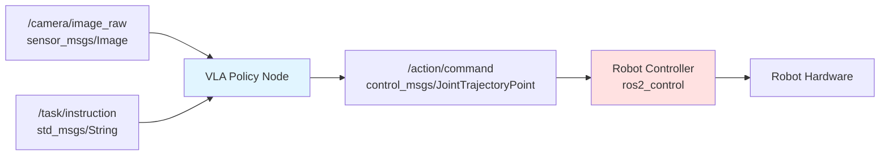

# Chapter 3: Policy Integration

## Learning Objectives

1. Integrate VLA policies with ROS 2 robot systems
2. Implement safety wrappers for collision avoidance and workspace limits
3. Address real-world deployment challenges (latency, failure modes, monitoring)

## 3.1 Policy-to-Robot Interface

### Action Space Design

**VLA Output**: Normalized actions in [-1, 1] per dimension

**Robot Input**: Task-specific action spaces

**Common Action Spaces**:

1. **End-Effector Pose (6-DOF + Gripper)**:
   ```python
   action = [x, y, z, roll, pitch, yaw, gripper_state]  # (7,)
   # x, y, z: Position in meters (workspace frame)
   # roll, pitch, yaw: Orientation in radians
   # gripper_state: 0 = open, 1 = closed
   ```

2. **Joint Velocities** (7-DOF arm):
   ```python
   action = [j1_vel, j2_vel, ..., j7_vel, gripper_vel]  # (8,)
   # Joint velocities in rad/s
   ```

3. **Delta End-Effector** (relative motion):
   ```python
   action = [dx, dy, dz, droll, dpitch, dyaw, gripper]  # (7,)
   # Small incremental changes (e.g., ±5cm, ±10°)
   ```

### Action Denormalization

**Mapping [-1, 1] → Real Units**:

```python
import numpy as np

class ActionDenormalizer:
    def __init__(self, action_space):
        """
        Args:
            action_space: Dict with 'low' and 'high' bounds

        Example:
            action_space = {
                'low': np.array([-0.5, -0.5, 0.0, -3.14, -1.57, -3.14, 0.0]),
                'high': np.array([0.5, 0.5, 0.5, 3.14, 1.57, 3.14, 1.0])
            }
        """
        self.low = np.array(action_space['low'])
        self.high = np.array(action_space['high'])

    def denormalize(self, normalized_action):
        """
        Convert [-1, 1] → [low, high]

        Args:
            normalized_action: (n,) array in [-1, 1]

        Returns:
            real_action: (n,) array in [low, high]
        """
        # Clip to [-1, 1]
        clipped = np.clip(normalized_action, -1, 1)

        # Linear mapping
        real_action = self.low + (clipped + 1) / 2 * (self.high - self.low)

        return real_action

# Example usage
action_space = {
    'low': np.array([-0.5, -0.5, 0.0, -3.14, -1.57, -3.14, 0.0]),
    'high': np.array([0.5, 0.5, 0.5, 3.14, 1.57, 3.14, 1.0])
}
denormalizer = ActionDenormalizer(action_space)

# VLA output
vla_action = np.array([0.2, -0.5, 0.8, 0.0, 0.3, -0.1, 1.0])

# Denormalize
robot_action = denormalizer.denormalize(vla_action)
print(robot_action)
# [0.1, -0.375, 0.4, 0.0, -0.314, 2.984, 1.0]
```

### ROS 2 Policy Node

**Architecture**:



**Figure 3.1**: ROS 2 integration showing VLA policy node consuming camera and instruction topics, publishing action commands to robot controller.

**Implementation**:

```python
import rclpy
from rclpy.node import Node
from sensor_msgs.msg import Image
from std_msgs.msg import String
from control_msgs.msg import JointTrajectoryPoint
from cv_bridge import CvBridge
import torch
from openvla import OpenVLA

class VLAPolicyNode(Node):
    def __init__(self):
        super().__init__('vla_policy_node')

        # Load VLA model
        self.model = OpenVLA.from_pretrained("openvla-7b").to("cuda")
        self.model.eval()

        # ROS utilities
        self.bridge = CvBridge()
        self.current_image = None
        self.current_instruction = "pick up the cup"  # Default

        # Subscribers
        self.image_sub = self.create_subscription(
            Image,
            '/camera/image_raw',
            self.image_callback,
            10
        )
        self.instruction_sub = self.create_subscription(
            String,
            '/task/instruction',
            self.instruction_callback,
            10
        )

        # Publisher
        self.action_pub = self.create_publisher(
            JointTrajectoryPoint,
            '/action/command',
            10
        )

        # Policy loop (10 Hz)
        self.timer = self.create_timer(0.1, self.policy_loop)

        self.get_logger().info("VLA Policy Node started")

    def image_callback(self, msg):
        # Convert ROS Image to OpenCV format
        self.current_image = self.bridge.imgmsg_to_cv2(msg, desired_encoding='rgb8')

    def instruction_callback(self, msg):
        self.current_instruction = msg.data
        self.get_logger().info(f"New instruction: {self.current_instruction}")

    def policy_loop(self):
        if self.current_image is None:
            return

        # Predict action
        with torch.no_grad():
            action = self.model.predict_action(
                image=self.current_image,
                instruction=self.current_instruction,
                unnormalize=True
            )

        # Publish action
        msg = JointTrajectoryPoint()
        msg.positions = action[:7].tolist()  # Joint positions or EE pose
        msg.time_from_start.sec = 0
        msg.time_from_start.nanosec = 100_000_000  # 100ms

        self.action_pub.publish(msg)

def main(args=None):
    rclpy.init(args=args)
    node = VLAPolicyNode()
    rclpy.spin(node)
    node.destroy_node()
    rclpy.shutdown()

if __name__ == '__main__':
    main()
```

### Control Frequencies

**Policy Frequency**: 10 Hz (typical for VLA models)
- Inference time: 20-50ms (OpenVLA on GPU)
- Remaining budget: 50-80ms for processing

**Robot Control Frequency**: 100-1000 Hz (joint-level control)
- High-level commands (10 Hz) → Low-level tracking (1000 Hz)

**Bridging Frequencies**:
```python
class FrequencyBridge:
    def __init__(self, policy_hz=10, control_hz=1000):
        self.policy_hz = policy_hz
        self.control_hz = control_hz
        self.steps_per_action = control_hz // policy_hz  # 100 steps

    def interpolate_action(self, prev_action, next_action, step):
        """
        Linear interpolation between actions

        Args:
            prev_action: Previous VLA output
            next_action: Current VLA output
            step: Current step in [0, steps_per_action-1]

        Returns:
            interpolated_action: Smooth action for this timestep
        """
        alpha = step / self.steps_per_action
        return (1 - alpha) * prev_action + alpha * next_action
```

## 3.2 Safety Wrappers

### Workspace Limits

**Problem**: VLA may command unsafe positions (outside reachable workspace)

**Solution**: Clip actions to safe bounds

```python
class WorkspaceSafetyWrapper:
    def __init__(self, workspace_bounds):
        """
        Args:
            workspace_bounds: Dict with 'position' and 'orientation' limits

        Example:
            bounds = {
                'position': {'min': [-0.5, -0.5, 0.0], 'max': [0.5, 0.5, 0.6]},
                'orientation': {'min': [-3.14, -1.57, -3.14], 'max': [3.14, 1.57, 3.14]}
            }
        """
        self.pos_min = np.array(workspace_bounds['position']['min'])
        self.pos_max = np.array(workspace_bounds['position']['max'])
        self.ori_min = np.array(workspace_bounds['orientation']['min'])
        self.ori_max = np.array(workspace_bounds['orientation']['max'])

    def clip_action(self, action):
        """
        Clip action to workspace bounds

        Args:
            action: (7,) [x, y, z, roll, pitch, yaw, gripper]

        Returns:
            clipped_action: Safe action within bounds
        """
        safe_action = action.copy()

        # Clip position (xyz)
        safe_action[:3] = np.clip(action[:3], self.pos_min, self.pos_max)

        # Clip orientation (rpy)
        safe_action[3:6] = np.clip(action[3:6], self.ori_min, self.ori_max)

        # Gripper unchanged
        safe_action[6] = np.clip(action[6], 0, 1)

        return safe_action
```

### Collision Avoidance

**Real-time collision checking** with robot environment:

```python
import pybullet as p

class CollisionChecker:
    def __init__(self, robot_urdf, obstacle_urdfs):
        """
        Initialize PyBullet for collision checking

        Args:
            robot_urdf: Path to robot URDF
            obstacle_urdfs: List of paths to obstacle URDFs
        """
        p.connect(p.DIRECT)  # Headless
        self.robot_id = p.loadURDF(robot_urdf)
        self.obstacle_ids = [p.loadURDF(urdf) for urdf in obstacle_urdfs]

    def check_collision(self, joint_positions):
        """
        Check if joint configuration causes collision

        Args:
            joint_positions: (n,) array of joint angles

        Returns:
            is_collision: True if collision detected
        """
        # Set robot state
        for i, pos in enumerate(joint_positions):
            p.resetJointState(self.robot_id, i, pos)

        # Check collisions
        for obstacle_id in self.obstacle_ids:
            contacts = p.getContactPoints(self.robot_id, obstacle_id)
            if len(contacts) > 0:
                return True  # Collision

        return False  # Safe

    def filter_safe_action(self, current_joints, target_action, num_checks=10):
        """
        Filter action to avoid collisions via interpolation

        Args:
            current_joints: Current joint positions
            target_action: Desired joint positions from VLA
            num_checks: Number of intermediate points to check

        Returns:
            safe_action: Closest collision-free action
        """
        for i in range(num_checks + 1):
            alpha = i / num_checks
            interpolated = (1 - alpha) * current_joints + alpha * target_action

            if self.check_collision(interpolated):
                # Collision detected, return previous safe point
                safe_alpha = max(0, (i - 1) / num_checks)
                return (1 - safe_alpha) * current_joints + safe_alpha * target_action

        return target_action  # All checks passed
```

### Emergency Stop

**Conditions for E-stop**:
1. Force/torque limits exceeded (gripper crushing object)
2. Joint limits violated
3. Communication timeout (policy node crashed)

```python
class EmergencyStop:
    def __init__(self, force_limit=50.0, timeout=0.5):
        """
        Args:
            force_limit: Max force in Newtons
            timeout: Max time without policy update (seconds)
        """
        self.force_limit = force_limit
        self.timeout = timeout
        self.last_update_time = time.time()

    def check_safety(self, force_reading, joint_positions, joint_limits):
        """
        Returns:
            (is_safe, reason)
        """
        # Check force
        if np.any(np.abs(force_reading) > self.force_limit):
            return False, "Force limit exceeded"

        # Check joint limits
        if np.any(joint_positions < joint_limits['min']) or \
           np.any(joint_positions > joint_limits['max']):
            return False, "Joint limit violated"

        # Check timeout
        if time.time() - self.last_update_time > self.timeout:
            return False, "Policy timeout"

        return True, "OK"

    def update_timestamp(self):
        self.last_update_time = time.time()
```

## 3.3 Real-World Deployment Considerations

### Latency Budget

**Total Latency**: Perception → Action
- **Camera capture**: 16ms (60 FPS)
- **Encoding/preprocessing**: 5ms
- **VLA inference**: 20-50ms (GPU), 100ms (CPU)
- **Action denormalization**: `<1ms`
- **ROS 2 messaging**: 1-5ms
- **Robot control**: 1ms
- **Total**: 50-80ms (12-20 Hz control loop)

**Latency Optimization**:
```python
import torch

# 1. Use FP16 inference (2x speedup)
model = model.half()  # Convert to FP16

# 2. TensorRT compilation (3-5x speedup)
import torch_tensorrt

trt_model = torch_tensorrt.compile(
    model,
    inputs=[torch_tensorrt.Input((1, 3, 224, 224))],
    enabled_precisions={torch.float16}
)

# 3. Batch processing (if multiple cameras)
actions = model(images_batch)  # Process all cameras at once
```

### Failure Modes and Recovery

**Common Failures**:

1. **Perception Failure**: Object not detected
   ```python
   def handle_perception_failure(confidence):
       if confidence < 0.5:
           # Request human demonstration
           return "teleop_mode"
   ```

2. **Grasp Failure**: Object slipped
   ```python
   def detect_grasp_failure(gripper_force, expected_weight):
       if gripper_force < 0.5 * expected_weight:
           # Retry grasp with tighter grip
           return "retry_grasp"
   ```

3. **Policy Uncertainty**: Low confidence action
   ```python
   def check_policy_confidence(action_distribution):
       entropy = -torch.sum(action_distribution * torch.log(action_distribution))
       if entropy > 2.0:  # High uncertainty
           return "request_human_help"
   ```

### Monitoring and Logging

**Real-time Metrics**:

```python
class PolicyMonitor:
    def __init__(self):
        self.metrics = {
            'inference_time': [],
            'action_magnitude': [],
            'safety_violations': 0,
            'success_rate': []
        }

    def log_inference(self, inference_time, action):
        self.metrics['inference_time'].append(inference_time)
        self.metrics['action_magnitude'].append(np.linalg.norm(action))

    def log_safety_violation(self):
        self.metrics['safety_violations'] += 1

    def log_task_outcome(self, success):
        self.metrics['success_rate'].append(1.0 if success else 0.0)

    def get_summary(self):
        return {
            'avg_latency_ms': np.mean(self.metrics['inference_time']) * 1000,
            'p95_latency_ms': np.percentile(self.metrics['inference_time'], 95) * 1000,
            'safety_violations': self.metrics['safety_violations'],
            'success_rate': np.mean(self.metrics['success_rate'][-100:])  # Last 100 tasks
        }
```

### Sim-to-Real Validation

**Checklist before real-world deployment**:

1. ✅ Test in simulation (Isaac Sim, Gazebo) with domain randomization
2. ✅ Validate safety wrappers with edge cases
3. ✅ Benchmark latency on target hardware (Jetson, workstation)
4. ✅ Collect initial demonstrations on real robot (fine-tune if needed)
5. ✅ Start with simple tasks (pick-and-place known objects)
6. ✅ Human supervisor ready for e-stop (first 100 runs)
7. ✅ Log all failures and update policy/safety rules

## Exercises

**Exercise 3.1**: ROS 2 Policy Integration
- Implement VLA policy node in ROS 2 (code above)
- Connect to simulated robot (Gazebo or Isaac Sim)
- Test latency: measure end-to-end time from image → action execution
- Optimize to achieve `<50ms` latency

**Exercise 3.2**: Safety Wrapper Implementation
- Implement workspace limits and collision checking
- Test with intentionally unsafe actions (outside bounds, collision paths)
- Measure false positive rate (safe actions rejected) and false negative rate (unsafe actions allowed)

**Exercise 3.3**: Failure Mode Analysis
- Simulate 3 failure modes: perception failure, grasp failure, policy uncertainty
- Implement recovery strategies for each
- Measure recovery success rate

**Exercise 3.4**: Real-World Deployment
- Deploy VLA policy on real robot (if available) or high-fidelity sim
- Run 50 pick-and-place tasks
- Log: success rate, latency, safety violations, failure modes
- Create deployment report with recommendations

## Summary

**Policy-Robot Interface**: Action denormalization, ROS 2 integration, frequency bridging (10 Hz → 1000 Hz)
**Safety Wrappers**: Workspace limits, collision avoidance, emergency stop
**Deployment**: Latency optimization (`<50ms`), failure recovery, monitoring, sim-to-real validation

**Next**: Chapter 4 covers humanoid-specific skills (manipulation, locomotion, multi-task learning).
