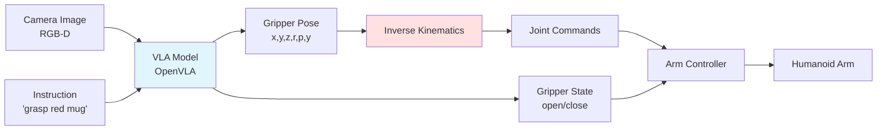

# Chapter 4: Humanoid Skills with VLA

## Learning Objectives

1. Apply VLA models to manipulation tasks (grasping, dexterous manipulation)
2. Integrate VLA with locomotion policies for mobile manipulation
3. Implement multi-task learning and skill composition for humanoid robots

## 4.1 Manipulation Skills

### Grasping with VLA

**Task**: "Grasp the red mug from the table"

**VLA Output**: 6-DOF gripper pose + gripper state

**Pipeline**:



**Figure 4.1**: VLA-based grasping pipeline showing conversion from end-effector pose to joint commands via inverse kinematics.

**Implementation**:

```python
import numpy as np
from openvla import OpenVLA
from scipy.spatial.transform import Rotation

class VLAGrasper:
    def __init__(self, robot_interface):
        self.vla = OpenVLA.from_pretrained("openvla-7b").to("cuda")
        self.robot = robot_interface

    def grasp_object(self, image, instruction):
        """
        Execute grasp using VLA

        Args:
            image: RGB image (224, 224, 3)
            instruction: str, e.g., "grasp the red mug"

        Returns:
            success: bool
        """
        # 1. Predict grasp pose with VLA
        action = self.vla.predict_action(image, instruction)
        pose = action[:6]  # x, y, z, roll, pitch, yaw
        gripper_cmd = action[6]  # 0-1 (open-close)

        # 2. Pre-grasp pose (10cm above target)
        pregrasp_pose = pose.copy()
        pregrasp_pose[2] += 0.1  # Lift z by 10cm

        # 3. Execute motion sequence
        # Step 1: Move to pre-grasp
        self.robot.move_to_pose(pregrasp_pose, speed=0.2)

        # Step 2: Open gripper
        self.robot.set_gripper(0.0)  # Fully open

        # Step 3: Move to grasp pose
        self.robot.move_to_pose(pose, speed=0.1)

        # Step 4: Close gripper
        self.robot.set_gripper(gripper_cmd)

        # Step 5: Lift object
        lift_pose = pose.copy()
        lift_pose[2] += 0.15
        self.robot.move_to_pose(lift_pose, speed=0.1)

        # 6. Check grasp success (force sensor)
        force = self.robot.get_gripper_force()
        success = force > 1.0  # Object held

        return success
```

### Dexterous Manipulation

**Task**: "Open the drawer" (requires force control, multi-step reasoning)

**Challenges**:
1. **Contact-rich**: Gripper must maintain contact with handle
2. **Force control**: Pull with appropriate force (not too hard/soft)
3. **Multi-step**: (1) Grasp handle, (2) Pull, (3) Release

**VLA + Impedance Control**:

```python
class DexterousManipulator:
    def __init__(self, vla_model, robot):
        self.vla = vla_model
        self.robot = robot

    def open_drawer(self, image, instruction="open the drawer"):
        """
        Complex manipulation with force feedback

        Strategy:
        1. VLA predicts grasp pose and pull direction
        2. Impedance controller executes pull with force limits
        """
        # VLA prediction
        action = self.vla.predict_action(image, instruction)
        handle_pose = action[:6]
        pull_direction = action[6:9]  # 3D vector (typically [-1, 0, 0])

        # Grasp handle
        self.robot.move_to_pose(handle_pose)
        self.robot.set_gripper(1.0)  # Close

        # Impedance control for pulling
        # Low stiffness in pull direction, high in others
        stiffness = np.array([100, 1000, 1000, 100, 100, 100])  # [x, y, z, rx, ry, rz]
        damping = 2 * np.sqrt(stiffness)  # Critical damping

        # Pull for 2 seconds or until drawer opens
        start_time = time.time()
        while time.time() - start_time < 2.0:
            # Current pose
            current_pose = self.robot.get_ee_pose()

            # Desired pose (incremental pull)
            desired_pose = current_pose + 0.01 * pull_direction

            # Impedance control law
            pose_error = desired_pose - current_pose
            force_cmd = stiffness * pose_error - damping * self.robot.get_ee_velocity()

            # Execute
            self.robot.apply_ee_force(force_cmd)

            # Check if drawer opened (depth camera feedback)
            if self.check_drawer_open(image_stream):
                break

        # Release handle
        self.robot.set_gripper(0.0)

        return self.check_drawer_open(self.robot.get_camera_image())
```

### Tool Use

**Task**: "Use the hammer to hit the nail"

**VLA Capabilities**:
- Affordance reasoning: Identifies hammer as tool for hammering
- Grasp planning: Grips hammer handle (not head)
- Motion planning: Swinging motion to strike nail

```python
def use_tool(image, instruction="use the hammer"):
    # VLA predicts:
    # 1. Tool to grasp (bounding box + grasp pose)
    # 2. Tool-use motion (trajectory waypoints)

    action = vla.predict_action(image, instruction)

    # Parse action
    tool_grasp_pose = action[:6]
    motion_waypoints = action[6:].reshape(-1, 6)  # N waypoints

    # Execute
    robot.move_to_pose(tool_grasp_pose)
    robot.set_gripper(1.0)

    for waypoint in motion_waypoints:
        robot.move_to_pose(waypoint, speed=0.3)

    robot.set_gripper(0.0)  # Release tool
```

## 4.2 Locomotion Skills

### VLA for Navigation

**Task**: "Walk to the kitchen"

**Challenge**: VLA trained on manipulation data may not generalize to locomotion

**Solution**: Hierarchical control
- **High-level** (VLA): Goal selection ("go to kitchen")
- **Low-level** (RL policy): Footstep planning and balance

```python
class HierarchicalNavigator:
    def __init__(self, vla_high_level, rl_low_level):
        self.vla = vla_high_level  # Trained on navigation tasks
        self.rl_policy = rl_low_level  # Trained in Isaac Gym

    def navigate_to_goal(self, image, instruction="go to the kitchen"):
        """
        VLA: Image → Waypoints
        RL: Waypoints → Joint torques
        """
        # VLA predicts waypoint path
        waypoints = self.vla.predict_waypoints(image, instruction)
        # waypoints: [(x1, y1), (x2, y2), ..., (xn, yn)]

        # RL policy tracks waypoints
        for waypoint in waypoints:
            while not self.reached_waypoint(waypoint):
                # Get robot state
                state = self.get_state()  # Joint angles, IMU, foot contacts

                # RL policy computes joint torques
                torques = self.rl_policy.predict(state, goal=waypoint)

                # Execute
                self.robot.set_joint_torques(torques)
                time.sleep(0.01)  # 100 Hz control
```

### Whole-Body Manipulation

**Task**: "Pick up the box from the floor while walking"

**Requirements**:
- Locomotion: Maintain balance while walking
- Manipulation: Reach down to grasp box
- Coordination: Synchronize arm and leg movements

**Whole-Body VLA**:

```python
class WholeBodyVLA:
    def __init__(self):
        # Shared vision-language encoder
        self.encoder = VisionLanguageEncoder()

        # Separate heads for arms and legs
        self.arm_head = ActionHead(action_dim=14)  # 7-DOF x2 arms
        self.leg_head = ActionHead(action_dim=12)  # 6-DOF x2 legs

    def forward(self, image, instruction):
        # Shared encoding
        features = self.encoder(image, instruction)

        # Predict arm and leg actions
        arm_actions = self.arm_head(features)  # (14,)
        leg_actions = self.leg_head(features)  # (12,)

        return {
            'arms': arm_actions,
            'legs': leg_actions
        }

# Usage
whole_body = WholeBodyVLA()
actions = whole_body(image, "pick up box while walking forward")

# Execute coordinated motion
robot.set_arm_positions(actions['arms'])
robot.set_leg_positions(actions['legs'])
```

### Mobile Manipulation

**Task**: "Navigate to the table and pick up the cup"

**Two-stage approach**:

1. **Stage 1**: Navigate to table (locomotion VLA)
2. **Stage 2**: Pick up cup (manipulation VLA)

```python
def mobile_manipulation(image, instruction="go to table and pick up cup"):
    # Parse instruction into subtasks
    subtasks = parse_instruction(instruction)
    # ['navigate to table', 'pick up cup']

    for subtask in subtasks:
        if 'navigate' in subtask or 'go to' in subtask:
            # Locomotion
            navigate_to_goal(image, subtask)
        elif 'pick up' in subtask or 'grasp' in subtask:
            # Manipulation
            grasp_object(image, subtask)
        else:
            # General VLA (handles both)
            execute_action(image, subtask)
```

## 4.3 Multi-Task Learning

### Task Composition

**Primitive Skills**:
- `grasp(object)`
- `place(location)`
- `navigate(goal)`
- `open(container)`

**Composed Tasks**:
- "Pick and place" = `grasp(cup)` → `navigate(table)` → `place(table)`
- "Fetch and deliver" = `navigate(kitchen)` → `open(drawer)` → `grasp(item)` → `navigate(living_room)` → `place(table)`

**Implementation** (Behavior Tree):

```python
class BehaviorTree:
    def __init__(self, vla_model):
        self.vla = vla_model
        self.skills = {
            'grasp': self.grasp_skill,
            'place': self.place_skill,
            'navigate': self.navigate_skill,
            'open': self.open_skill
        }

    def execute_task(self, task_description):
        """
        Parse language instruction into skill sequence

        Example:
            "Go to kitchen and pick up the mug"
            → ['navigate(kitchen)', 'grasp(mug)']
        """
        skill_sequence = self.parse_to_skills(task_description)

        for skill_name, args in skill_sequence:
            skill_fn = self.skills[skill_name]
            success = skill_fn(*args)

            if not success:
                return False  # Task failed

        return True  # All skills succeeded

    def parse_to_skills(self, instruction):
        # Use VLA language understanding
        # Or simple rule-based parsing for now
        if "go to" in instruction and "pick up" in instruction:
            location = extract_location(instruction)
            object_name = extract_object(instruction)
            return [('navigate', [location]), ('grasp', [object_name])]
        # ... more rules
```

### Multi-Task VLA Training

**Dataset**: Mix of manipulation, navigation, and tool-use tasks

**Training Strategy**:

```python
# Multi-task dataset
datasets = {
    'manipulation': load_dataset('bridge_v2'),  # 60k demos
    'navigation': load_dataset('go_stanford'),  # 50k demos
    'tool_use': load_dataset('language_table')  # 40k demos
}

# Multi-task dataloader
multi_task_loader = MultiTaskDataLoader(datasets, batch_size=32)

# Training loop
for batch in multi_task_loader:
    images, instructions, actions, task_ids = batch

    # Forward pass (task-conditioned)
    predicted_actions = vla(images, instructions, task_id=task_ids)

    # Compute loss (per-task weighting)
    losses = {}
    for task_name in ['manipulation', 'navigation', 'tool_use']:
        mask = (task_ids == task_name)
        if mask.sum() > 0:
            losses[task_name] = F.mse_loss(
                predicted_actions[mask],
                actions[mask]
            )

    # Weighted combination
    total_loss = 0.5 * losses['manipulation'] + \
                 0.3 * losses['navigation'] + \
                 0.2 * losses['tool_use']

    total_loss.backward()
    optimizer.step()
```

### Transfer Learning

**Scenario**: Train on simulated humanoid → Deploy on real humanoid

**Approach**:

1. **Pretrain** on Open X-Embodiment (diverse robots, 1M demos)
2. **Fine-tune** on target humanoid in simulation (Isaac Sim, 10k demos)
3. **Domain adapt** with real robot data (1k demos)

```python
# Step 1: Pretrain (done by OpenVLA team)
vla = OpenVLA.from_pretrained("openvla-7b")

# Step 2: Fine-tune on humanoid sim data
humanoid_sim_data = load_isaac_sim_dataset("humanoid_tasks")
vla.fine_tune(humanoid_sim_data, epochs=20)

# Step 3: Domain adaptation (real robot)
real_robot_data = collect_real_demos(num_demos=1000)
vla.fine_tune(
    real_robot_data,
    epochs=5,
    learning_rate=1e-6,  # Small LR to avoid catastrophic forgetting
    freeze_encoder=True  # Only update action head
)

# Deploy
vla.save("openvla-humanoid-real")
```

### Continual Learning

**Problem**: Robot learns new task, forgets old tasks (catastrophic forgetting)

**Solution**: Elastic Weight Consolidation (EWC)

```python
class ContinualVLA:
    def __init__(self, base_model):
        self.model = base_model
        self.fisher_information = {}  # Importance of each weight
        self.optimal_params = {}  # Previous task's optimal weights

    def train_new_task(self, new_task_data, lambda_ewc=1000):
        """
        Train on new task while preserving old task performance

        Args:
            new_task_data: Dataset for new task
            lambda_ewc: Regularization strength
        """
        optimizer = torch.optim.Adam(self.model.parameters(), lr=1e-5)

        for batch in new_task_data:
            # Standard loss on new task
            loss_new = self.model.compute_loss(batch)

            # EWC penalty (preserve important weights)
            loss_ewc = 0
            for name, param in self.model.named_parameters():
                if name in self.fisher_information:
                    fisher = self.fisher_information[name]
                    optimal = self.optimal_params[name]
                    loss_ewc += (fisher * (param - optimal) ** 2).sum()

            # Combined loss
            loss = loss_new + lambda_ewc * loss_ewc

            loss.backward()
            optimizer.step()
            optimizer.zero_grad()

    def compute_fisher_information(self, old_task_data):
        """
        Compute Fisher information after training on a task
        """
        self.model.eval()
        fisher = {n: torch.zeros_like(p) for n, p in self.model.named_parameters()}

        for batch in old_task_data:
            self.model.zero_grad()
            loss = self.model.compute_loss(batch)
            loss.backward()

            for name, param in self.model.named_parameters():
                fisher[name] += param.grad.data ** 2 / len(old_task_data)

        self.fisher_information = fisher
        self.optimal_params = {n: p.clone().detach() for n, p in self.model.named_parameters()}
```

## Exercises

**Exercise 4.1**: VLA Grasping
- Implement VLA-based grasping in simulation (Isaac Sim or Gazebo)
- Test on 10 different objects (varied shapes, sizes, materials)
- Measure success rate and analyze failure modes

**Exercise 4.2**: Whole-Body Manipulation
- Train whole-body VLA with separate arm/leg heads
- Task: "Walk forward 2 meters while holding a tray level"
- Evaluate: walking speed, tray stability, success rate

**Exercise 4.3**: Multi-Task Learning
- Create dataset with 3 tasks: grasping, navigation, opening drawers
- Train single VLA on all tasks
- Compare with 3 separate task-specific models (data efficiency, performance)

**Exercise 4.4**: Continual Learning
- Train VLA on Task A (grasping cups)
- Train on Task B (grasping boxes) with and without EWC
- Measure forgetting: performance on Task A after learning Task B

## Summary

**Manipulation**: VLA for grasping, dexterous manipulation, tool use (affordance reasoning)
**Locomotion**: Hierarchical control (VLA high-level, RL low-level), whole-body coordination
**Multi-Task**: Skill composition, task-conditioned training, continual learning (EWC)

**Module 4 Complete!** Next module covers capstone project: autonomous humanoid system.
