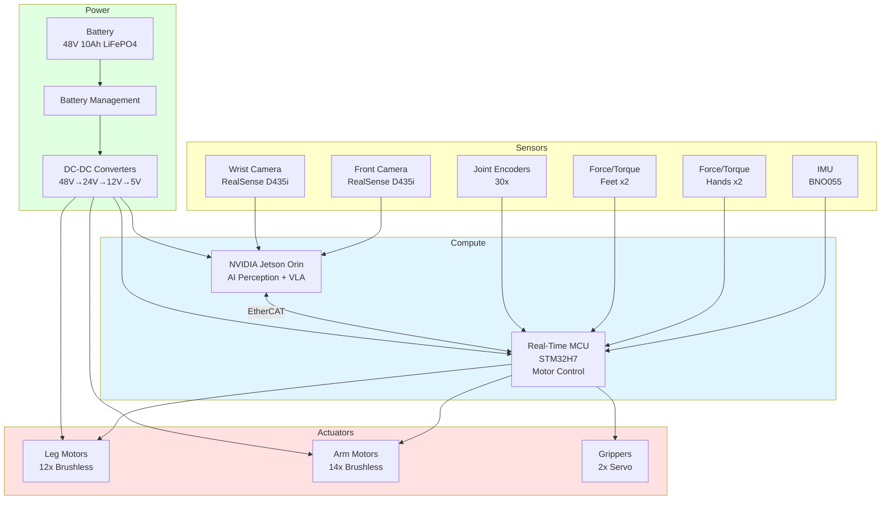
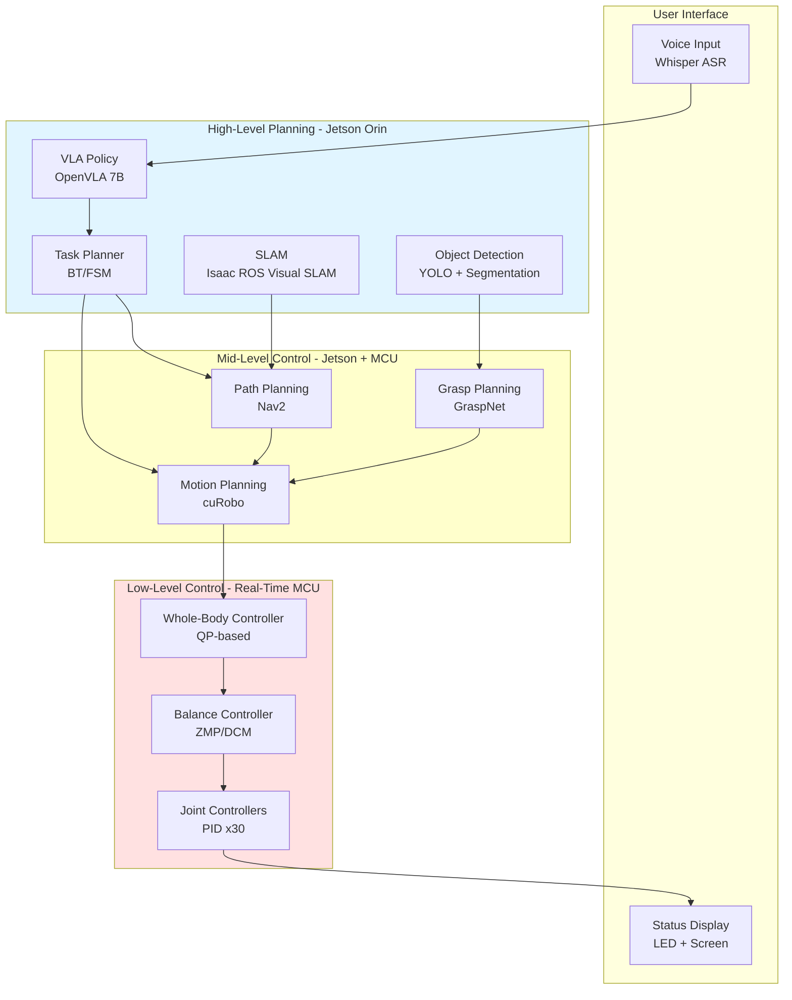

# Chapter 1: Autonomous Humanoid System Overview

## Learning Objectives

1. Define system requirements for an autonomous humanoid robot
2. Design complete system architecture (hardware + software)
3. Create phased development roadmap for implementation

## 1.1 Requirements Analysis

### Use Cases

**Primary Use Case**: Autonomous household assistant

**Scenarios**:
1. **Kitchen Assistant**: "Fetch me a drink from the fridge"
   - Navigate to kitchen
   - Open refrigerator door
   - Identify and grasp drink
   - Navigate back to user
   - Hand over drink

2. **Cleaning Helper**: "Clean up the toys from the floor"
   - Navigate to living room
   - Detect toys on floor (vision)
   - Pick up each toy
   - Place in designated container
   - Return to charging station

3. **Object Delivery**: "Bring me the book from the shelf"
   - Parse natural language instruction
   - Navigate to bookshelf
   - Identify target book (visual + semantic understanding)
   - Grasp and retrieve
   - Deliver to user

### Functional Requirements

**FR1: Locomotion**
- Walk on flat surfaces at 0.5 m/s (minimum)
- Climb stairs (max height: 20cm per step)
- Maintain balance during manipulation tasks
- Navigate around obstacles (dynamic path planning)

**FR2: Manipulation**
- Grasp objects (0.1-2 kg weight range)
- Dual-arm coordination (e.g., open door while holding object)
- Fine manipulation (e.g., press buttons, turn knobs)
- Tool use (e.g., use broom, open drawers)

**FR3: Perception**
- 3D environment mapping (SLAM)
- Object detection and recognition (100+ common household objects)
- Human detection and tracking
- Depth estimation for grasp planning

**FR4: Autonomy**
- Natural language command understanding
- Task planning from high-level goals
- Obstacle avoidance and replanning
- Error recovery (e.g., retry failed grasp)

**FR5: Safety**
- Collision avoidance (humans, furniture)
- Compliant control (soft contact with environment)
- Emergency stop capability
- Fall detection and safe shutdown

### Non-Functional Requirements

**NFR1: Performance**
- End-to-end task latency: `<10s` (from command to action start)
- Real-time control frequency: 100 Hz (low-level), 10 Hz (high-level)
- Perception update rate: 30 Hz (vision), 100 Hz (IMU)

**NFR2: Reliability**
- Task success rate: `>80%` on known tasks
- MTBF (Mean Time Between Failures): `>4 hours` continuous operation
- Battery life: `>2 hours` active use

**NFR3: Usability**
- Natural language interface (no programming required)
- One-button start/stop
- Audio/visual feedback (status indicators)

**NFR4: Cost**
- Target: `<$50k` total system cost
- Compute: Jetson Orin (edge AI) + optional cloud offload

### System Specifications

| Component | Specification |
|-----------|---------------|
| **Height** | 150-180 cm (human-scale) |
| **Weight** | 40-60 kg |
| **DOF** | 30+ (12 legs, 14 arms, 3 torso, 1+ head) |
| **Payload** | 5 kg per arm |
| **Speed** | 0.5 m/s walking, 1.0 m/s max |
| **Battery** | 48V LiFePO4, 10Ah (2 hrs runtime) |
| **Compute** | Jetson Orin (275 TOPS AI), ARM Cortex (real-time control) |
| **Sensors** | RGB-D cameras (2), IMU (1), Force/torque (hands, feet) |

## 1.2 System Architecture

### Hardware Architecture



**Figure 1.1**: Hardware architecture showing sensor inputs, compute nodes (Jetson for AI, MCU for real-time control), actuators, and power distribution.

### Software Architecture



**Figure 1.2**: Software architecture with three control layers: high-level (VLA + planning), mid-level (motion/path planning), low-level (whole-body + joint control).

### System Integration

**ROS 2 Communication**:
```python
# High-level VLA node publishes tasks
/vla/task_command (std_msgs/String)

# Task planner decomposes into primitives
/planner/motion_goal (geometry_msgs/PoseStamped)
/planner/navigation_goal (nav_msgs/Path)

# Mid-level planners publish trajectories
/motion/joint_trajectory (trajectory_msgs/JointTrajectory)
/navigation/cmd_vel (geometry_msgs/Twist)

# Low-level controller executes
/joint_commands (control_msgs/JointJog)
```

**Data Flow Example** (Fetch drink task):
1. User: "Fetch me a drink" (voice)
2. VLA: Parse → "navigate(kitchen) + grasp(drink) + navigate(user)"
3. Task Planner: Execute navigation → Execute grasp → Execute return
4. Motion Planner: Generate arm trajectory for grasp
5. Path Planner: Generate walking path to kitchen
6. Whole-Body Controller: Coordinate arms + legs
7. Joint Controllers: Execute motor commands

## 1.3 Development Roadmap

### Phase 1: Simulation Setup (Weeks 1-2)

**Goal**: Virtual twin in Isaac Sim

**Tasks**:
- Import humanoid URDF (or use pre-built model like G1, Unitree H1)
- Configure PhysX physics (realistic contacts, friction)
- Add environment (kitchen, living room)
- Integrate ROS 2 bridge

**Deliverable**: Teleoperable humanoid in simulation

**Validation**: Walk 10 meters, grasp objects, avoid obstacles

### Phase 2: Perception Stack (Weeks 3-4)

**Goal**: Real-time environment understanding

**Tasks**:
- Deploy Isaac ROS Visual SLAM on Jetson
- Integrate YOLOv8 for object detection
- Implement depth-based grasp pose estimation
- Fuse IMU + camera for state estimation

**Deliverable**: Perception pipeline (30 Hz)

**Validation**: Detect 10 objects, map 50m² environment, localize with `<5cm` error

### Phase 3: Base Control (Weeks 5-6)

**Goal**: Stable locomotion + manipulation

**Tasks**:
- Implement balance controller (ZMP-based)
- Train RL policy for walking in Isaac Gym (100k steps)
- Fine-tune on Isaac Sim with randomization
- Implement dual-arm manipulation primitives

**Deliverable**: Walk + grasp controller

**Validation**: Walk 20m without falling, grasp 5/5 objects in sim

### Phase 4: VLA Integration (Weeks 7-8)

**Goal**: Language-conditioned autonomy

**Tasks**:
- Fine-tune OpenVLA on humanoid tasks (1k demos)
- Integrate VLA with task planner (behavior tree)
- Implement safety wrappers (collision, workspace limits)
- Deploy on Jetson Orin (optimize for `<50ms` latency)

**Deliverable**: End-to-end autonomous system (sim)

**Validation**: Complete 3 tasks: fetch, place, navigate

### Phase 5: Sim-to-Real Transfer (Weeks 9-10)

**Goal**: Deploy on real hardware

**Tasks**:
- System identification (measure real joint dynamics)
- Domain randomization (10x varied sim environments)
- Collect real-world fine-tuning data (100 demos)
- Progressive deployment (sim → table-top → full robot)

**Deliverable**: Real robot executing simple tasks

**Validation**: 50% success on fetch task (real world)

### Phase 6: Iteration and Scaling (Weeks 11-12)

**Goal**: Improve robustness and generalization

**Tasks**:
- Failure analysis (log 100 attempts)
- Update VLA with corrective demos (DAgger)
- Expand object set (100 → 200 objects)
- Multi-task evaluation (5 different tasks)

**Deliverable**: Production-ready system

**Validation**: 80% success across 5 tasks, `<5min` per task

### Risk Mitigation

| Risk | Impact | Mitigation |
|------|--------|------------|
| **Hardware failure** | High | Redundant sensors, modular design, spare parts |
| **Sim-to-real gap** | High | Extensive randomization, real-world fine-tuning, progressive transfer |
| **VLA latency** | Medium | Quantization (INT8), TensorRT, model distillation |
| **Battery life** | Medium | Power-efficient hardware, sleep modes, hot-swappable batteries |
| **Safety incidents** | Critical | Multi-layer safety (software + hardware e-stop), human-in-loop testing |

## Exercises

**Exercise 1.1**: Requirements Specification
- Define requirements for a warehouse robot (vs household)
- List 5 functional requirements specific to warehouse tasks
- Specify non-functional requirements (speed, payload, uptime)

**Exercise 1.2**: Hardware Selection
- Choose sensors for outdoor humanoid (vs indoor)
- Select compute platform (Jetson Orin vs AGX Xavier vs cloud)
- Justify choices with performance/cost tradeoffs

**Exercise 1.3**: Software Architecture Design
- Design software stack for a quadruped robot (vs humanoid)
- Identify differences in control layers
- Draw architecture diagram (Mermaid or similar)

**Exercise 1.4**: Development Planning
- Create 8-week roadmap for your capstone project
- Define milestones and validation criteria
- Identify top 3 risks and mitigation strategies

## Summary

**Requirements**: Household assistant with locomotion, manipulation, perception, autonomy, and safety
**Architecture**: Hardware (sensors, compute, actuators, power) + Software (3-layer control hierarchy)
**Roadmap**: 12-week phased development (sim → perception → control → VLA → real → iteration)

**Next**: Chapter 2 covers perception stack implementation (SLAM, object detection, state estimation).
