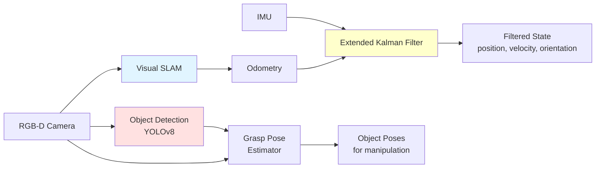

# Chapter 2: Perception Stack

## Learning Objectives

1. Integrate multi-modal sensors (RGB-D cameras, IMU, force/torque)
2. Implement real-time SLAM and object detection pipeline
3. Fuse sensor data for robust state estimation

## 2.1 Sensor Suite Integration

### RGB-D Cameras

**Intel RealSense D435i**: Depth + RGB + IMU

**Specifications**:
- Depth range: 0.3-10m
- Resolution: 1280x720 @ 30 FPS
- FOV: 87° x 58°
- IMU: BMI055 (accel + gyro)

**ROS 2 Integration**:
```bash
# Install RealSense ROS 2 wrapper
sudo apt-get install ros-humble-realsense2-camera

# Launch camera node
ros2 launch realsense2_camera rs_launch.py \
    enable_depth:=true \
    enable_color:=true \
    enable_infra:=false \
    enable_gyro:=true \
    enable_accel:=true \
    depth_module.profile:=640x480x30 \
    rgb_camera.profile:=640x480x30
```

**Published Topics**:
```
/camera/color/image_raw (sensor_msgs/Image)
/camera/depth/image_rect_raw (sensor_msgs/Image)
/camera/aligned_depth_to_color/image_raw (sensor_msgs/Image)
/camera/imu (sensor_msgs/Imu)
/camera/camera_info (sensor_msgs/CameraInfo)
```

### IMU (Inertial Measurement Unit)

**BNO055**: 9-DOF IMU (accel, gyro, magnetometer)

**Calibration**:
```python
import board
import adafruit_bno055

i2c = board.I2C()
imu = adafruit_bno055.BNO055_I2C(i2c)

# Calibration status (0-3 for each)
print(f"System: {imu.calibration_status[0]}")
print(f"Gyro: {imu.calibration_status[1]}")
print(f"Accel: {imu.calibration_status[2]}")
print(f"Mag: {imu.calibration_status[3]}")

# Wait until fully calibrated
while imu.calibration_status != (3, 3, 3, 3):
    time.sleep(0.1)

# Read orientation (quaternion)
quat = imu.quaternion
print(f"Quaternion: {quat}")
```

**ROS 2 Publisher**:
```python
import rclpy
from rclpy.node import Node
from sensor_msgs.msg import Imu
import adafruit_bno055

class IMUNode(Node):
    def __init__(self):
        super().__init__('imu_node')
        self.publisher = self.create_publisher(Imu, '/imu/data', 10)
        self.timer = self.create_timer(0.01, self.publish_imu)  # 100 Hz

        i2c = board.I2C()
        self.imu = adafruit_bno055.BNO055_I2C(i2c)

    def publish_imu(self):
        msg = Imu()
        msg.header.stamp = self.get_clock().now().to_msg()
        msg.header.frame_id = 'imu_link'

        # Orientation (quaternion)
        quat = self.imu.quaternion
        if quat is not None:
            msg.orientation.x = quat[1]
            msg.orientation.y = quat[2]
            msg.orientation.z = quat[3]
            msg.orientation.w = quat[0]

        # Angular velocity
        gyro = self.imu.gyro
        if gyro is not None:
            msg.angular_velocity.x = gyro[0]
            msg.angular_velocity.y = gyro[1]
            msg.angular_velocity.z = gyro[2]

        # Linear acceleration
        accel = self.imu.linear_acceleration
        if accel is not None:
            msg.linear_acceleration.x = accel[0]
            msg.linear_acceleration.y = accel[1]
            msg.linear_acceleration.z = accel[2]

        self.publisher.publish(msg)
```

### Force/Torque Sensors

**ATI Mini45**: 6-axis F/T sensor (hands + feet)

**Use Cases**:
- **Hands**: Grasp force feedback, object weight estimation
- **Feet**: Ground contact detection, balance control

**ROS 2 Integration**:
```python
from sensor_msgs.msg import WrenchStamped

class FTSensorNode(Node):
    def __init__(self):
        super().__init__('ft_sensor_node')
        self.pub_left = self.create_publisher(WrenchStamped, '/ft/left_hand', 10)
        self.pub_right = self.create_publisher(WrenchStamped, '/ft/right_hand', 10)

        # Initialize sensor via serial/USB
        self.ft_sensor = ATI_FT_Sensor('/dev/ttyUSB0')
        self.timer = self.create_timer(0.01, self.publish_ft)

    def publish_ft(self):
        # Read F/T data
        fx, fy, fz, tx, ty, tz = self.ft_sensor.read()

        msg = WrenchStamped()
        msg.header.stamp = self.get_clock().now().to_msg()
        msg.wrench.force.x = fx
        msg.wrench.force.y = fy
        msg.wrench.force.z = fz
        msg.wrench.torque.x = tx
        msg.wrench.torque.y = ty
        msg.wrench.torque.z = tz

        self.pub_left.publish(msg)
```

## 2.2 Perception Pipeline

### Visual SLAM

**Isaac ROS Visual SLAM**: GPU-accelerated ORB-SLAM3

**Setup**:
```bash
# Install Isaac ROS Visual SLAM
sudo apt-get install ros-humble-isaac-ros-visual-slam

# Launch
ros2 launch isaac_ros_visual_slam isaac_ros_visual_slam.launch.py
```

**Configuration** (`config/vslam.yaml`):
```yaml
visual_slam_node:
  ros__parameters:
    enable_imu_fusion: true
    enable_localization_n_mapping: true
    enable_observations_view: true
    enable_landmarks_view: true
    enable_debug_mode: false

    # Performance
    max_landmarks_per_frame: 500
    num_cameras: 1

    # IMU settings
    imu_frame: 'imu_link'
    gyroscope_noise_density: 0.001
    accelerometer_noise_density: 0.01
```

**Subscribed Topics**:
- `/camera/color/image_raw`
- `/camera/camera_info`
- `/imu/data`

**Published Topics**:
- `/visual_slam/tracking/odometry` (nav_msgs/Odometry)
- `/visual_slam/tracking/vo_pose` (geometry_msgs/PoseStamped)
- `/visual_slam/vis/observations_cloud` (sensor_msgs/PointCloud2)

### Object Detection

**YOLOv8 + Segmentation**:

```python
from ultralytics import YOLO
import rclpy
from rclpy.node import Node
from sensor_msgs.msg import Image
from vision_msgs.msg import Detection2DArray, Detection2D
from cv_bridge import CvBridge

class ObjectDetectionNode(Node):
    def __init__(self):
        super().__init__('object_detection_node')

        # Load YOLOv8 model
        self.model = YOLO('yolov8n.pt')  # Nano for speed
        self.bridge = CvBridge()

        # Subscribers
        self.image_sub = self.create_subscription(
            Image,
            '/camera/color/image_raw',
            self.image_callback,
            10
        )

        # Publishers
        self.detection_pub = self.create_publisher(
            Detection2DArray,
            '/detections',
            10
        )

    def image_callback(self, msg):
        # Convert ROS Image to OpenCV
        cv_image = self.bridge.imgmsg_to_cv2(msg, desired_encoding='rgb8')

        # Run inference
        results = self.model(cv_image, conf=0.5)

        # Parse results
        detections_msg = Detection2DArray()
        detections_msg.header = msg.header

        for result in results:
            for box in result.boxes:
                det = Detection2D()
                det.bbox.center.position.x = (box.xyxy[0][0] + box.xyxy[0][2]) / 2
                det.bbox.center.position.y = (box.xyxy[0][1] + box.xyxy[0][3]) / 2
                det.bbox.size_x = box.xyxy[0][2] - box.xyxy[0][0]
                det.bbox.size_y = box.xyxy[0][3] - box.xyxy[0][1]

                # Class and confidence
                det.results[0].hypothesis.class_id = str(int(box.cls[0]))
                det.results[0].hypothesis.score = float(box.conf[0])

                detections_msg.detections.append(det)

        self.detection_pub.publish(detections_msg)
```

### Depth-Based Grasp Pose Estimation

**GraspNet-1Billion** (or simpler heuristic):

```python
import numpy as np
from geometry_msgs.msg import PoseStamped

class GraspPoseEstimator:
    def __init__(self):
        self.camera_intrinsics = np.array([
            [615.0, 0, 320.0],
            [0, 615.0, 240.0],
            [0, 0, 1.0]
        ])

    def estimate_grasp(self, depth_image, object_bbox):
        """
        Estimate 6-DOF grasp pose from depth image and object bbox

        Args:
            depth_image: (H, W) depth in meters
            object_bbox: (x_min, y_min, x_max, y_max)

        Returns:
            PoseStamped: Grasp pose in camera frame
        """
        x_min, y_min, x_max, y_max = object_bbox

        # Crop object region
        object_depth = depth_image[y_min:y_max, x_min:x_max]

        # Find closest point (naive approach)
        min_depth = np.min(object_depth[object_depth > 0])
        y_grasp, x_grasp = np.where(object_depth == min_depth)
        x_grasp = x_grasp[0] + x_min
        y_grasp = y_grasp[0] + y_min

        # Backproject to 3D
        z = depth_image[y_grasp, x_grasp]
        x = (x_grasp - self.camera_intrinsics[0, 2]) * z / self.camera_intrinsics[0, 0]
        y = (y_grasp - self.camera_intrinsics[1, 2]) * z / self.camera_intrinsics[1, 1]

        # Grasp pose (top-down grasp)
        pose = PoseStamped()
        pose.header.frame_id = 'camera_color_optical_frame'
        pose.pose.position.x = x
        pose.pose.position.y = y
        pose.pose.position.z = z
        pose.pose.orientation.x = 0.707
        pose.pose.orientation.y = 0.0
        pose.pose.orientation.z = 0.0
        pose.pose.orientation.w = 0.707  # 90° pitch for top-down grasp

        return pose
```

## 2.3 State Estimation

### Sensor Fusion (EKF)

**robot_localization** package for sensor fusion:

```yaml
# config/ekf.yaml
ekf_filter_node:
  ros__parameters:
    frequency: 50.0
    sensor_timeout: 0.1
    two_d_mode: false

    # Input sources
    odom0: /visual_slam/tracking/odometry
    odom0_config: [true,  true,  true,  # x, y, z
                   false, false, false, # roll, pitch, yaw
                   true,  true,  true,  # vx, vy, vz
                   false, false, false, # vroll, vpitch, vyaw
                   false, false, false] # ax, ay, az

    imu0: /imu/data
    imu0_config: [false, false, false,  # x, y, z (position from IMU = false)
                  true,  true,  true,   # roll, pitch, yaw
                  false, false, false,  # vx, vy, vz
                  true,  true,  true,   # vroll, vpitch, vyaw
                  true,  true,  true]   # ax, ay, az

    # Process noise covariance
    process_noise_covariance: [0.05, 0,    0,    ...
                                0,    0.05, 0,    ...
                                ...]

    # Initial estimate covariance
    initial_estimate_covariance: [1e-9, 0,    0,    ...
                                   0,    1e-9, 0,    ...
                                   ...]
```

**Launch**:
```bash
ros2 launch robot_localization ekf.launch.py
```

**Output**:
- `/odometry/filtered` (nav_msgs/Odometry) - Fused pose and velocity

### Complete Perception Pipeline



**Figure 2.1**: Perception pipeline showing sensor fusion (SLAM + IMU → EKF) and object understanding (detection + depth → grasp poses).

### Perception Quality Metrics

**Localization Accuracy**:
```python
def evaluate_localization(ground_truth_poses, estimated_poses):
    """
    Compute localization error metrics

    Returns:
        dict: {'mean_error': float, 'max_error': float, 'rmse': float}
    """
    errors = []
    for gt, est in zip(ground_truth_poses, estimated_poses):
        error = np.linalg.norm(gt.position - est.position)
        errors.append(error)

    return {
        'mean_error': np.mean(errors),
        'max_error': np.max(errors),
        'rmse': np.sqrt(np.mean(np.array(errors)**2))
    }
```

**Object Detection Performance**:
- **mAP (mean Average Precision)**: >0.7 for 100 household objects
- **Inference time**: `<30ms` (YOLOv8-nano on Jetson Orin)
- **Detection rate**: >90% at 1m distance

## Exercises

**Exercise 2.1**: Sensor Integration
- Connect RealSense D435i to ROS 2
- Verify all topics are publishing (RGB, depth, IMU)
- Visualize in RViz2
- Measure actual frame rates

**Exercise 2.2**: Visual SLAM Evaluation
- Run Isaac ROS Visual SLAM in a room
- Walk a closed loop (return to start)
- Measure loop closure error (drift)
- Compare with and without IMU fusion

**Exercise 2.3**: Object Detection Pipeline
- Train/fine-tune YOLOv8 on custom objects (5-10 classes)
- Deploy on Jetson Orin
- Benchmark inference time and accuracy (mAP)
- Integrate with ROS 2 perception stack

**Exercise 2.4**: Grasp Pose Estimation
- Implement depth-based grasp pose estimator
- Test on 10 different objects (varied shapes)
- Measure success rate in simulation
- Analyze failure modes (reflective surfaces, thin objects)

## Summary

**Sensor Integration**: RGB-D cameras (depth + color), IMU (orientation), F/T sensors (contact)
**Perception Pipeline**: Visual SLAM (localization), YOLOv8 (object detection), depth-based grasp estimation
**State Estimation**: EKF sensor fusion (SLAM + IMU) for robust pose and velocity estimates

**Next**: Chapter 3 covers control stack (whole-body control, balance, joint-level control).
