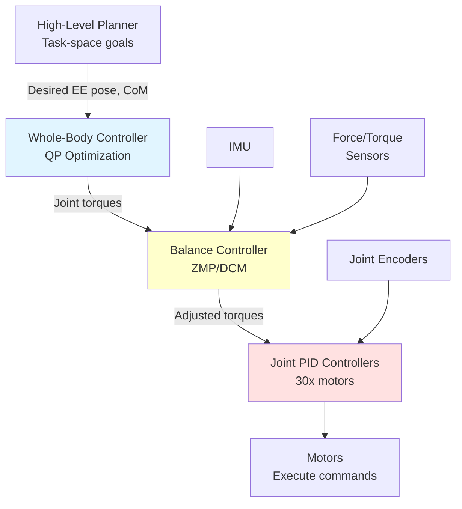

# Chapter 3: Control Stack

## Learning Objectives

1. Implement whole-body controller for coordinated motion
2. Design balance controller using ZMP or MPC
3. Tune joint-level PID controllers for tracking

## 3.1 Whole-Body Control Architecture

### Control Hierarchy

**Three-Layer Architecture**:

1. **High-Level** (10 Hz): Task-space commands (end-effector poses, CoM trajectory)
2. **Mid-Level** (100 Hz): Whole-body QP optimization (joint torques/accelerations)
3. **Low-Level** (1000 Hz): Joint PID control (motor commands)



**Figure 3.1**: Control hierarchy showing high-level task commands flowing through whole-body QP, balance controller, and joint PIDs with sensor feedback loops.

### Quadratic Programming (QP) Formulation

**Goal**: Find joint accelerations $\ddot{q}$ that achieve multiple tasks while respecting constraints

**Optimization Problem**:

```
minimize:   || J_ee * q̈ - ẍ_ee_des ||²     (end-effector task)
          + || J_com * q̈ - ẍ_com_des ||²   (CoM task)
          + || q̈ ||²                        (regularization)

subject to: M * q̈ + h = τ                  (dynamics)
            τ_min ≤ τ ≤ τ_max               (torque limits)
            J_contact * q̈ = 0               (contact constraints)
```

**Implementation** (using `qpsolvers`):

```python
import numpy as np
from qpsolvers import solve_qp

class WholeBodyController:
    def __init__(self, robot_model):
        self.robot = robot_model
        self.n_joints = robot_model.nq

    def solve(self, q, q_dot, ee_pose_des, com_pos_des):
        """
        Solve QP for joint accelerations

        Args:
            q: Joint positions (n,)
            q_dot: Joint velocities (n,)
            ee_pose_des: Desired end-effector pose (6,)
            com_pos_des: Desired CoM position (3,)

        Returns:
            tau: Joint torques (n,)
        """
        # Compute Jacobians
        J_ee = self.robot.get_ee_jacobian(q)  # (6, n)
        J_com = self.robot.get_com_jacobian(q)  # (3, n)

        # Desired accelerations
        ee_error = ee_pose_des - self.robot.get_ee_pose(q)
        com_error = com_pos_des - self.robot.get_com_position(q)

        # PD control law
        kp_ee, kd_ee = 100, 20
        kp_com, kd_com = 200, 40

        acc_ee_des = kp_ee * ee_error - kd_ee * (J_ee @ q_dot)
        acc_com_des = kp_com * com_error - kd_com * (J_com @ q_dot)

        # QP matrices
        # Minimize: 1/2 q̈^T P q̈ + q^T q̈
        P = J_ee.T @ J_ee + J_com.T @ J_com + 0.001 * np.eye(self.n_joints)
        q_vec = -J_ee.T @ acc_ee_des - J_com.T @ acc_com_des

        # Equality constraint: M * q̈ + h = τ (dynamics)
        M = self.robot.get_mass_matrix(q)
        h = self.robot.get_nonlinear_effects(q, q_dot)

        # Torque limits
        tau_max = self.robot.torque_limits
        G = np.vstack([np.eye(self.n_joints), -np.eye(self.n_joints)])
        h_ineq = np.hstack([tau_max, tau_max])

        # Solve QP
        q_ddot = solve_qp(P, q_vec, G, h_ineq, solver='quadprog')

        # Compute torques
        tau = M @ q_ddot + h

        return tau
```

### Prioritized Tasks

**Use Case**: High-priority task (balance) vs low-priority task (arm motion)

**Hierarchical QP**:

```python
class PrioritizedWBC(WholeBodyController):
    def solve_hierarchical(self, q, q_dot, tasks_prioritized):
        """
        Solve tasks in order of priority

        Args:
            tasks_prioritized: List of (Jacobian, acc_des, weight) tuples
                               Ordered from high to low priority

        Returns:
            tau: Joint torques
        """
        q_ddot = np.zeros(self.n_joints)

        for J, acc_des, weight in tasks_prioritized:
            # Minimize: || J * q̈ - acc_des ||² + || q̈ - q̈_prev ||²
            P = J.T @ J + weight * np.eye(self.n_joints)
            q_vec = -J.T @ acc_des + weight * q_ddot

            # Solve
            q_ddot = solve_qp(P, q_vec)

        # Dynamics
        M = self.robot.get_mass_matrix(q)
        h = self.robot.get_nonlinear_effects(q, q_dot)
        tau = M @ q_ddot + h

        return tau
```

## 3.2 Balance Controller

### Zero Moment Point (ZMP)

**Definition**: Point on the ground where net moment is zero

**Condition for Stability**: ZMP must be inside support polygon (footprint)

**ZMP Computation**:

```python
class ZMPController:
    def __init__(self, robot):
        self.robot = robot
        self.g = 9.81

    def compute_zmp(self, q, q_dot, q_ddot):
        """
        Compute ZMP position from robot state

        Returns:
            zmp: (2,) - ZMP position in (x, y)
        """
        # Center of mass
        com_pos = self.robot.get_com_position(q)
        com_vel = self.robot.get_com_velocity(q, q_dot)
        com_acc = self.robot.get_com_acceleration(q, q_dot, q_ddot)

        # ZMP formula (assuming flat ground at z=0)
        zmp_x = com_pos[0] - (com_pos[2] / (com_acc[2] + self.g)) * com_acc[0]
        zmp_y = com_pos[1] - (com_pos[2] / (com_acc[2] + self.g)) * com_acc[1]

        return np.array([zmp_x, zmp_y])

    def is_stable(self, zmp, support_polygon):
        """
        Check if ZMP is inside support polygon

        Args:
            zmp: (2,) ZMP position
            support_polygon: (N, 2) vertices of support polygon

        Returns:
            bool: True if stable
        """
        from matplotlib.path import Path
        polygon = Path(support_polygon)
        return polygon.contains_point(zmp)
```

**ZMP-Based Walking**:

```python
def generate_zmp_trajectory(footstep_plan, com_height=0.8):
    """
    Generate ZMP trajectory for walking

    Args:
        footstep_plan: List of (x, y, theta) footstep poses
        com_height: Desired CoM height

    Returns:
        zmp_traj: (T, 2) ZMP trajectory
        com_traj: (T, 3) CoM trajectory
    """
    zmp_traj = []
    com_traj = []

    for i in range(len(footstep_plan) - 1):
        # ZMP stays at current foot during swing phase
        foot_current = footstep_plan[i][:2]
        foot_next = footstep_plan[i+1][:2]

        # Double support: ZMP at midpoint
        zmp_double = (foot_current + foot_next) / 2

        # Single support: ZMP at stance foot
        zmp_single = foot_current

        # Trajectory (10 steps per phase)
        for t in range(10):
            zmp_traj.append(zmp_single)

        for t in range(10):
            zmp_traj.append(zmp_double)

        # CoM follows ZMP with offset
        com_x = zmp_single[0]
        com_y = zmp_single[1]
        com_traj.append([com_x, com_y, com_height])

    return np.array(zmp_traj), np.array(com_traj)
```

### Model Predictive Control (MPC)

**Formulation**:

Predict future states over horizon $N$ and optimize control inputs:

```
minimize:   Σ || x_k - x_ref ||²_Q + || u_k ||²_R

subject to: x_{k+1} = A x_k + B u_k     (linear dynamics)
            x_min ≤ x_k ≤ x_max         (state limits)
            u_min ≤ u_k ≤ u_max         (control limits)
```

**Implementation** (using `cvxpy`):

```python
import cvxpy as cp

class MPCBalanceController:
    def __init__(self, dt=0.01, horizon=20):
        self.dt = dt
        self.N = horizon

        # Linearized CoM dynamics (inverted pendulum)
        # ẍ = g/h * x (where h = CoM height)
        self.g = 9.81
        self.h = 0.8

        # Discretize: x_{k+1} = A x_k + B u_k
        # State: [pos, vel], Control: [acc]
        self.A = np.array([[1, dt], [0, 1 + (self.g/self.h)*dt**2]])
        self.B = np.array([[0], [dt]])

    def solve(self, x0, x_ref):
        """
        Solve MPC for CoM control

        Args:
            x0: Initial state [pos, vel]
            x_ref: Reference trajectory (N, 2)

        Returns:
            u_opt: Optimal control sequence (N, 1)
        """
        n_states = 2
        n_controls = 1

        # Decision variables
        x = cp.Variable((self.N + 1, n_states))
        u = cp.Variable((self.N, n_controls))

        # Cost matrices
        Q = np.diag([100, 10])  # Position and velocity weights
        R = np.diag([1])        # Control effort weight

        # Objective
        cost = 0
        for k in range(self.N):
            cost += cp.quad_form(x[k] - x_ref[k], Q)
            cost += cp.quad_form(u[k], R)

        # Constraints
        constraints = [x[0] == x0]
        for k in range(self.N):
            constraints += [x[k+1] == self.A @ x[k] + self.B @ u[k]]
            constraints += [cp.abs(u[k]) <= 5.0]  # Acceleration limits

        # Solve
        problem = cp.Problem(cp.Minimize(cost), constraints)
        problem.solve(solver=cp.OSQP)

        return u.value
```

## 3.3 Joint-Level Control

### PID Tuning

**Ziegler-Nichols Method**:

1. Set $K_i = 0$, $K_d = 0$
2. Increase $K_p$ until oscillation (critical gain $K_u$)
3. Measure oscillation period $T_u$
4. Compute PID gains:
   - $K_p = 0.6 K_u$
   - $K_i = 2 K_p / T_u$
   - $K_d = K_p T_u / 8$

**Implementation**:

```python
class JointPIDController:
    def __init__(self, kp, ki, kd, dt=0.001):
        self.kp = kp
        self.ki = ki
        self.kd = kd
        self.dt = dt

        self.error_integral = 0
        self.prev_error = 0

    def compute(self, q_des, q_actual, q_dot_actual):
        """
        Compute PID control

        Args:
            q_des: Desired joint position
            q_actual: Actual joint position
            q_dot_actual: Actual joint velocity

        Returns:
            tau: Joint torque command
        """
        # Error
        error = q_des - q_actual

        # Integral (with anti-windup)
        self.error_integral += error * self.dt
        self.error_integral = np.clip(self.error_integral, -10, 10)

        # Derivative (from velocity feedback)
        error_derivative = -q_dot_actual

        # PID law
        tau = self.kp * error + self.ki * self.error_integral + self.kd * error_derivative

        self.prev_error = error
        return tau
```

### Impedance Control

**Compliant interaction** with environment:

```python
class ImpedanceController:
    def __init__(self, K_stiffness, D_damping):
        """
        Args:
            K_stiffness: (6, 6) stiffness matrix (task space)
            D_damping: (6, 6) damping matrix
        """
        self.K = K_stiffness
        self.D = D_damping

    def compute(self, x_des, x_actual, x_dot_actual, f_external):
        """
        Compute impedance control force

        Args:
            x_des: Desired end-effector pose (6,)
            x_actual: Actual pose (6,)
            x_dot_actual: Actual velocity (6,)
            f_external: External force (6,)

        Returns:
            f_cmd: Commanded force (6,)
        """
        # Position error
        x_error = x_des - x_actual

        # Impedance law: F = K*(x_des - x) - D*ẋ
        f_cmd = self.K @ x_error - self.D @ x_dot_actual

        # Add external force compensation
        f_cmd += f_external

        return f_cmd

    def joint_torques(self, f_cmd, J):
        """
        Convert task-space force to joint torques

        Args:
            f_cmd: Task-space force (6,)
            J: Jacobian (6, n)

        Returns:
            tau: Joint torques (n,)
        """
        return J.T @ f_cmd
```

## Exercises

**Exercise 3.1**: Whole-Body Controller Implementation
- Implement QP-based whole-body controller in simulation
- Test with dual-arm reaching task (2 end-effectors)
- Compare prioritized vs weighted multi-task approach

**Exercise 3.2**: ZMP-Based Walking
- Generate ZMP trajectory for 5-step walking pattern
- Simulate in Isaac Sim or MuJoCo
- Measure stability margin (distance from ZMP to support polygon edge)

**Exercise 3.3**: PID Tuning
- Tune PID gains for a single joint (elbow or knee)
- Use Ziegler-Nichols method or manual tuning
- Plot step response and measure: rise time, overshoot, settling time

**Exercise 3.4**: Impedance Control
- Implement impedance controller for arm
- Test compliance by pushing end-effector in simulation
- Measure interaction force and position deviation

## Summary

**Whole-Body Control**: QP optimization for multi-task coordination (end-effector + CoM tracking)
**Balance Control**: ZMP for stability verification, MPC for predictive balance
**Joint Control**: PID for tracking, impedance for compliant interaction

**Next**: Chapter 4 covers VLA autonomy integration and real-world deployment.
