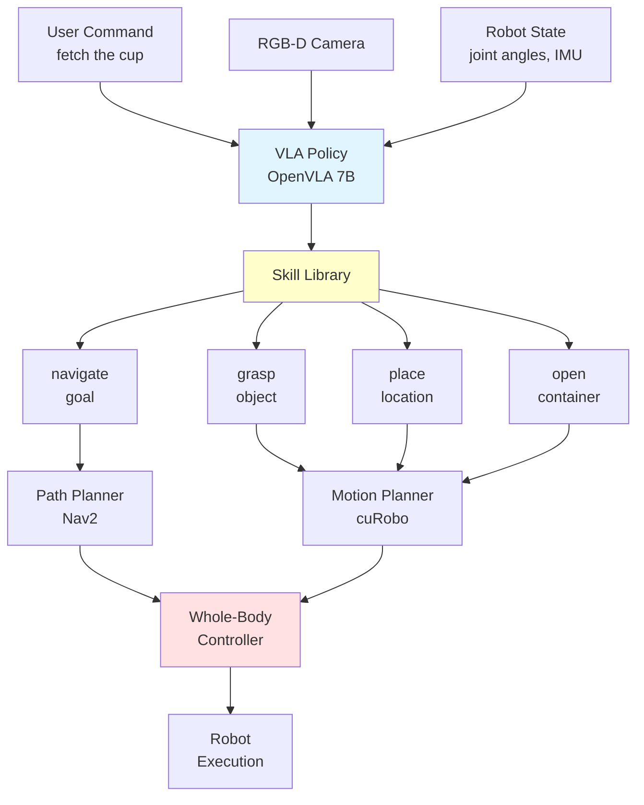

# Chapter 4: VLA Autonomy

## Learning Objectives

1. Integrate OpenVLA policy with humanoid control stack
2. Implement task planning and execution framework
3. Deploy and test autonomous system in real-world scenarios

## 4.1 VLA Policy Integration

### OpenVLA Deployment on Humanoid

**System Architecture**:



**Figure 4.1**: VLA autonomy architecture showing language commands flowing through VLA policy to skill primitives, then to motion/path planners, and finally whole-body controller.

### Fine-Tuning OpenVLA for Humanoid

**Dataset Collection** (simulation):

```python
import isaac_sim
from openvla.data import RobotDataset

class HumanoidDataCollector:
    def __init__(self, sim_env):
        self.env = sim_env
        self.demonstrations = []

    def collect_demonstration(self, task_instruction):
        """
        Collect one demonstration via teleoperation or scripted policy

        Args:
            task_instruction: str, e.g., "pick up the red cup"

        Returns:
            demo: Dict with observations, actions, language
        """
        demo = {
            'images': [],
            'joint_states': [],
            'actions': [],
            'instruction': task_instruction
        }

        # Reset environment
        obs = self.env.reset()

        # Execute task (teleoperation or expert policy)
        done = False
        while not done:
            # Capture observation
            image = self.env.get_camera_image()
            joint_state = self.env.get_joint_positions()

            # Get action (from human or expert)
            action = self.get_expert_action()  # Implement this

            # Execute
            obs, reward, done, info = self.env.step(action)

            # Store
            demo['images'].append(image)
            demo['joint_states'].append(joint_state)
            demo['actions'].append(action)

        self.demonstrations.append(demo)
        return demo

    def save_dataset(self, path):
        """Save demonstrations in RLDS format"""
        dataset = RobotDataset(demonstrations=self.demonstrations)
        dataset.save(path)
```

**Fine-Tuning**:

```python
from openvla import OpenVLA
from torch.utils.data import DataLoader

# Load pretrained model
vla = OpenVLA.from_pretrained("openvla-7b")

# Load humanoid dataset
dataset = RobotDataset(data_path="humanoid_demos/")
dataloader = DataLoader(dataset, batch_size=16, shuffle=True)

# Fine-tune
optimizer = torch.optim.AdamW(vla.parameters(), lr=1e-5)

for epoch in range(20):
    for batch in dataloader:
        images, instructions, actions = batch

        # Forward pass
        predicted_actions = vla(images, instructions)
        loss = F.mse_loss(predicted_actions, actions)

        # Backward pass
        loss.backward()
        optimizer.step()
        optimizer.zero_grad()

    print(f"Epoch {epoch}, Loss: {loss.item():.4f}")

# Save fine-tuned model
vla.save_pretrained("openvla-humanoid")
```

### ROS 2 Integration

**VLA Policy Node** (from Module 4, adapted for humanoid):

```python
import rclpy
from rclpy.node import Node
from sensor_msgs.msg import Image, JointState
from std_msgs.msg import String
from trajectory_msgs.msg import JointTrajectory
from cv_bridge import CvBridge
from openvla import OpenVLA

class HumanoidVLANode(Node):
    def __init__(self):
        super().__init__('humanoid_vla_node')

        # Load fine-tuned model
        self.vla = OpenVLA.from_pretrained("openvla-humanoid").to("cuda")
        self.vla.eval()

        self.bridge = CvBridge()
        self.current_image = None
        self.current_joint_state = None
        self.current_instruction = "stand still"

        # Subscribers
        self.image_sub = self.create_subscription(
            Image, '/camera/color/image_raw', self.image_callback, 10
        )
        self.joint_sub = self.create_subscription(
            JointState, '/joint_states', self.joint_callback, 10
        )
        self.instruction_sub = self.create_subscription(
            String, '/task/instruction', self.instruction_callback, 10
        )

        # Publishers (high-level skills)
        self.skill_pub = self.create_publisher(
            String, '/vla/skill_command', 10
        )

        # Policy loop
        self.timer = self.create_timer(0.1, self.policy_loop)  # 10 Hz

    def policy_loop(self):
        if self.current_image is None or self.current_joint_state is None:
            return

        # Predict skill from VLA
        with torch.no_grad():
            skill_command = self.vla.predict_skill(
                image=self.current_image,
                instruction=self.current_instruction,
                proprioception=self.current_joint_state
            )

        # Publish skill (e.g., "navigate(kitchen)" or "grasp(cup)")
        msg = String()
        msg.data = skill_command
        self.skill_pub.publish(msg)

    def image_callback(self, msg):
        self.current_image = self.bridge.imgmsg_to_cv2(msg, 'rgb8')

    def joint_callback(self, msg):
        self.current_joint_state = np.array(msg.position)

    def instruction_callback(self, msg):
        self.current_instruction = msg.data
        self.get_logger().info(f"New instruction: {msg.data}")
```

## 4.2 Task Planning and Execution

### Behavior Tree Framework

**Skill Primitives**:

```python
import py_trees

class NavigateSkill(py_trees.behaviour.Behaviour):
    def __init__(self, goal_location):
        super().__init__(name=f"Navigate to {goal_location}")
        self.goal = goal_location

    def update(self):
        # Publish navigation goal to Nav2
        self.publish_nav_goal(self.goal)

        # Check if reached
        if self.distance_to_goal() < 0.5:  # meters
            return py_trees.common.Status.SUCCESS
        else:
            return py_trees.common.Status.RUNNING

class GraspSkill(py_trees.behaviour.Behaviour):
    def __init__(self, object_name):
        super().__init__(name=f"Grasp {object_name}")
        self.object = object_name

    def update(self):
        # Detect object
        object_pose = self.detect_object(self.object)

        if object_pose is None:
            return py_trees.common.Status.FAILURE

        # Plan grasp
        grasp_trajectory = self.plan_grasp(object_pose)

        # Execute
        self.execute_trajectory(grasp_trajectory)

        # Check success (force sensor)
        if self.gripper_force() > 1.0:
            return py_trees.common.Status.SUCCESS
        else:
            return py_trees.common.Status.FAILURE
```

**Composing Tasks**:

```python
def create_fetch_task(object_name, delivery_location):
    """
    Create behavior tree for fetch task

    Task: "Fetch me the {object_name} from the {source_location}"
    """
    root = py_trees.composites.Sequence(name="Fetch Task")

    # 1. Navigate to object
    navigate_to_object = NavigateSkill(goal_location="kitchen")
    root.add_child(navigate_to_object)

    # 2. Grasp object
    grasp_object = GraspSkill(object_name=object_name)
    root.add_child(grasp_object)

    # 3. Navigate to user
    navigate_to_user = NavigateSkill(goal_location=delivery_location)
    root.add_child(navigate_to_user)

    # 4. Hand over (open gripper)
    handover = HandoverSkill()
    root.add_child(handover)

    return root

# Execute
task_tree = create_fetch_task("cup", "living_room")
task_tree.setup_with_descendants()

while task_tree.status != py_trees.common.Status.SUCCESS:
    task_tree.tick_once()
    time.sleep(0.1)

print("Task completed!")
```

### Error Recovery

**Retry Logic**:

```python
class RobustGraspSkill(GraspSkill):
    def __init__(self, object_name, max_retries=3):
        super().__init__(object_name)
        self.max_retries = max_retries
        self.retry_count = 0

    def update(self):
        # Attempt grasp
        result = super().update()

        if result == py_trees.common.Status.FAILURE:
            self.retry_count += 1

            if self.retry_count < self.max_retries:
                self.get_logger().warn(f"Grasp failed, retrying ({self.retry_count}/{self.max_retries})")
                # Adjust grasp pose slightly
                self.adjust_grasp_strategy()
                return py_trees.common.Status.RUNNING
            else:
                self.get_logger().error("Max retries exceeded")
                return py_trees.common.Status.FAILURE

        return result
```

**Fallback Behaviors**:

```python
fallback = py_trees.composites.Selector(name="Grasp with Fallback")

# Try primary grasp
fallback.add_child(GraspSkill("cup"))

# Fallback 1: Try different approach angle
fallback.add_child(GraspSkill("cup", approach="side"))

# Fallback 2: Request human help
fallback.add_child(RequestHumanHelp("Cannot grasp cup"))

fallback.tick_once()
```

## 4.3 Real-World Testing and Iteration

### Deployment Checklist

**Pre-Deployment**:
- ✅ Simulate 100+ task executions (80%+ success)
- ✅ Safety tests (emergency stop, collision avoidance, fall detection)
- ✅ Battery life test (2+ hours continuous operation)
- ✅ Latency verification (VLA policy `<50ms`, end-to-end `<10s`)
- ✅ Hardware checks (all sensors functional, motors calibrated)

**Initial Deployment** (controlled environment):
- ✅ Human supervisor present at all times
- ✅ Soft objects only (foam, cloth) for first 50 trials
- ✅ Restricted workspace (1m radius)
- ✅ Emergency stop button within reach

### Evaluation Metrics

**Task Success Rate**:

```python
class TaskEvaluator:
    def __init__(self):
        self.results = []

    def evaluate_task(self, task_name, success, time_taken, error_type=None):
        """
        Log task execution result

        Args:
            task_name: str
            success: bool
            time_taken: float (seconds)
            error_type: str or None (e.g., "grasp_failure", "navigation_timeout")
        """
        self.results.append({
            'task': task_name,
            'success': success,
            'time': time_taken,
            'error': error_type
        })

    def compute_metrics(self):
        """
        Compute aggregate metrics

        Returns:
            dict: Success rate, avg time, error breakdown
        """
        total = len(self.results)
        successes = sum(r['success'] for r in self.results)

        metrics = {
            'success_rate': successes / total,
            'avg_time': np.mean([r['time'] for r in self.results if r['success']]),
            'error_breakdown': {}
        }

        # Error analysis
        for result in self.results:
            if result['error'] is not None:
                error_type = result['error']
                metrics['error_breakdown'][error_type] = \
                    metrics['error_breakdown'].get(error_type, 0) + 1

        return metrics

# Usage
evaluator = TaskEvaluator()

for i in range(100):
    success, time_taken, error = execute_fetch_task("cup")
    evaluator.evaluate_task("fetch_cup", success, time_taken, error)

metrics = evaluator.compute_metrics()
print(f"Success rate: {metrics['success_rate']:.1%}")
print(f"Average time: {metrics['avg_time']:.1f}s")
print(f"Errors: {metrics['error_breakdown']}")
```

### Iterative Improvement

**Failure Analysis**:

1. **Collect failure cases** (video + sensor logs)
2. **Categorize errors** (perception, planning, control, hardware)
3. **Prioritize fixes** (highest impact, easiest to fix)
4. **Update system** (retrain VLA, tune controllers, fix bugs)
5. **Re-evaluate** (measure improvement)

**DAgger for Continuous Learning**:

```python
class DAggerCollector:
    def __init__(self, vla_policy, expert_policy):
        self.vla = vla_policy
        self.expert = expert_policy
        self.new_demos = []

    def collect_corrective_demo(self, task):
        """
        Collect demonstration where VLA policy is corrected by expert

        Args:
            task: Task description

        Returns:
            demo: Demonstration with VLA actions + expert corrections
        """
        demo = {'images': [], 'actions_vla': [], 'actions_expert': []}

        obs = self.env.reset()
        done = False

        while not done:
            image = self.env.get_camera_image()

            # VLA prediction
            action_vla = self.vla.predict_action(image, task)

            # Expert correction (human or oracle)
            action_expert = self.expert.get_action(image, task)

            # Execute expert action
            obs, _, done, _ = self.env.step(action_expert)

            # Store both
            demo['images'].append(image)
            demo['actions_vla'].append(action_vla)
            demo['actions_expert'].append(action_expert)

        self.new_demos.append(demo)
        return demo

    def retrain_vla(self):
        """Retrain VLA on mixture of original + corrective demos"""
        # Mix: 80% original, 20% corrective
        mixed_dataset = self.mix_datasets(
            original_ratio=0.8,
            corrective_ratio=0.2
        )

        # Fine-tune
        self.vla.train(mixed_dataset, epochs=10)
```

## Exercises

**Exercise 4.1**: VLA Fine-Tuning
- Collect 100 demonstrations of a custom task in Isaac Sim
- Fine-tune OpenVLA on your dataset
- Evaluate on held-out test set (20 trials)
- Measure success rate before vs after fine-tuning

**Exercise 4.2**: Behavior Tree Design
- Design behavior tree for "clean the table" task
- Implement in py_trees
- Add error recovery (retry logic, fallback behaviors)
- Test in simulation (50 trials)

**Exercise 4.3**: Real-World Deployment (Simulation)
- Deploy full autonomous system in Isaac Sim
- Run 5 different tasks (fetch, place, navigate, open, stack)
- Log all failures and categorize errors
- Compute overall success rate

**Exercise 4.4**: DAgger Iteration
- Implement DAgger data collection
- Collect 50 corrective demonstrations
- Retrain VLA with mixed dataset
- Measure improvement in success rate

## Summary

**VLA Integration**: Fine-tune OpenVLA on humanoid tasks, deploy with ROS 2 policy node
**Task Planning**: Behavior trees for skill composition, error recovery with retries and fallbacks
**Real-World Testing**: Systematic evaluation (success rate, time, errors), iterative improvement with DAgger

**Module 5 Complete!** You now have a complete autonomous humanoid system ready for deployment.

## Capstone Project Checklist

✅ **System Design** (Chapter 1):
- Requirements analysis (functional, non-functional)
- Hardware and software architecture
- 12-week development roadmap

✅ **Perception Stack** (Chapter 2):
- Multi-modal sensor integration (RGB-D, IMU, F/T)
- Visual SLAM + object detection pipeline
- EKF sensor fusion for state estimation

✅ **Control Stack** (Chapter 3):
- Whole-body QP controller for multi-task coordination
- Balance controller (ZMP or MPC)
- Joint-level PID and impedance control

✅ **VLA Autonomy** (Chapter 4):
- OpenVLA fine-tuning and deployment
- Task planning with behavior trees
- Real-world testing and iterative improvement

**Congratulations!** You've completed the Physical AI and Humanoid Robotics book. You're now equipped to build, deploy, and iterate on autonomous humanoid robot systems.
  